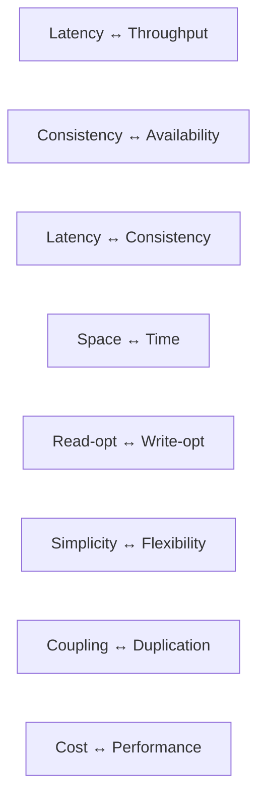
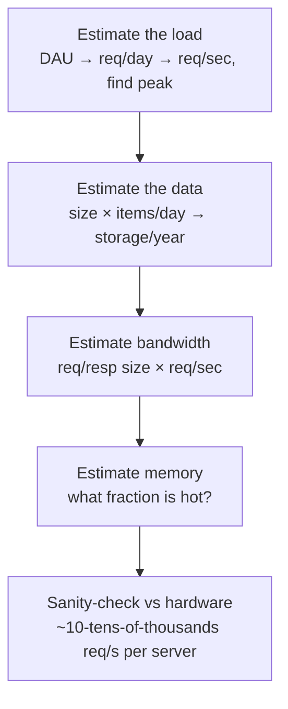

> **TL;DR:** There is no best architecture, only one best for a specific set of constraints. Every chapter after this one is a catalogue of tradeoffs — this chapter gives you the units they're measured in.

## The numbers every engineer should know

Jeff Dean's latency numbers, updated for modern hardware. Memorize the *orders of magnitude*, not the exact figures.

| Operation | Time | In human terms (×1B) |
|---|---|---|
| L1 cache reference | ~1 ns | 1 second |
| Branch mispredict | ~3 ns | 3 seconds |
| Mutex lock/unlock | ~17 ns | 17 seconds |
| Main memory reference | ~100 ns | 1.5 minutes |
| Read 1 MB from memory | ~3 µs | 50 minutes |
| Read 1 MB from SSD | ~50 µs | 14 hours |
| Round trip, same datacenter | ~500 µs | 6 days |
| Read 1 MB from disk (HDD) | ~825 µs | 11 days |
| Send packet CA → Netherlands → CA | ~150 ms | 5 years |

- **Memory ≈100× faster than SSD; SSD ≈20× faster than HDD; network is the slowest thing you do regularly.** Caching exists because of the first gap.
- **A cross-continent round trip is ~150 ms.** Three sequential cross-region calls = half a second gone before any computation. Parallelize, co-locate, use a CDN.
- **Disk seeks are expensive; sequential reads are cheap.** Shapes how databases store data (B-trees, LSM-trees) and why append-only logs are fast.

## Latency vs. throughput

| | Measures | Example |
|---|---|---|
| **Latency** | How long *one* operation takes | ms, µs |
| **Throughput** | How many operations complete per unit time | req/s, MB/s |

Not inverses — a cargo ship has terrible latency (weeks to cross an ocean) and enormous throughput (thousands of containers). A queue improves throughput, worsens latency. A cache improves latency and often throughput. Know which one you're optimizing.

## Percentiles, not averages

If 99 requests take 10ms and one takes 5s, the **average is 60ms** — a number describing no actual request.

| Percentile | Meaning |
|---|---|
| **p50** | Half of requests are faster. The "typical" experience |
| **p90/p95** | Where degradation first shows |
| **p99** | The tail — 1 in 100. A page making 100 backend calls will, on average, hit p99 once |
| **p999** | The deep tail — matters for high-traffic systems and SLAs |

**Tail latency amplification:** a request fanning out to 10 services, each with p99=100ms, has a much higher chance that *at least one* is slow — the request is as slow as its slowest dependency (Google's "The Tail at Scale").

**Coordinated omission:** a load tester that waits for a slow response before sending the next one under-counts slow periods. Real users don't wait politely.

## The universal scalability tradeoffs

Every backend decision spends something to buy something. The skilled answer names both axes.

| Tradeoff | The tension |
|---|---|
| **Consistency vs. availability** | Network partitions force a choice: refuse to answer (stay correct) or answer with stale data (stay up). CAP formalizes this — chapter 8. |
| **Latency vs. consistency** | Even with no partition, keeping replicas consistent costs round-trips. PACELC names this. |
| **Space vs. time** | A cache spends memory to save time; an index spends disk/write-time to save read-time; denormalization spends storage/write-complexity to save join-time. |
| **Read vs. write optimization** | Indexes speed reads, slow writes. LSM-trees optimize writes; B-trees balance toward reads. Know your read/write ratio. |
| **Simplicity vs. flexibility** | Microservices buy flexibility at the cost of operational/cognitive simplicity. |
| **Coupling vs. duplication** | Share logic (one source of truth, ripples on change) or duplicate it (independence, but drift). |
| **Cost vs. performance** | The right amount of performance is "SLA plus headroom," not "the most achievable." |

## Vertical vs. horizontal scaling

| | Vertical (bigger machine) | Horizontal (more machines) |
|---|---|---|
| Pros | Simple, no distribution, no consistency problems | Near-unlimited headroom, redundancy |
| Cons | Hard ceiling, expensive at the top, single point of failure | Distribution: consistency, partitioning, partial failure |

**The mature instinct: scale vertically until it genuinely hurts, then scale horizontally deliberately.** Most of this glossary exists because of horizontal scaling — teams reach for it far too early.

## Stateless vs. stateful

**Push state to the edges (databases, caches), keep the compute layer stateless.** A stateless service — no per-client data between requests — is the backbone of horizontal scaling: load balancer in front, add instances freely, lose one without consequence.

## The eight fallacies of distributed computing

Every distributed-systems bug is, ultimately, one of these being falsely assumed:

1. The network is reliable — it isn't.
2. Latency is zero — it isn't.
3. Bandwidth is infinite — it isn't.
4. The network is secure — it isn't.
5. Topology doesn't change — it does.
6. There is one administrator — there isn't.
7. Transport cost is zero — it isn't.
8. The network is homogeneous — it isn't.

Timeouts, retries, idempotency, circuit breakers, health checks — all exist because these fallacies are fallacies.

## Back-of-the-envelope estimation

**Worked example — a URL shortener:** 100M new URLs/day → ~1,160 writes/sec avg, ~3,500/sec peak. Reads 10:1 over writes → ~35,000 reads/sec peak. ~500 bytes/record → 50GB/day → ~18TB/year. **Five minutes of math told you: cache tier mandatory, key-value access pattern, sharding on the roadmap** — before a line of code.

Useful constants: ~86,400 seconds/day (≈10⁵) · 1M seconds ≈ 12 days · 1B seconds ≈ 31 years · UUID = 16 bytes · typical row = 100 bytes–1KB.

## SLA, SLO, SLI

| Term | What it is |
|---|---|
| **SLI** | The measured number — p99 latency, success ratio |
| **SLO** | The internal target — "p99 under 200ms" |
| **SLA** | The external, contractual promise — always looser than the SLO |

**The nines:**

| Availability | Downtime/year |
|---|---|
| 99% | 3.65 days |
| 99.9% | 8.77 hours |
| 99.99% | 52.6 min |
| 99.999% | 5.26 min |

Each nine is ~10× harder and more expensive. Five nines means recovery must be *automatic* — no human can be paged and respond in 5 minutes/year.

**Error budget:** if your SLO is 99.9% success, you're *allowed* to fail 0.1%. Reframes reliability from "never break" (paralyzing) to "stay within budget" (actionable) — unspent budget lets you ship faster; exhausted budget means freeze features and fix reliability.

## How to read the rest of this glossary

Every technique from here on is presented with what it costs, not just what it buys. The goal isn't reciting definitions — it's asking, on sight: *what does this trade away, and are those the right things to trade given our constraints?*
