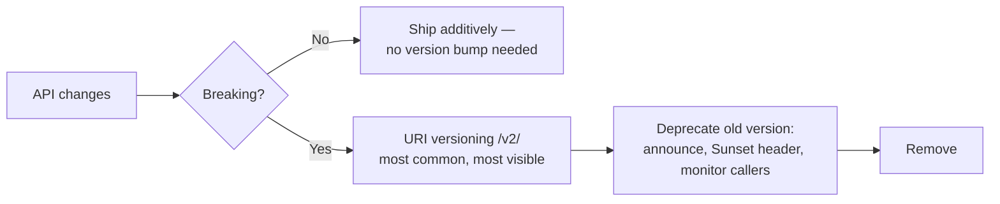

> **TL;DR:** An API is a contract. The hard part isn't the happy path — it's designing a promise you can keep for years while the implementation churns underneath.

## Choosing an API style

| Situation | Reach for |
|---|---|
| Public API, third-party consumers | **REST** — familiar, cacheable, debuggable |
| Many UI screens, one backend, varied data needs | **GraphQL** |
| Internal service-to-service, polyglot, perf-sensitive | **gRPC** |
| Full-stack TypeScript, one repo, one team | **tRPC** |
| Server needs to notify external systems | **Webhooks** (+ polling fallback) |

Normal to use several at once: gRPC internally, REST/GraphQL at the public edge, webhooks for outbound events.

| Style | Strength | Cost |
|---|---|---|
| **REST** | Universal, cacheable, stateless, verb semantics visible on the wire | Over/under-fetching; versioning is political; no standard for filtering/pagination |
| **GraphQL** | No over/under-fetching, one round-trip, introspectable schema | Caching is harder (POST to one URL); N+1 built in; a bad query can be catastrophically expensive |
| **gRPC** | Fast (binary + HTTP/2), strongly typed across languages, streaming | Not browser-native, not human-readable, heavier tooling |
| **tRPC** | Fastest dev loop for one TS repo, zero schema duplication | TS-only both ends; couples client/server at the type level |
| **Webhooks** | Real-time-ish, no polling | Delivery unreliable (needs retries + idempotency); ordering not guaranteed; sign payloads (HMAC) |

**Richardson Maturity Model (REST):** Level 0 = one URL, one verb (RPC in disguise) → Level 1 = multiple resources, one verb → Level 2 = proper verbs + status codes (where most real APIs live) → Level 3 = HATEOAS (elegant, rarely implemented by clients).

## REST design essentials

**Resource naming** — nouns, not verbs. `/getUser` is the most common smell; the verb is the HTTP method.

```
GET    /users                 list
POST   /users                 create
GET    /users/123             fetch one
PATCH  /users/123             partial update
GET    /users/123/orders      relationship
```

**HTTP method guarantees:**

| Method | Safe | Idempotent |
|---|---|---|
| GET / HEAD / OPTIONS | yes | yes |
| PUT / DELETE | no | yes |
| POST | no | no |
| PATCH | no | not necessarily |

These properties tell intermediaries what's safe to retry. A failed POST cannot be retried blindly — see idempotency keys below.

**Status codes:** 401 = "I don't know who you are." 403 = "I know who you are and you can't do this." 409 = state conflict. 429 = rate limited. 503 pairs with `Retry-After`.

**Error shape** — pick one, use it everywhere:
```json
{"error": {"code": "insufficient_funds", "message": "...", "request_id": "req_8f3k2"}}
```
`code` is the contract clients branch on. `request_id` is the single most useful debugging field you can return.

**Pagination:**

| Pattern | Tradeoff |
|---|---|
| Offset/limit | Trivial, supports jump-to-page — but slower as page N grows, breaks under concurrent inserts |
| Cursor/keyset | Constant-time at any depth, stable under inserts — no jump-to-page. **The right default for feeds/logs.** |

## Versioning — the unavoidable argument



- **Tolerant reader principle:** clients should ignore unknown fields, not choke — lets servers add fields freely.
- Every guarantee you make to consumers is freedom you take from your future self. Promise little, promise it precisely.

## Idempotency

POST is not idempotent — and POST is how you create things and move money. If a connection drops mid-request, the client doesn't know if it worked.

```
POST /orders
Idempotency-Key: 7d3a9f21-...
```

Server records the key with the result; a repeat key returns the stored result instead of re-executing. Stripe, Square, and every serious payments API require this. Keys expire (24h typical). **Not optional polish** — any mutating endpoint a client might retry needs this story.

## Rate limiting

| Algorithm | How it works | Note |
|---|---|---|
| Fixed window | Count per clock-aligned window | Allows a 2× burst at the boundary |
| Sliding window log | Timestamp per request | Accurate, memory grows with traffic |
| Sliding window counter | Weighted blend of current/previous window | Good accuracy/cost compromise |
| **Token bucket** | Refills at a steady rate, spends a token per request | **Most popular** — allows controlled bursts |
| Leaky bucket | Requests queue, drain at fixed rate | Smooths bursts, adds queuing latency |

Communicate limits: `X-RateLimit-Limit/Remaining/Reset`, and `429` + `Retry-After` on rejection. Decide the dimension (per key/user/IP) and *where* it runs (edge vs. per-service) deliberately.

## API gateways

A single front door centralizing auth, rate limiting, routing, TLS termination, logging. **Keep it thin** — cross-cutting concerns, not business logic, or it becomes a mini-monolith every team must coordinate through.

**BFF (Backend for Frontend)** — a dedicated backend per client type, removing lowest-common-denominator compromises at the cost of more services.

## Designing for evolution — the rules

- Make the contract explicit (OpenAPI, `.proto`, GraphQL schema).
- Validate input at the boundary — never trust a caller.
- **Postel's Law:** be conservative in what you send, liberal in what you accept.
- Return `request_id` on every response.
- Paginate everything that can grow — no unbounded collections, ever.
- Design errors as carefully as success.
- Treat a published, external API as forever. Internal APIs can churn.
