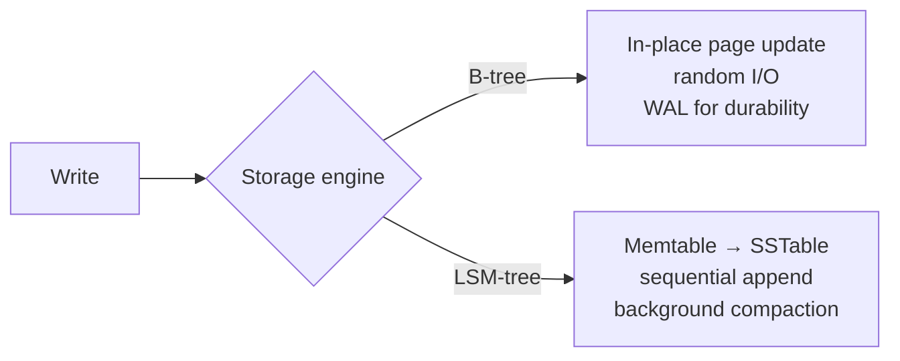

> **TL;DR:** The database is the hardest part of a system to change later. App code can be rewritten in an afternoon; migrating a live production database is a multi-month project with a non-zero chance of data loss.

## Storage engines: what's under the database

| | B-tree | LSM-tree |
|---|---|---|
| Write pattern | In-place, random I/O | Append-only, sequential |
| Write speed | Good | Excellent |
| Read speed | Excellent, predictable | Good, variable (Bloom filters help) |
| Space | Fragmentation over time | Better compression |
| Background work | Minimal | Compaction (steals I/O) |
| Best for | Balanced/read-heavy | Write-heavy (metrics, events, logs) |
| Examples | Postgres, MySQL, SQL Server | Cassandra, RocksDB, LevelDB, ScyllaDB |

Most relational defaults are B-tree, and that default is right far more often than not.

## Relational vs. NoSQL

**Relational is the right default** — decades of maturity, ACID removes whole categories of bug, schema is documentation, modern engines scale higher than their reputation suggests. Major engines: **PostgreSQL** (modern default), **MySQL/MariaDB**, **SQLite** (most-deployed database on earth), SQL Server/Oracle (enterprise).

**"NoSQL" covers four genuinely different models**, chosen for different reasons:

| Family | Strength | Cost | Use for |
|---|---|---|---|
| **Key-value** (Redis, DynamoDB, Memcached) | Fastest access pattern, trivially partitionable | No querying by value, no secondary indexes | Caching, sessions, leaderboards |
| **Document** (MongoDB, Firestore) | Maps to app objects, related data stored together | Weak cross-document relationships, limited multi-doc transactions | Content, catalogues, event payloads |
| **Wide-column** (Cassandra, HBase, Bigtable) | Massive horizontal write scale, tunable consistency | Must model the table around the exact query — no ad-hoc querying | Time-series at scale, event logging |
| **Graph** (Neo4j, Neptune) | Multi-hop traversal queries are natural and fast | Niche — worse than relational for non-graph workloads; hard to shard | Social graphs, recommendations, fraud |

**Start relational unless you have a specific, named reason not to** — "we might need scale someday" is a guess, not a reason. Real systems are **polyglot**: Postgres as system of record, Redis for caching, Elasticsearch for search, a vector store for embeddings — assign each workload to the store that fits it.

> The most expensive database mistake isn't picking the "wrong" database. It's picking one to solve a scaling problem you don't have yet, and paying its complexity tax daily for insurance never claimed.

## Indexes

Without one: full table scan, `O(n)`. With one: `O(log n)`.

| Type | Use |
|---|---|
| **B-tree** | Default — equality, range, prefix match |
| **Hash** | O(1) exact-match only, no ranges |
| **Bitmap** | Low-cardinality columns (analytics) |
| **Inverted** | Full-text search |
| **GiST/GIN** (Postgres) | Geometric, full-text, JSONB, arrays |
| **BRIN** | Tiny indexes for huge naturally-ordered tables |

- **Clustered index** — determines physical row order on disk; a table has at most one.
- **Composite index leftmost-prefix rule** — an index on `(a,b,c)` serves queries on `a`, `a,b`, or `a,b,c` — never `b` alone.
- **Covering index** — contains every column a query needs → index-only scan, no table touch.

**What indexes cost:** every write updates every affected index (8 indexes = up to 9 writes per row change); real disk space; a misled query planner with too many overlapping indexes. Index what you filter/join/sort on. Find slow queries with `EXPLAIN ANALYZE`.

## Transactions and ACID

- **Atomicity** — all or nothing.
- **Consistency** — constraints hold at commit (the application/schema's job, really).
- **Isolation** — concurrent transactions don't see each other's half-finished work.
- **Durability** — committed data survives crashes (WAL flushed before ack).

**Isolation levels** and the anomalies each permits:

| Level | Dirty read | Non-repeatable read | Phantom read |
|---|---|---|---|
| Read Uncommitted | possible | possible | possible |
| Read Committed (Postgres default) | prevented | possible | possible |
| Repeatable Read (MySQL default) | prevented | prevented | possible |
| Serializable | prevented | prevented | prevented |

Stronger isolation = more correctness, less concurrency. Most databases default *below* Serializable — anomalies are possible by default unless you opt into more.

**Optimistic vs. pessimistic concurrency:** pessimistic locks the row first (correct under contention, risks deadlock); optimistic checks at commit time and retries on conflict (fast when contention is rare). Optimistic for most workloads, pessimistic for hot contended rows.

**MVCC** (Postgres, MySQL/InnoDB) — a write creates a new version instead of overwriting; readers never block writers, writers never block readers. Cost: old versions accumulate (Postgres `VACUUM`, InnoDB purge) — neglected cleanup causes bloat.

## Connection pooling

Opening a connection is expensive (TCP handshake, auth, process setup), and Postgres in particular dedicates a process per connection — a few hundred is a lot. A **pool** keeps connections open and lends them out. For serverless/high-fan-out, a server-side pooler (PgBouncer) is often necessary — thousands of ephemeral instances would otherwise exhaust `max_connections` all at once. This is invisible until traffic rises, then everything fails together.

## Reading a query plan

`EXPLAIN ANALYZE` — the highest-leverage database skill there is. Most "the database is slow" incidents are one missing index, visible in one plan.

| Plan node | Meaning |
|---|---|
| Seq Scan | Reading every row — fine for tiny tables, a red flag on large ones |
| Index Scan | Using an index, then fetching rows — good |
| Index-Only Scan | Answered entirely from a covering index — best |
| Rows: estimated vs. actual wildly off | Statistics are stale — run `ANALYZE` |
