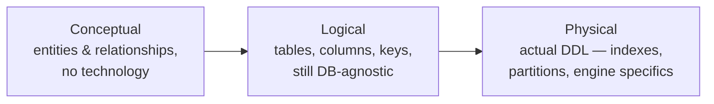
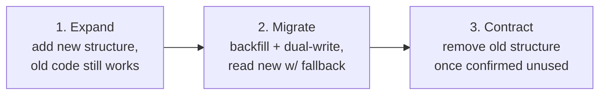

> **TL;DR:** A schema is a set of bets about the future. **You model data for the queries you will run, not for the abstract beauty of the domain.** A "correct" model that makes your hot query slow is a wrong model.

## Three levels of modeling

Skipping the conceptual level is the most common mistake — teams jump to tables and mismodel a fundamental relationship, discovered three months later.

## Keys

| Key type | Tradeoff |
|---|---|
| **Natural** (email, ISBN) | Meaningful, but real-world values change/get reused |
| **Surrogate — auto-increment** | Compact, index-friendly — but guessable, leaks volume, clashes on merge/shard |
| **Surrogate — UUID** | Globally unique, no coordination needed — but 16 bytes, random UUIDv4 hurts insert locality |
| **Surrogate — sortable (UUIDv7, ULID, Snowflake)** | Time-ordered inserts stay local, unique, no coordination — **the modern default for distributed systems** |

## Normalization vs. denormalization

**Normalization** removes redundancy so each fact is stored once, preventing update/insertion/deletion anomalies. Target: **3NF or thereabouts** — removes the painful anomalies without over-fragmenting.

**Denormalization** deliberately reintroduces redundancy for read speed — a copy of `customer_name` on `orders` to skip a join. **You own keeping copies in sync** afterward.

> **Not all duplication is denormalization.** Storing a product's price *at purchase time* on the order line isn't a stale copy — it's a distinct fact ("the price paid" vs. "the price now"). Telling these apart is a core modeling skill.

| | Optimizes | Costs |
|---|---|---|
| Normalize (default) | Writes, correctness | Reads need joins to reassemble |
| Denormalize (specific hot paths) | Reads | A sync mechanism you now own |

## Modeling for NoSQL: query-first

Relational modeling is data-first (model cleanly, query however via joins). NoSQL modeling is **query-first** — enumerate access patterns *before* designing anything. No joins to bail you out.

| Store | Rule |
|---|---|
| **Document DBs** | **Embed** when read together, bounded, belongs to parent. **Reference** when large/shared/many-to-many/unbounded growth. Anti-pattern: the unbounded array. |
| **Wide-column** | One table *per query pattern* — duplication is the design, not a smell. |
| **DynamoDB single-table** | Multiple entity types in one table via composite keys — powerful, famously hard to evolve if access patterns change. |

## Schema evolution: expand-contract

The safe way to make a breaking change with zero downtime:

Renaming a column directly requires every running instance to change in the same instant — impossible during a rolling deploy. Stripe's "Online migrations at scale" is the canonical write-up.

**Migration discipline:** versioned and in source control · forward-only, write the down-migration but roll *forward* in production · beware locking (`CREATE INDEX CONCURRENTLY` in Postgres) · backfill in batches of a few thousand rows, not one giant transaction.

## Recurring modeling problems

| Problem | Pattern |
|---|---|
| **Temporal/historical data** | History/audit table, bitemporal `valid_from`/`valid_to`, or event sourcing (ch. 10) |
| **Soft deletes** | `deleted_at` — recoverable, but every query must remember to filter it out |
| **Hierarchies/trees** | Adjacency list (simple, needs recursive CTE) · materialized path (prefix-match subtrees) · nested sets (fast read, painful write) · closure table (flexible, more storage) |
| **Polymorphic associations** | Nullable FK per type (clean, sparse) · `(type, id)` pair (flexible, no real FK) · separate tables per relationship |
| **High-frequency counters** | Sharded counters, async aggregation job, or a store built for it (Redis) |

## Where to enforce integrity

| Layer | Guarantee | Cost |
|---|---|---|
| **Database** (`CHECK`, `NOT NULL`, FK) | Unbreakable — holds no matter what writes the data | Rigid, logic lives away from app |
| **Application** | Flexible, expressive, testable | Only holds if *every* write path goes through it — they won't, eventually |

**The robust answer is both, deliberately**: hard structural invariants in the database, richer business rules in the application. Treating "the application validates it" as sufficient is how databases end up full of impossible rows.
