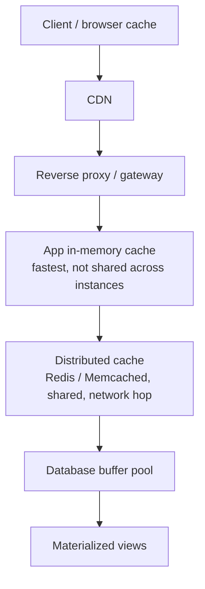
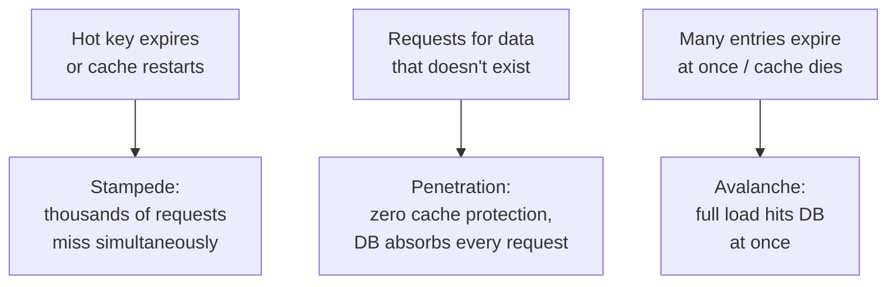

> **TL;DR:** A cache is a deliberate copy of the truth that's allowed to be wrong. Every cache is a bet that staleness is cheaper than freshness — this chapter is about making that bet well.

## Why caching works

- **Temporal locality** — data accessed recently is likely accessed again soon.
- **The 80/20 rule** — a small fraction of data serves most requests. A cache only needs to hold the hot fraction.

**Hit rate** is the metric that matters: 95% hit rate = the backing store sees only 5% of traffic. The gap between a 90% and 99% hit rate is 10× vs. 1% of load reaching the backing store — a big swing from what looks like a small number.

## The caching stack

A request ideally gets answered as high up this stack as possible.

## Caching strategies

| Pattern | How it works | Pros | Cons |
|---|---|---|---|
| **Cache-aside** | App checks cache; miss → read DB, write cache. Write → invalidate. | Only requested data cached; cache down = "slow" not "broken" | Miss = 3 ops; cold-start misses |
| **Read-through** | Cache itself loads from DB on miss | Simpler app code | Needs a cache that supports it |
| **Write-through** | Write hits cache, synchronously writes DB | Never stale, read-after-write always hits | Every write pays for two writes |
| **Write-behind** | Write hits cache, async flush to DB | Very fast writes, batches well | **Data-loss window** if cache dies before flush |
| **Write-around** | Writes bypass cache; populated on next read miss | Write flood doesn't evict hot read data | Just-written item is a guaranteed first-read miss |

Real systems mix these per data type: cache-aside for profiles, write-through for config that must never be stale, write-behind for a high-frequency counter.

## Eviction and TTL

| Policy | Best for |
|---|---|
| **LRU** | Sensible default — exploits temporal locality |
| **LFU** | Persistently-hot items that LRU might evict during a burst |
| **FIFO / Random** | Simple, cheap, rarely optimal |
| **TTL-based** | Usually combined with one of the above |

**TTL is the staleness dial** — no universally correct value. "How wrong is this allowed to be?" A stock price: seconds. A display name: hours. Country codes: forever. Add **jitter** (270-330s instead of a flat 300s) so a batch created together doesn't expire together and stampede the backing store.

## Cache invalidation — the genuinely hard part

> "There are only two hard things in Computer Science: cache invalidation and naming things." — Phil Karlton

| Approach | Tradeoff |
|---|---|
| TTL expiry (passive) | Simplest — guaranteed staleness window up to one TTL |
| Explicit invalidation on write | Fresh, but every write path must remember — the one that forgets is a hard-to-find bug |
| Write-through | Sidesteps invalidation, at write-cost |
| Event-driven (CDC stream) | Decoupled from app write paths, at the cost of running that pipeline |
| **Versioned/immutable keys** | Bake a version/hash into the key (`asset:a1b2c3`) — a change = a new key, old one just ages out. **Most robust**, nothing to get wrong. |

**Delete, don't update** on write — an update races with concurrent reads and can re-cache stale data; a delete just forces a clean repopulate.

## Three classic caching failures

| Failure | Mitigations |
|---|---|
| **Stampede** | Request coalescing (first request fetches, others wait) · early/probabilistic recomputation · TTL jitter |
| **Penetration** | Cache the negative result · Bloom filter of keys that exist · input validation at the edge |
| **Avalanche** | TTL jitter · HA cache tier (replication) · circuit breakers/rate limiting on the DB · multi-layer cache |

## CDN and HTTP caching

**CDN** — edge servers serve requests from the nearest location, collapsing network latency. Static content (long TTL, hashed URLs) is the classic use; dynamic content and edge compute are increasingly common.

| HTTP header | Does |
|---|---|
| `Cache-Control: max-age` | How long it's fresh |
| `no-cache` | Store it, but revalidate before use (not "don't cache") |
| `no-store` | Never store |
| `immutable` | Never revalidate — for content-hashed assets |
| `ETag` + `If-None-Match` | `304 Not Modified` saves the payload |
| `stale-while-revalidate` | Serve stale immediately, revalidate in background — the staleness/latency tradeoff as a feature |

## Redis vs. Memcached

| | Memcached | Redis |
|---|---|---|
| Model | Pure, minimal KV cache, opaque blobs | Data-structure store: hashes, lists, sets, sorted sets, streams |
| Persistence | None | Optional (snapshots, AOF) |
| Extras | None by design | Replication, clustering, pub/sub, Lua, distributed locks |
| Choose when | Exactly a fast, simple, volatile cache | You also want the leaderboard, rate limiter, queue — running one system beats several |

⚠️ Redis keeps data until memory runs out by default — configure `maxmemory` + an eviction policy (`allkeys-lru`) or it's a data store that fills up, not a cache that evicts.

## What not to cache

- Data that must be perfectly current (account balance at the moment of a transaction).
- Data accessed once — no second read to benefit.
- Highly personalized, low-reuse data — near-zero hit rate.
- Anything where a stale read causes *incorrect* behavior, not just a slightly old display — permissions especially.

**The closing discipline:** a cache is an optimization; the system must stay *correct* if the cache is empty, stale, or down. Build the correct, cache-free path first. Then add the cache to make it fast.
