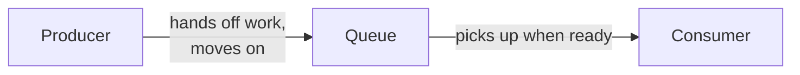
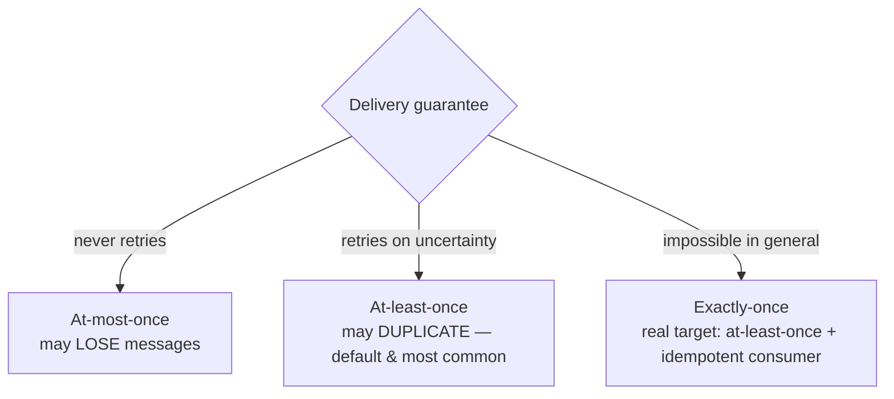

> **TL;DR:** A message queue turns "now" into "soon" — decoupling a producer from a consumer in time. One of the most powerful structural tools in backend design, and not free.

## What queues buy vs. cost

| Buys | Costs |
|---|---|
| Responsiveness — user request does only the essential work | Eventual consistency — queued work isn't done yet |
| Load leveling — absorbs bursts, drains at sustainable rate | Operational complexity — another stateful system |
| Decoupling — producer doesn't know/care who consumes | Harder debugging — needs correlation IDs, distributed tracing |
| Resilience — a dead consumer just means waiting work | Ordering & duplication — most queues are at-least-once |
| Elastic scaling — add consumers, they share load | "Is it done?" stops being simple — needs explicit status tracking |

## Point-to-point vs. pub/sub

| | Point-to-point (work queue) | Pub/sub |
|---|---|---|
| Delivery | Exactly one consumer per message | Every subscriber gets its own copy |
| Model | *Distributes* work — done once | *Broadcasts* events — seen by all interested parties |
| Use for | Task distribution | Event-driven architecture |

## Queue vs. stream — a real distinction

> **Mental model:** a queue is a to-do list (do it, cross it off). A stream is a ledger (append, never erase, different readers read for different reasons).

| | Message queue | Streaming log |
|---|---|---|
| After consumption | Message deleted | Event retained |
| Consumers | Compete for messages | Each reads independently at its own offset |
| Replay history | No | **Yes** — first-class feature |
| Ordering | Limited | Strong, per partition |
| Built around | Tasks | Events / facts |
| Examples | RabbitMQ, SQS, ActiveMQ | Kafka, Kinesis, Redpanda, Pulsar |

## Delivery guarantees

⚠️ Treat any unqualified "exactly-once" claim with suspicion. What Kafka actually provides is exactly-once *processing semantics* within a bounded scope, via at-least-once delivery + idempotent producers + transactional processing.

**Idempotent consumers** — since duplicates *will* happen:
- Deduplication by message ID (needs a retention window for the dedup store).
- Idempotency keys at the operation level.
- Naturally idempotent operations ("set status to SHIPPED" vs. "increment balance").
- Conditional writes ("insert if not exists").

## Ordering

Most queues do **not** guarantee global ordering. The standard real-world answer: **partitioned/keyed ordering** — all messages sharing a key route to the same partition, guaranteeing per-key order while still parallelizing across keys (how Kafka works). Strict-FIFO queues exist but trade throughput for it. Don't ask for global ordering — identify the key that actually needs order, partition by it.

## Backpressure and dead letter queues

| Response to a growing backlog | Use when |
|---|---|
| Autoscale consumers | Healthy default — watch for the bottleneck just shifting downstream |
| Throttle/block producers | Can afford to slow the source |
| Load shedding | Genuine overload — drop low-priority, keep high-priority alive |
| Buffer to durable storage | Reprocess later |

**A Dead Letter Queue (DLQ)** catches messages that fail repeatedly, unblocking the main queue and preserving the failure for investigation. An unmonitored DLQ is a silent graveyard — alert on anything landing in it.

**Retry strategy:** exponential backoff + jitter (prevents a synchronized "retry storm") + a bounded attempt budget + distinguish transient (retry) from permanent errors (straight to DLQ, retrying is pure waste).

## Choosing a system

| Need | Reach for |
|---|---|
| Background jobs (email, thumbnails) | App-level job queue (Sidekiq/Celery/BullMQ) on Redis — **not Kafka** |
| Simple, scalable, minimal ops | SQS or RabbitMQ |
| Complex routing between tasks | RabbitMQ |
| Event streaming, replay, event sourcing | Kafka / Pulsar / Redpanda |
| Already on Redis, modest streaming | Redis Streams |

The recurring mistake: reaching for Kafka because it's prestigious, when the need is "send a welcome email without blocking signup" — a job for a Redis-backed queue at a tenth of the operational cost.
