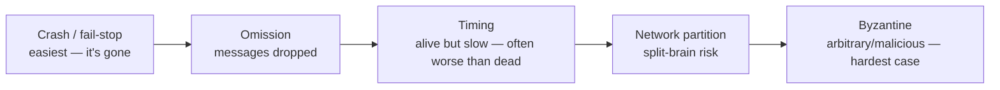
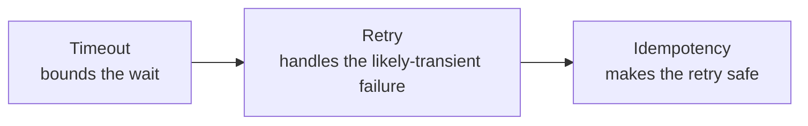

> **TL;DR:** A distributed system isn't just "bigger" — it's different in kind. Parts fail while others keep running, messages arrive late/twice/never, and there's no single "now." You adopt distribution because one machine can't give you the scale/availability/reach you need, and you pay for it in correctness surface.

## Why distribute — and the cost, stated once

Legitimate reasons: scalability beyond one machine, availability through redundancy, geographic reach, fault isolation. **The cost: everything gets harder** — reasoning, testing, debugging, deploying. Stay on one machine until it genuinely can't meet a real requirement.

## Types of failure — and the worst one

**The deepest issue:** you cannot reliably distinguish a crashed node from a slow node from a broken network (the Two Generals Problem — fundamental, not an implementation gap). Every timeout, retry, and health check is a *heuristic* response to an unanswerable question.

**Gray failure** — partial, ambiguous failure (up but slow, working for some requests not others) evades simple up/down checks while quietly degrading the system. Designing for gray failure matters more than designing for clean crashes.

## Time: there is no shared clock

- **Never use wall-clock timestamps to order events across machines.** Clock drift is real; NTP only syncs to milliseconds; clocks can jump backward. (Spanner is the famous exception — atomic clocks + GPS + deliberately waiting out the uncertainty interval.)
- **Lamport timestamps** — a counter per node; if A caused B, A's timestamp < B's. Gives total order, but can't tell you if two events were concurrent.
- **Vector clocks** — a vector of counters, one per node; *can* detect concurrency (how Dynamo detects conflicting writes). Cost: grows with node count.

**Ordering comes from causality tracking, not clocks on the wall.**

## Detecting failure — since you can't know, you infer

| Mechanism | Tradeoff |
|---|---|
| **Heartbeats** | Short timeout = fast detection, more false positives. Long = fewer false alarms, dead node "live" longer. |
| **Health checks (shallow)** | Cheap, misses gray failure |
| **Health checks (deep)** | Catches more, but a shared-dependency blip can mark the whole fleet unhealthy at once |
| **Phi-accrual detectors** | Suspicion *level*, not binary — adapts to network conditions (Cassandra, Akka) |
| **Gossip protocols** | Peer-to-peer membership view, converges, no central coordinator (Cassandra, Consul) |

## Load balancing

**Layer 4** (transport — fast, protocol-agnostic) vs. **Layer 7** (application — slower, content-based routing, TLS termination).

| Algorithm | Note |
|---|---|
| Round robin | Simple, ignores instance/request cost differences |
| Least connections | Adapts to uneven request durations — good default |
| Power-of-two-choices | Pick 2 at random, send to the less-loaded — cheap and remarkably effective |
| Consistent/IP hash | Same client → same instance — cache locality, sticky sessions |

Sticky sessions work but undermine balancing and lose the session on instance loss — push session state to a shared store instead.

## Timeouts + retries + idempotency = one inseparable pattern

Because of the two-generals problem, a caller with no response **cannot know** if the operation happened. Retry (risk duplicating) or don't (risk it never happened) — retrying is almost always right, *provided the operation is idempotent*.

Use any two without the third and you have a bug. Retries need exponential backoff + jitter (a synchronized retry storm re-overloads the recovering service) + a bounded budget + transient-only.

## Cascading failures and split-brain

**Cascade mechanism:** A depends on B → B slows → A's threads block on B, exhausting A's own resources → A starts failing → everything depending on A is now affected, often faster than the original failure. Retries make it worse — automatic retries *multiply* load on the already-struggling B.

Defenses (chapter 11): **circuit breaker** (stop calling, fail fast), **bulkhead** (isolate resources per dependency), **timeouts**, **load shedding**. Core principle: a component must fail in a way that protects the rest of the system.

**Split-brain:** a partition splits a cluster; the side that can't see the primary elects a new one — now two primaries, both accepting writes, histories diverging irreconcilably. Defense: **quorum** — require a majority before electing. This is why clusters use an odd number of nodes: guarantees exactly one side can ever hold a majority.

## CAP, briefly (full treatment in ch. 8)

When a partition happens, choose **consistency** (may mean refusing to serve) or **availability** (may mean serving stale data) — not both, and partitions are not optional.
