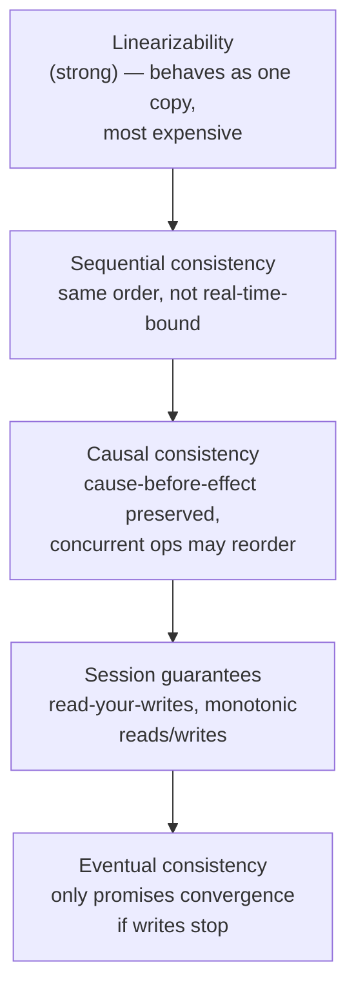

> **TL;DR:** "Consistency" is an overloaded word, "eventual consistency" is far weaker than it sounds, and CAP is the most misquoted theorem in the field. This chapter aims for precision.

## Three different "consistency"s

| # | Concept | Scope |
|---|---|---|
| 1 | ACID consistency (ch. 3) | Single database — constraints hold at commit. Application's job, mostly. |
| 2 | CAP consistency | Replicas agreeing — specifically linearizability |
| 3 | Consistency models (below) | The full spectrum of what a read can observe |

## The consistency spectrum, strongest to weakest

| Model | Guarantee |
|---|---|
| **Linearizability** | Every read sees the most recent write, as if one copy exists. Most intuitive, most expensive — coordination on every op. |
| **Causal** | Causally-related ops seen in the same order by everyone; concurrent ops may differ. **The strongest model still achievable while remaining available during a partition.** |
| **Read-your-own-writes** | You always see your own writes — even if others briefly see stale data. |
| **Monotonic reads** | Once you've seen a value, you never see an older one. |
| **Eventual** | *If writes stop*, replicas eventually converge. That's the entire promise — no ordering, no timing guarantee. |

> ⚠️ **"Eventually" can mean milliseconds or, under load/partition, minutes.** Teams choose eventual consistency for performance and are then surprised by anomalies that were exactly what they signed up for.

## CAP, stated correctly

A system provides at most two of **Consistency** (linearizability), **Availability** (every request gets a response), **Partition tolerance**.

**The correct reading:** partitions are not optional — P isn't a choice. The theorem reduces to a forced choice **only during a partition**:

| | During a partition |
|---|---|
| **CP** | Refuse requests that can't be made consistent (errors/blocking) |
| **AP** | Keep serving, accept stale data on some replicas |

**When there's no partition, you don't have to choose at all.** CAP describes behavior during the minority of the time a system spends partitioned.

## PACELC — the more useful theorem

> **If** Partition: choose Availability or Consistency. **Else** (normal operation): choose Latency or Consistency.

The "ELC" half matters more day-to-day: even with a healthy network, linearizable replicas cost coordination round-trips *all the time*, not just during partitions.

| Classification | Example |
|---|---|
| PA/EL | Cassandra, DynamoDB (default), Riak |
| PC/EC | Traditional RDBMS, VoltDB |
| PC/EL | MongoDB (roughly) |

## Quorums

With **N** replicas: **W** must ack a write, **R** must respond to a read.

**W + R > N** → every read overlaps the most recent write on at least one replica → strong consistency (strict quorum).

| Config | Tradeoff |
|---|---|
| W=N, R=1 | Slow, fragile writes; fast reads. Read-heavy data. |
| W=1, R=N | Fast writes; reads consult everyone. Write-heavy data. |
| **W=R=(N/2+1)** | Majority quorum — the common default |
| W+R ≤ N | Sloppy quorum — faster, more available, reads can miss the latest write |

Typical: **N=3, W=2, R=2** — strongly consistent, tolerates one replica down.

## Consensus

Getting nodes to agree on a value despite crashes and lost/delayed messages. Foundation under leader election, distributed locks, replicated state machines.

**FLP impossibility:** in a fully asynchronous system with even one faulty node, no protocol can *guarantee* termination. Real systems escape via timeouts (partial synchrony) — protocols guarantee *safety* (never decide wrong) unconditionally; *liveness* (eventually deciding) depends on reasonable network behavior.

| Protocol | Note |
|---|---|
| **Paxos** | Original, proven correct — famously hard to understand/implement |
| **Raft** | Designed to be understandable, equal power to Multi-Paxos. Decomposes into leader election + log replication + safety. Powers etcd, Consul, CockroachDB. **Mainstream choice.** |
| **ZooKeeper/ZAB** | Coordination service — configs, locks, leader election. etcd (Raft) is the modern equivalent, at the heart of Kubernetes. |

> **Do not implement consensus yourself.** The failure modes are silent data corruption. Use etcd/ZooKeeper/Consul, or a database with it correctly built in.

## Two-phase commit → sagas

**2PC**: coordinator asks all participants "can you commit?" (prepare), then tells everyone to commit/abort. Fatal flaw: **blocking** — if the coordinator crashes after prepare but before the decision, participants are stuck holding locks. Largely avoided in modern architectures.

**Saga pattern** (ch. 10 detail): a sequence of local transactions, each with a **compensating action** to semantically undo it if a later step fails (*Refund* compensates *Charge*). Trades atomicity/isolation for cross-service consistency without distributed locking.

## Conflict resolution (AP systems)

| Approach | Tradeoff |
|---|---|
| **Last-Write-Wins** | Simple, widely used — silently discards the losing write; clock skew can pick the wrong "latest" |
| **Application-level** | Vector clocks surface all conflicting versions to the app/user to merge (Dynamo's shopping cart) |
| **CRDTs** | Concurrent updates merge deterministically, no conflict, no lost data — backbone of collaborative editing/local-first apps |

## Choosing in practice

| Data | Model | Why |
|---|---|---|
| Money, inventory, bookings | Strong | A stale read causes an incorrect, costly decision |
| Feeds, comments | Causal | Preserves cause-effect without full strong-consistency cost |
| A user's own edits | Read-your-own-writes minimum | Otherwise their change appears to vanish |
| Counts, view tallies, presence | Eventual | Cheap, fast, available — off-by-a-few harms nothing |

**The unifying principle: the right consistency model is determined by the cost of being wrong, not a preference for "strong" or "fast."**
