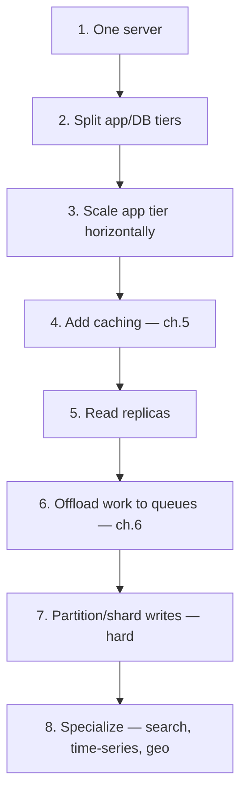

> **TL;DR:** Scaling is a sequence of bottlenecks, each removed in turn, each removal exposing the next. The cheapest scaling is the scaling you avoid — a better query beats a new moving part.

## The scaling sequence

Most teams are at steps 3-6. Steps 7-8 should be deferred until unavoidable.

## Scaling the stateless tier

Nearly free if the app tier holds no session state anywhere but a shared store, no local file storage (use object storage), no instance-local cache treated as authoritative. Get this right and the scaling problem becomes the database — almost always.

## Replication

Two distinct goals that pull different ways: **availability** (redundancy) and **read scalability** (parallel reads).

| Model | Reads | Writes | Note |
|---|---|---|---|
| **Leader-follower** | Scale by adding followers | **Do not scale** — all through one leader | Most common. Failover risks split-brain without quorum. |
| **Multi-leader** | — | Better write availability, local-latency writes | Write conflicts possible, need resolution (ch. 8) |
| **Leaderless** (Dynamo-style) | Any replica | Any replica | Quorums (W+R>N) provide consistency; no failover needed |

**Synchronous vs. asynchronous replication:**

| | No data loss on leader failure | Write speed | Risk |
|---|---|---|---|
| Synchronous | Yes | Stalls if a follower is slow/down | — |
| Asynchronous | **No** — acknowledged writes can be lost | Fast, always available | Small loss window |
| Semi-synchronous | One follower guaranteed | Common compromise | — |

**Replication lag** causes the read-your-own-writes anomaly directly: write to leader, immediately read a lagging follower, your change is missing. Mitigation: route a user's reads to the leader briefly after they write.

## Partitioning and sharding — scaling writes

Replication scales reads; **sharding scales writes** by splitting data across servers, each an independent database. Total write throughput becomes the *sum* of shards — the only way past one machine's write ceiling, and the hardest step in the sequence.

| Strategy | Pro | Con |
|---|---|---|
| **Range** | Efficient range queries | Prone to hotspots (all new writes hit the newest range) |
| **Hash** | Distributes load evenly | Destroys range queries — scans hit every shard |
| **Directory/lookup** | Maximum flexibility, rebalance by editing the map | A lookup on every access, new critical component |
| **Geographic** | Good for latency/data-residency | — |

**The shard key is the hardest-to-reverse decision.** A good one distributes load evenly, has high cardinality, and matches the common query pattern (so most queries hit one shard, not scatter-gather). Get it wrong → hotspots (the "celebrity problem"). Changing it later often means re-sharding everything.

**Consistent hashing** fixes naive `hash(key) mod N`'s fatal flaw (changing N reshuffles nearly every key) — hashing keys and shards onto a ring means adding/removing a shard relocates only ~K/N keys. Virtual nodes keep distribution even. Standard behind Cassandra, DynamoDB, distributed caches.

**Why sharding is last:** cross-shard queries scatter-gather (slow as the slowest shard), cross-shard transactions need 2PC or sagas, rebalancing is hard, referential integrity weakens. **Shard only when replication, caching, and offloading are exhausted.**

## NewSQL / distributed SQL

**CockroachDB, Spanner, TiDB, YugabyteDB, Vitess** — keep the SQL interface and ACID while sharding/replicating underneath via consensus (Raft/Paxos) per data range. The tradeoff hasn't vanished, it's moved: cross-shard transactions still cost coordination latency. Often a better answer than hand-rolled sharding for teams that need both scale and real SQL.

## Database write-scaling, cheapest first

1. Optimize queries, add missing indexes, fix N+1s — free.
2. Connection pooling.
3. Cache (ch. 5).
4. Read replicas.
5. Vertical scale — boring, effective, underrated.
6. Offload writes to queues (ch. 6).
7. Functional partitioning (different tables, different DBs).
8. Shard a single large table — the last resort.

## CQRS, object storage, multi-region

- **CQRS** — different models for writing (normalized, consistency-focused) and reading (denormalized, precomputed). Shines when read/write shape and volume are very different; costs two models to maintain and read-side lag.
- **Object storage** for blobs (S3, GCS, R2) — never in the relational database. **Pre-signed URLs** let clients upload/download directly, bypassing app servers entirely.
- **Multi-region** — the final frontier, constrained by the speed of light (~100ms+ cross-region). Read-local/write-global is simpler; active-active is lowest-latency but full multi-leader conflict cost. Adopt for a concrete requirement — latency, residency, disaster tolerance — never as a default.

## The closing discipline

Measure, find the *actual* current bottleneck, remove it with the cheapest tool that works, repeat. A single well-tuned server with a cache and a read replica outperforms a sprawling distributed system the team can't reason about — and serves most products comfortably.
