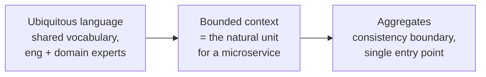
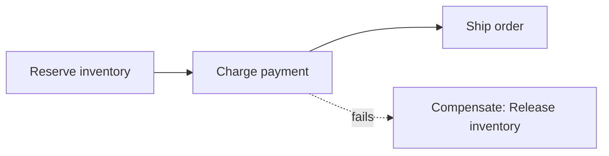

> **TL;DR:** Architecture is the set of decisions that are expensive to reverse — how services divide, how they communicate, where boundaries fall. Every pattern trades independence against simplicity; nothing gives both for free.

## Monolith vs. microservices

| | Monolith | Microservices |
|---|---|---|
| Initial dev speed | Fast | Slow |
| Operational complexity | Low | High |
| Deployment | All-or-nothing | Independent |
| Scaling | Whole app | Per service |
| Cross-cutting transactions | ACID, easy | Sagas, hard |
| Debugging | One stack trace | Distributed tracing |
| Best for | Most systems, small/medium teams | Large orgs, many teams, real scale |

> **Microservices don't solve technical problems — they solve an organizational one: letting many teams ship independently.** No many teams, no benefit, just the costs.

**The monolith is the correct default** for the overwhelming majority of systems. Weaknesses (hard to understand, redeploy everything, scale everything) **only bite at significant scale of code and team**.

**Microservices** buy independent deploy/scale/tech-choice per service, at the cost of network calls replacing function calls (inheriting the ch. 7 fallacies), no cross-service ACID (need sagas), and running service discovery/gateways/a deployment platform. A **distributed monolith** — services too coupled to deploy separately — has all the cost, none of the benefit.

**Start with a modular monolith:** one deploy, internally organized into well-bounded modules with explicit interfaces. If a module later needs its own service, extraction is mechanical because the boundary already exists.

## Finding boundaries: Domain-Driven Design

Boundaries should fall where **coupling is low and cohesion is high** — following business capabilities (Ordering, Payments, Inventory), not technical layers. Bad boundaries produce **chatty services** (cut through a high-traffic path) or **distributed monoliths** (cut through tight coupling).

## Service communication

| | Synchronous (REST/gRPC) | Asynchronous (events) |
|---|---|---|
| Coupling | Temporal — B must be up now | Decoupled — A doesn't wait |
| Latency | A's latency includes B's | Consumer down = delayed work, not failure |
| Use for | Caller genuinely needs an answer now | Everything that can happen "soon" |

**Event-driven architecture:** max decoupling, add consumers without touching the producer — but the overall flow becomes **implicit**, no single place describes "what happens when an order is placed." Real risk of incomprehensible "event spaghetti."

## The Saga pattern

No cross-service ACID (ch. 8 rejected 2PC for blocking). A saga is a sequence of *local* transactions, each with a **compensating action** if a later step fails — not a rollback, a deliberate counter-action (*Refund* compensates *Charge*).

| Style | Tradeoff |
|---|---|
| **Choreography** | No coordinator, decoupled — the overall saga lives nowhere explicit, hard to follow |
| **Orchestration** | A central orchestrator drives it — visible, centrally managed, adds a component |

Gives up atomicity and isolation (other transactions can observe intermediate saga states) for cross-service consistency without distributed locking.

## Event sourcing

Store the full ordered sequence of events, not current state — current state is *derived* by replaying them. Strengths: complete audit trail, reconstruct state as of any past moment, answer questions not anticipated at record time. Costs: querying current state needs CQRS-style projections; schema evolution is hard (events are immutable forever); snapshots needed so replay isn't from time zero. Adopt where history/auditability is a first-class requirement — ledgers, finance — not as a default.

## Structuring a single service

| Style | Core idea | Tradeoff |
|---|---|---|
| **Layered (n-tier)** | Presentation → business logic → data → DB | Business logic gets coupled to the database layer below it |
| **Hexagonal (ports & adapters)** | Business core depends on nothing external; adapters implement ports | Domain logic becomes testable in isolation, infra becomes swappable — more upfront structure |

Clean/Onion Architecture are variations on the same dependency rule: source-code dependencies point only inward.

## The strangler fig pattern

Migrate a legacy system incrementally rather than a risky big-bang rewrite: a routing layer sends each request to the new service (if migrated) or the legacy system (if not). Over time more routes to new, until legacy retires. Incremental, continuously shippable, reversible at each step — at the cost of running both systems during the transition.

## Service mesh

As service count grows, every service needs the same cross-cutting network concerns (retries, mTLS, load balancing, telemetry). A **sidecar proxy** per instance intercepts traffic, configured centrally by a control plane (Istio, Linkerd) — moves this out of application code into uniform infrastructure. Worth it at *many*-services scale; real operational and latency cost (two extra proxy hops per call) makes it overkill for a handful.

## Choosing — the through-line

1. Start with a modular monolith.
2. Use DDD to find real boundaries.
3. Extract a service only when a *specific, demonstrated* need justifies the distributed-systems tax — use the strangler fig.
4. Add event-driven communication where decoupling genuinely helps; keep sync calls where an immediate answer is genuinely needed.
5. Reach for event sourcing, service mesh, multi-region only against concrete requirements, never as defaults.

The architectural failure mode is adopting large-company patterns at a scale that doesn't need them.
