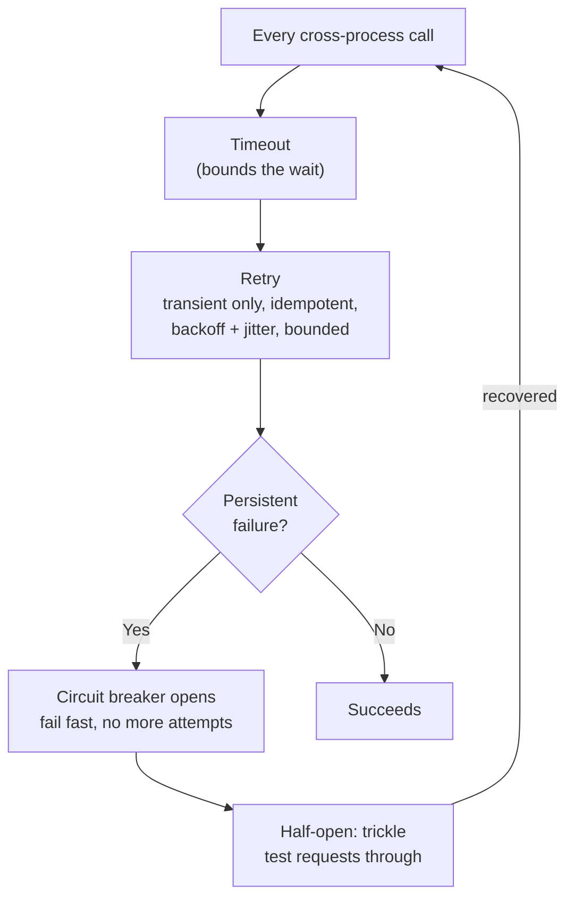

> **TL;DR:** Reliability isn't the absence of failure — it's the system working acceptably despite failures that are *continuously happening*. Design for failure as the default case, not the happy path plus error handling bolted on.

## Reliability vs. availability vs. resilience

| Term | Means |
|---|---|
| **Reliability** | Performs its function correctly over time |
| **Availability** | Up and responding when needed (the "nines," ch. 1) |
| **Resilience** | Absorbs failures and recovers, degrades gracefully |
| **Fault tolerance** | Keeps operating, possibly degraded, despite component failures |

Resilience is the means; reliability and availability are the ends.

## The core resilience patterns

| Pattern | Problem it solves | How |
|---|---|---|
| **Timeout** | A hung dependency blocks the caller forever | Every cross-process call needs one, set above observed p99. Coordinate down a call chain (deadline propagation). |
| **Retry** | Transient failures | Transient errors only, idempotent ops only, exponential backoff + jitter, bounded attempts |
| **Circuit breaker** | Continuing to call a persistently-failing dependency wastes resources | Closed → Open (fail fast, no attempt) → Half-open (test trickle) → Closed |
| **Bulkhead** | One dependency's failure exhausts shared resources, sinking healthy calls too | Separate resource pool (thread/connection) per dependency |
| **Load shedding** | Trying to serve everything under overload collapses the whole system | Reject some requests early and cheaply (fast 503), prioritized — background before user-facing |
| **Graceful degradation** | A failed dependency takes down a whole feature | Disable/simplify the feature that needs it, keep the rest working. A degraded experience beats a broken one. |

> **The retry paradox:** retries exist to improve reliability, but unbounded or un-jittered retries are a leading *cause* of large outages — a struggling service's own clients, all retrying, can finish it off.

## Redundancy and failover

| | Note |
|---|---|
| **Redundancy** | Multiple instances so losing one is survivable — only real if *independent* (different availability zones, not shared power) |
| **Active-active** | All instances serve traffic; failover is instant, nothing idle |
| **Active-passive** | Standby waits idle, promoted on failure; simpler, but paid-for idle capacity and slower promotion |

## Health checks

| Type | Question | On failure |
|---|---|---|
| **Liveness** | Is the process alive? | Restart the instance |
| **Readiness** | Ready for traffic right now? | Stop routing, don't restart |
| **Startup** | Has a slow-starter finished initializing? | Delays liveness checks |

⚠️ A *too-deep* health check (verifying every downstream dependency) can cause its own cascading failure — a shared-dependency blip fails every instance's check simultaneously, pulling the whole fleet from rotation at once.

## Chaos engineering

Deliberately inject failures into production (or production-like) — kill instances, add latency, sever links — to verify the system handles them *before* they find you. Pioneered by Netflix's Chaos Monkey. Disciplined, not reckless: form a hypothesis, inject with a limited blast radius, observe, fix what you found. Converts "we *think* failover works" into "we *watched* failover work."

## Disaster recovery

| Term | Means |
|---|---|
| **RPO** (Recovery Point Objective) | How much data can you afford to lose, in time? |
| **RTO** (Recovery Time Objective) | How long can recovery take? |

| Strategy | Cost/speed |
|---|---|
| Backup-and-restore | Cheap, slow |
| Pilot light | Minimal core running, scaled up on disaster |
| Warm standby | Scaled-down full copy, ready |
| Hot standby / active-active | Near-zero RTO, most expensive |

**A backup is only real if tested by actually restoring it.** Untested backups fail exactly when needed. Must also be isolated from what an attacker (or buggy script) reaching the primary could also delete. **3-2-1 rule:** three copies, two media types, one off-site.

## The reliability mindset

- Failure is continuous and normal — design for it as the default.
- Every cross-process call gets a timeout.
- Retry transient failures only — idempotent, backoff, jitter, bounded.
- Circuit breakers stop cascades; bulkheads isolate resources.
- Shed load and degrade gracefully under overload.
- Redundancy removes single points of failure; failover must be *tested*, not assumed.
- Chaos engineering turns assumed resilience into verified resilience.

**Idempotency (ch. 2, 6, 7) is the foundation that makes all of this safe** — without it, none of the retry-based recovery model can run without corrupting data.
