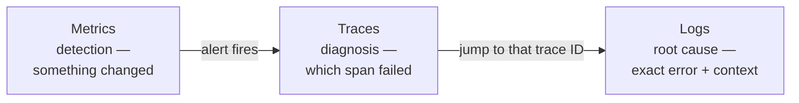

> **TL;DR:** Monitoring tells you *whether* the system is healthy (known signals, known problems). Observability lets you ask *new* questions without shipping new code — including ones you didn't anticipate. Modern systems fail in unpredicted ways, so observability is the actual goal.

## The three pillars



| Pillar | Answers | Cost |
|---|---|---|
| **Logs** | What exactly happened, in detail | Volume — sampling/tiered retention needed at scale |
| **Metrics** | *That* something changed (error rate tripled) | Cheap, compact, high resolution, long retention |
| **Traces** | *Where* in a multi-service request the time/failure went | Needs context propagation across every hop |

**Correlation IDs** are the connective tissue — a shared trace ID stamped on every log line, span, and metric dimension turns three disconnected datasets into one flowing investigation.

**Structured logging is non-negotiable** — JSON, not prose:
```json
{"timestamp":"...","level":"error","service":"checkout","event":"payment_failed","trace_id":"a1b2c3","duration_ms":3018}
```
Queryable ("all payment_failed events for this user in the last hour"); `grep`-and-hope on prose logs cannot answer that.

**Metrics frameworks:**

| Method | For | Watches |
|---|---|---|
| **RED** | Request-driven services | Rate, Errors, Duration |
| **USE** | Resources (CPU, memory, disk) | Utilization, Saturation, Errors |

Dominant tools: **Prometheus** (pulls metrics) + **Grafana** (dashboards). **OpenTelemetry** is the standard framework for traces/metrics/logs; **Jaeger/Zipkin** are trace backends.

## Dashboards and alerting

**A dashboard is a communication tool** — a wall of 200 graphs no one can read under pressure has failed. Build a top-level health dashboard (RED + SLO status) for "is it healthy?" in one glance; per-service dashboards for diagnosis.

**Alert fatigue is the central failure mode.** Noisy alerts train people to ignore them — then the one that matters gets ignored too.

- **Alert on symptoms, not causes** — "error rate above SLO," not every internal metric. High CPU alone isn't a problem.
- **Alert on SLO burn rate** — ties alerts to the error budget (ch. 1), distinguishing "look tomorrow" from "wake someone now."
- **Every alert must be actionable** — if the recipient can do nothing, it's a dashboard entry, not a page.
- **Tier by urgency** — not everything deserves a 3am page.

## On-call, incidents, postmortems

| Practice | Key discipline |
|---|---|
| **On-call** | Sustainable: humane rotations, alert volume low enough to sleep |
| **Incident response** | A clear incident commander who *coordinates*, doesn't personally debug |
| **Postmortems** | **Blameless** — focused on systemic causes, not punishing an individual. Blame makes people hide information, which destroys the learning. |

## Deployment strategies

| Strategy | Downtime | Rollback | Cost |
|---|---|---|---|
| Recreate | Yes | — | Simplest |
| Rolling | No | Slow (itself a roll) | Old & new versions coexist during rollout |
| **Blue-green** | No | **Instant** — switch back | Two full environments during switch |
| **Canary** | No | Halt at small blast radius | Needs good observability to see it going wrong |
| Feature flags | Decouples deploy from release | Instant kill switch | Flag debt accumulates |

Cross-cutting requirement: **backward compatibility** — rolling/canary deploys guarantee old and new code run simultaneously. This is the expand-contract discipline (ch. 4) again.

## CI/CD, IaC, containers

- **CI** — every change built and tested on every commit, catches breakage while it's small.
- **CD** — delivery (always deployable) vs. deployment (ships automatically). Small, frequent, automated releases are safer releases — easy to review, easy to revert.
- **Infrastructure as Code** (Terraform, Pulumi) — reproducible, reviewable, version-controlled infra. Ends the *snowflake server* no one dares touch.
- **Containers** (Docker) package an app with its dependencies — ends "works on my machine." **Kubernetes** orchestrates them at scale — powerful, genuinely complex, worth it for large containerized systems; often more machinery than a small app needs.

## The through-line

Instrument all three pillars and connect them with correlation IDs. Aim for observability, not just monitoring. Alert on symptoms, keep alerts few and actionable. Run blameless postmortems. Deploy in small, automated, reversible increments with backward-compatible migrations.
