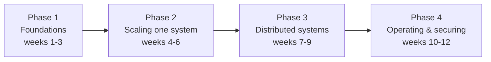

> **TL;DR:** Twelve weeks. You don't learn backend engineering by reading — you learn it by reading, building, then reflecting on the gap between what you expected and what happened. Each week: **Read** (~2h, incl. one engineering-blog piece from ch. 14) → **Build** (~3-4h, small and ugly on purpose) → **Reflect** (~30min, written).

Total ~5-6 hours/week. Take 14-16 weeks if that's tight — the *sequence* matters, the calendar doesn't.

## Phase 1 — Foundations

| Week | Read | Build | Reflect on |
|---|---|---|---|
| 1 | Ch. 1 Foundations | Load-test any HTTP endpoint, report p50/p90/p99/p999 — not the average. Add a 200ms delay to 1% of responses and watch the average vs. p99 diverge. | Why is average latency misleading? Name 3 tradeoffs from a system you use daily. |
| 2 | Ch. 3 Databases | Take a table with 100k+ rows. Query an unindexed column, time it. Add an index, time it again. Run `EXPLAIN ANALYZE` on both. Add 5 more indexes, measure the `INSERT` slowdown. | B-tree vs. LSM-tree — what does each optimize? When would you be *wrong* to choose a document store? |
| 3 | Ch. 4 Data Modeling + Ch. 2 API Design | Design a schema (library, ticketing, expense tracker) to ~3NF, write the DDL. Denormalize one hot-read path and write the sync code. Sketch a REST API over the same domain. | What anomaly does each normalization step remove? What did your denormalization buy, and what did you sign up to maintain? |

## Phase 2 — Scaling one system

| Week | Read | Build | Reflect on |
|---|---|---|---|
| 4 | Ch. 5 Caching | Cache-aside a slow query from week 2. Measure hit vs. miss latency. Deliberately trigger a stampede, a penetration, and an avalanche — watch load hit the DB each time. | Which of the three failures surprised you most? What TTL for 3 different kinds of data, and why? |
| 5 | Ch. 6 Queues | Move a slow operation off the request path onto a job queue + worker (BullMQ/Celery/Sidekiq — not Kafka). Make the worker fail 30% randomly; add retry+backoff+DLQ. Make it non-idempotent, observe double-processing, then fix it. | Why is "exactly-once delivery" a myth? How did you make your consumer idempotent? |
| 6 | Ch. 9 Scaling | Stand up a Postgres primary + one read replica (Docker, ~20 min). Write, then immediately read from the replica — catch the missing row (read-your-own-writes anomaly). Fix by routing that read to the primary. On paper, choose a shard key for a `posts` table and name its hotspots. | Why does leader-follower replication scale reads but not writes? What made your shard key choice hard? |

## Phase 3 — Distributed systems (the deep end — pace yourself)

| Week | Read | Build | Reflect on |
|---|---|---|---|
| 7 | Ch. 7 Distributed Systems | Two services calling each other over HTTP. Add a timeout; make the callee hang, watch behavior with/without it. Add retries with backoff+jitter; launch many clients at once to trigger a retry storm. | Explain the two-generals problem. Why are timeouts+retries+idempotency one inseparable pattern? |
| 8 | Ch. 8 Consistency & Consensus (read it twice) | Simulate a quorum: N replicas as an array, write to W, read from R. Verify W+R>N always sees the latest write; W+R≤N sometimes doesn't. Vary N/W/R. | State CAP *correctly*. For 4 features of a product you know, which consistency model does each actually need? |
| 9 | Ch. 10 Architecture | Structure your week-3 domain as a modular monolith — explicit interfaces, no module reaching into another's tables. Write a one-pager: which module would extract first, and what would it cost? | Why do microservices solve an organizational problem more than a technical one? What is a saga giving up vs. a real distributed transaction? |

## Phase 4 — Operating and securing

| Week | Read | Build | Reflect on |
|---|---|---|---|
| 10 | Ch. 11 Reliability | Add a circuit breaker (library, not hand-rolled) to your week-7 call. Make the callee fail persistently, watch it open → fail fast → half-open → recover. Add a fallback. | How does a circuit breaker prevent a cascade? Why can retries *cause* an outage? |
| 11 | Ch. 12 Observability | Add structured JSON logging with a correlation ID per request. Expose basic RED metrics. Trace one request end-to-end across both services via its correlation ID. | Monitoring vs. observability — what's the actual difference? Why alert on symptoms, not causes? |
| 12 | Ch. 13 Security + re-read Ch. 1 | Audit a system you built this plan against ch. 13 (parameterized queries? per-resource authz? secrets in git history?). Fix what you find. **Capstone:** a 3-5 page design doc for a system of your choosing, naming a tradeoff in *every* section — data model, API, caching, scaling, consistency, failure handling, observability, security. | The capstone *is* the reflection: could you defend every decision to a skeptical senior engineer, including what you'd choose differently under changed constraints? |

## After the twelve weeks

You won't be "done" — backend engineering doesn't have a done — but you'll have the reflex to look at a design and immediately ask *what does this trade away, and are those the right things to trade here?*

Three ways forward: **go deeper on theory** (read *Designing Data-Intensive Applications* cover to cover — it will land now, you have the scaffolding). **Go deeper on practice** (build the capstone for real, deployed, with observability and resilience in place, and write publicly about the tradeoffs you actually hit). **Mind the fork** — this glossary sets up a full-stack trajectory cleanly, and AI engineering reuses a surprising amount of it (RAG pipelines are data pipelines, inference services are services). Either way, nothing here is wasted.
