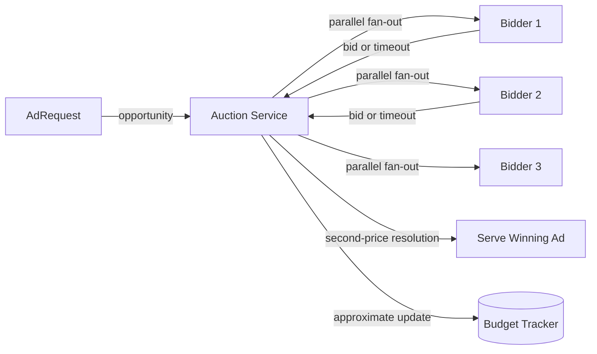

## Overview

- **Real-world analog:** the real-time bidding (RTB) infrastructure behind programmatic
  advertising
- **Difficulty:** Hard

An ad request triggers an auction among many independent bidders — and the entire
auction, fan-out, scoring, and settlement has to complete inside roughly 100
milliseconds, because the ad has to actually render as part of a page load a real user
is waiting on. This is a distributed computation problem where the deadline isn't a
nice-to-have performance target — it's a hard constraint that shapes the architecture
from the ground up.

## Clarifying Questions & Requirements

> **Ask these first:** how many bidders participate per auction? What's the hard
> latency deadline? First-price or second-price auction? How is an advertiser's daily
> budget paced across the day?

| | In scope | Out of scope |
|---|---|---|
| **Functional** | Fan out an ad opportunity to bidders, collect bids within a deadline, run the auction, serve the winning ad, track spend against budget | Building any individual bidder's own bidding strategy/model |
| **Non-functional** | Hard deadline (~100ms) for the entire auction, including all network round-trips | Perfect budget pacing precision (a real-time approximation is the accepted target) |

Assume: dozens of bidders participate per auction, a 100ms hard deadline, and a
second-price auction format.

## Back-of-Envelope Estimation

| | Estimate |
|---|---|
| Auctions/sec at peak | Millions across a large ad exchange |
| Bidders contacted per auction | Dozens |
| Hard deadline | ~100ms, including fan-out, bid collection, and auction resolution |
| Budget tracking granularity | Near-real-time, across potentially millions of concurrent auctions per advertiser |

The deadline is the number every other decision in this system is subordinate to —
there's no tradeoff that's allowed to violate it.

## API Design

```
POST /auction    {adSlot, userContext, deadline: 100ms}   → 200 {winningAd, clearingPrice}
```

Internally, this fans out to each bidder's own bid endpoint in parallel, all racing
against the same shared deadline.

## Data Model & Storage

```
budgets
  advertiser_id    text PK
  daily_budget      decimal
  spent_today       decimal    -- updated near-real-time, approximately

auction_log
  auction_id, winning_bidder, clearing_price, timestamp
```

| Choice | Why |
|---|---|
| **Parallel, async fan-out to all bidders with a hard deadline cutoff**, not sequential polling | Contacting bidders one at a time and waiting for each response would make total auction time scale with bidder count — entirely incompatible with a 100ms budget for dozens of bidders. Firing all bid requests simultaneously and collecting whichever respond before the shared deadline is what makes the deadline achievable regardless of how many bidders participate |
| **Second-price auction — the winner pays the second-highest bid, not their own**, not a first-price format | In a first-price auction, bidders are incentivized to strategically underbid their true valuation to avoid overpaying, which degrades price discovery and forces every bidder into more complex guessing strategies. A second-price auction removes that incentive — bidding your true value is the optimal strategy regardless of what others bid, which produces cleaner, more predictable market dynamics |
| **Approximate, near-real-time budget tracking, not a synchronous ledger check on every bid** | Checking and decrementing an advertiser's exact remaining budget synchronously, across millions of concurrent auctions per advertiser, would need a highly contended shared counter checked on the deadline-critical path — instead, spend is tracked with a small amount of acceptable lag, and pacing algorithms smooth spend across the day using that approximate signal rather than a perfectly exact one |

## High-Level Architecture



## Deep Dives

**1. The deadline is a design constraint, not a failure-handling concern.** A bidder
that doesn't respond within the deadline is simply excluded from that specific auction
— there's no retry, because a retry would itself take time the auction doesn't have.
This inverts how timeouts are usually treated elsewhere in this course (as a trigger for
recovery logic): here, "didn't respond in time" is a completely normal, expected outcome
for a fraction of bidders on every single auction, not an error condition.

**2. Parallel fan-out with a shared deadline is what makes bidder count independent of
total auction time.** Every bidder is contacted at effectively the same instant, and the
auction proceeds the moment the deadline passes or all bidders have responded, whichever
comes first — adding more bidders to the pool doesn't linearly increase auction time the
way sequential contact would, because they're all racing the same clock simultaneously
rather than each adding to a cumulative wait.

**3. Budget pacing is itself a variant of the distributed rate-limiting problem covered
elsewhere in this course.** An advertiser's daily budget needs to be spent smoothly
across the day rather than exhausted in the first hour — this requires tracking
near-real-time spend across many concurrent, geographically distributed auctions without
that tracking itself becoming a latency bottleneck on the deadline-critical path, the
same fundamental tension the global rate limiter chapter addresses, applied to spend
rather than request count.

**4. Second-price settlement changes what "winning" actually costs, and the mechanism
has to be understood precisely.** The winning bidder is determined by the highest bid,
but the price they actually pay is the second-highest bid (plus a small increment,
typically) — not their own bid. This is what removes the incentive to underbid
strategically: bidding exactly your true valuation never costs you more than necessary
and never loses you an auction you were willing to pay more to win.

## Bottlenecks & Failure Modes

| Bottleneck | Mitigation | Tradeoff accepted |
|---|---|---|
| Slow bidders threatening the deadline | Hard timeout cutoff, exclude non-responders from that auction | Some bidders miss auctions they might have won with slightly more time |
| Budget tracking becoming a contended hot path | Approximate, near-real-time tracking rather than a synchronous exact ledger | Budget can be slightly over- or under-spent relative to the exact target at any given instant |
| Fan-out to many bidders at extreme auction volume | Async, non-blocking parallel requests, not per-bidder threads/connections held synchronously | Requires infrastructure genuinely built for high-concurrency async I/O |

## Why Not X?

**Why not extend the timeout to let more bidders respond and improve auction quality?**
The ad has to render as part of an actual page load a real user is waiting on — a longer
deadline directly degrades page performance for that user, so latency here is a hard
constraint on user experience, not a tunable knob for auction quality.

**Why not use a first-price auction instead of second-price?** Incentivizes bidders to
strategically underbid to avoid overpaying relative to what they'd have actually needed
to win, which produces worse price discovery for the market as a whole and forces every
participant into more complex bidding strategy just to avoid loss — second-price avoids
this by design, at the cost of a slightly less intuitive settlement mechanism to explain.

**Why not a synchronous budget check against a central ledger before every bid is
allowed to participate?** Adds a real-time, cross-datacenter dependency to every single
auction an advertiser participates in, at a volume of millions of auctions/sec platform-
wide — an approximate, asynchronously-updated budget tracker avoids putting that
contended check on the deadline-critical path.

## Interview Signals

| | Strong answer | Weak answer |
|---|---|---|
| Deadline handling | Treats a bidder timeout as a normal, expected outcome, not an error to retry | Proposes retrying slow bidders, which would blow the deadline |
| Fan-out | Explains why parallel async fan-out decouples auction time from bidder count | Proposes contacting bidders sequentially |
| Auction mechanics | Explains second-price settlement and why it changes bidder incentives | Doesn't distinguish first-price from second-price, or explain why it matters |

**Common failure modes:** treating a slow bidder as a failure to retry rather than an
expected exclusion; sequential bidder contact that can't meet the deadline at scale; no
understanding of why second-price settlement affects bidding behavior.

## Glossary Links

No shared-glossary terms apply directly to this chapter's core mechanisms.
