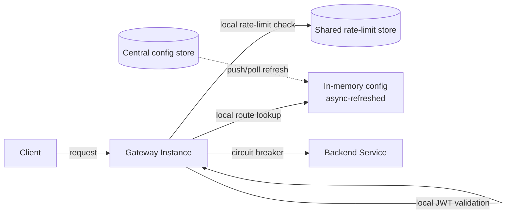

## Overview

- **Real-world analog:** Kong, AWS API Gateway, or an internal envoy-based edge layer
- **Difficulty:** Medium

Every backend service in this course has needed auth, rate limiting, and request
routing at some point. An API gateway is the design decision to solve those problems
exactly once, centrally, instead of every service reimplementing them slightly
differently — which sounds simple until the gateway itself becomes the single point
every request in the system passes through.

## Clarifying Questions & Requirements

> **Ask these first:** does the gateway terminate authentication itself, or just
> forward credentials downstream? How many backend services sit behind it? Is
> per-route configuration expected to change frequently?

| | In scope | Out of scope |
|---|---|---|
| **Functional** | Route requests to the correct backend, authenticate/authorize, rate limit per client, transform requests/responses | Building the backend services themselves |
| **Non-functional** | The gateway must not become a slower path than calling backends directly; must be highly available (no single point of failure) | Complex API composition/aggregation across multiple backend calls (a further extension) |

Assume: dozens of backend services behind the gateway, route/auth config that changes
routinely, and a requirement that the gateway itself never becomes the system's
availability bottleneck.

## Back-of-Envelope Estimation

| | Estimate |
|---|---|
| Total request volume through the gateway | Sum of all backend traffic — often the single highest-QPS component in the whole system |
| Added latency budget | Single-digit milliseconds — anything more is a tax on every request to every backend |
| Config change frequency | Route/auth rules can change multiple times/day as services deploy |

Because the gateway sits in front of everything, its own latency overhead is multiplied
across the entire system's traffic — a small inefficiency here is not small in
aggregate.

## API Design

The gateway's own "API" is really its configuration surface:

```
PUT /routes/{path}     {backendUrl, authRequired, rateLimit}   → 200
GET /routes                                                     → 200 [routes]
```

Actual traffic just flows through transparently, routed according to this config.

## Data Model & Storage

```
routes
  path            text PK
  backend_url     text
  auth_required   bool
  rate_limit      int    -- requests/min per client

api_keys
  key             text PK
  client_id       uuid
  scopes          text[]
```

| Choice | Why |
|---|---|
| **Route/auth config replicated locally to each gateway instance, refreshed asynchronously**, not read from a central store on every request | Reading config from a shared database on every single request through the gateway adds a dependency and latency to the highest-traffic path in the system. Each gateway instance instead holds an in-memory copy, refreshed on a short interval (or pushed via events on change) — trading a small propagation delay for removing the config store from the request hot path entirely |
| **JWT validation done locally at the gateway**, not a network call to an auth service per request | Validating a signed JWT is a local cryptographic check against a known public key — no network round-trip needed. Calling out to a separate auth service on every request would add exactly the kind of latency tax this design is trying to avoid |

## High-Level Architecture



## Deep Dives

**1. The gateway has to be stateless and horizontally scaled, by necessity.** Since
every request in the system passes through it, a single gateway instance is a hard
single point of failure for the entire platform. Statelessness (all shared state —
rate-limit counters, revoked tokens — lives in an external store like Redis, not gateway
process memory) is what makes running many identical gateway instances behind a load
balancer safe and simple, rather than needing sticky sessions or instance-specific state.

**2. Circuit breaking per backend, so one slow service doesn't take down the gateway's
capacity for every other service.** If one backend starts responding slowly, requests to
it can pile up holding gateway connections/threads waiting on responses, starving
capacity that unrelated requests to healthy backends need. A circuit breaker per backend
(trip to "open" after a failure/latency threshold, reject fast instead of waiting, retry
occasionally to check recovery) is a form of load shedding — deliberately rejecting
requests to the struggling backend to protect capacity for every other backend's
traffic.

**3. Config propagation delay is an accepted, explicit tradeoff.** Because config is
locally cached and asynchronously refreshed rather than read live, a route or auth
change takes up to the refresh interval to actually take effect across the whole
gateway fleet. This is deliberately chosen over synchronous config reads — the same
tradeoff CDN purge propagation makes, for the same underlying reason: reading shared
state on every request doesn't scale to this request volume.

**4. The same routing config that sends traffic to the right backend can also drive
progressive rollout.** Once route config is dynamic and fast-propagating (the mechanism
already built for ordinary routing), it's a small extension to route a configurable
percentage of traffic for a given path to a new backend version instead of the old one —
canary releases and progressive rollout become a routing-config change, not a separate
system, precisely because the gateway already centralizes exactly the decision that
needs to change.

## Bottlenecks & Failure Modes

| Bottleneck | Mitigation | Tradeoff accepted |
|---|---|---|
| Gateway as a single point of failure | Stateless design, horizontally scaled behind a load balancer | Shared state (rate limits, revoked tokens) needs an external store |
| One slow backend starving gateway capacity | Per-backend circuit breaking | Requests to a tripped-open backend fail fast rather than eventually succeeding |
| Config change propagation delay | Async refresh with a short interval | Route/auth changes aren't instantaneous across the fleet |

## Why Not X?

**Why not have each backend service implement its own auth and rate limiting?**
Duplicates the same logic across every service with a real risk of subtle
inconsistencies between implementations, and does nothing to protect network and
connection capacity upstream of the backends themselves — a malicious or buggy client
can still exhaust connection slots even if every backend correctly rejects the request
once it arrives.

**Why not call a central auth service synchronously on every request instead of local
JWT validation?** Adds a network round-trip to every single request through the highest-
traffic point in the system — local signature validation against a known public key
achieves the same security property without that latency cost, at the price of a slight
delay in revocation propagation (mitigated with short token lifetimes plus a revocation
list check).

**Why not have clients call each backend service's own load balancer directly for
internal-to-internal calls, skipping the gateway?** For service-to-service traffic that
doesn't need external auth or public rate limiting, this is often reasonable — but for
any traffic that does need centralized auth, quota enforcement, or observability,
bypassing the gateway means reimplementing those concerns at the call site, which is the
exact duplication the gateway exists to avoid.

## Interview Signals

| | Strong answer | Weak answer |
|---|---|---|
| Statelessness | Explains why the gateway must be stateless to scale horizontally | Designs a gateway that holds meaningful state in process memory |
| Latency discipline | Recognizes that gateway overhead is multiplied across all traffic and minimizes it deliberately | Adds synchronous calls to other services without weighing the latency cost |
| Failure isolation | Proposes per-backend circuit breaking | Assumes one slow backend has no effect on requests to other backends |

**Common failure modes:** a gateway design with meaningful local state that prevents
horizontal scaling; no circuit breaking, letting one bad backend degrade everything; a
central config or auth read on the hot path of every request.

## Glossary Links

This question draws on: Load shedding — linked on first mention above (circuit breaking
as a form of shedding load away from a struggling backend).
