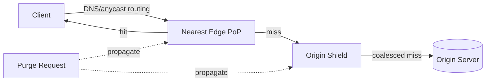

## Overview

- **Real-world analog:** Cloudflare, Fastly, Akamai
- **Difficulty:** Medium-Hard

Every other question in this course caches things *within* one service. A CDN is caching
as the entire product — hundreds of points of presence worldwide, each one a cache in
front of an origin, and the two genuinely hard problems are getting a request to the
*nearest* cache and making a purge actually propagate everywhere it needs to.

## Clarifying Questions & Requirements

> **Ask these first:** static assets only, or dynamic/personalized content too? How
> fast does an invalidation/purge need to propagate? Is origin protection (shielding
> against a stampede of misses) in scope?

| | In scope | Out of scope |
|---|---|---|
| **Functional** | Cache and serve static content from edge locations, route requests to the nearest edge, support purge/invalidation, serve private content via a signed URL rather than public caching | Full dynamic personalization at the edge (edge compute is a further extension) |
| **Non-functional** | Sub-50ms edge response for cache hits, purge propagation within seconds globally, origin protected from thundering-herd misses | Perfect global cache consistency the instant content changes (purge is inherently eventually consistent) |

Assume: hundreds of edge PoPs globally, each serving thousands of requests/sec, fronting
a much smaller number of origin servers.

## Back-of-Envelope Estimation

| | Estimate |
|---|---|
| Global request volume | Millions/sec across all edge PoPs combined |
| Cache hit ratio target | 90%+ for well-cached static content |
| Origin traffic (after caching) | A small fraction of total — this is the entire point of a CDN's economics |
| Purge propagation target | Seconds, to hundreds of PoPs simultaneously |

The economics only work if the hit ratio is high — a CDN serving mostly misses is just a
slower, more complex path to the origin.

## API Design

The CDN's "API" is mostly transparent HTTP — the operationally relevant surface is
configuration and purge:

```
GET  /any-cached-path          → served from edge cache | forwarded to origin on miss
POST /purge  {urls[] | tags[]}  → 202 (propagating)
```

## Data Model & Storage

There's no traditional schema — each edge node holds a local cache keyed by request URL
(plus relevant headers, forming the *cache key*). The data-model decisions that matter
are about that key and about propagating purges.

| Choice | Why |
|---|---|
| **Cache key includes only the headers that actually vary the response** (e.g., `Accept-Encoding`, not `User-Agent` unless content genuinely differs by it) | An overly broad cache key (including headers that don't actually change the response) fragments the cache into many near-identical entries, tanking the hit ratio for no benefit. An overly narrow one risks serving the wrong variant to the wrong client. Getting this right is most of what determines real-world hit ratio |
| **An origin shield layer — one intermediate caching tier between edge PoPs and the actual origin**, not every edge PoP hitting origin directly on a miss | Without a shield, a newly-published or purged popular object gets requested by every edge PoP worldwide nearly simultaneously on the next request — hundreds of simultaneous origin hits for the same object. A shield layer coalesces those into far fewer actual origin requests, serving the rest of the edge fleet from itself once the first request populates it |

## High-Level Architecture



## Deep Dives

**1. Routing a request to the nearest edge.** Two real approaches exist, and a strong
answer names both. **Anycast**: the same IP address is announced from every PoP, and
internet routing (BGP) naturally sends a client's packets to whichever announcing PoP is
network-topologically closest — fast and automatic, but coarse-grained (topological
closeness isn't always geographic closeness). **DNS-based geo-routing**: the DNS
resolver returns a different edge IP depending on the resolving client's apparent
location — more control over routing logic, but adds DNS resolution as a dependency and
can be fooled by clients using a distant DNS resolver.

**2. Why purge is necessarily eventually consistent, not synchronous.** Guaranteeing a
purge has taken effect at every one of hundreds of globally distributed PoPs before
returning success would mean waiting on the slowest, most distant, or momentarily
unreachable PoP on every purge call — an availability and latency disaster. Real CDN
purge is fire-and-forget-with-propagation: the purge call returns once it's durably
queued for delivery, and PoPs apply it as the message reaches them, typically within a
few seconds — a deliberate, stated eventual-consistency tradeoff, not an oversight.

**3. The origin shield's job is request coalescing, not just extra caching.** When ten
edge PoPs simultaneously miss on the same URL, the shield layer ensures only one of
those ten actually reaches the origin — the other nine either wait on that in-flight
request or are served once it completes, the same single-flight coalescing pattern used
against cache stampedes throughout this course, just applied at a different layer of the
stack (edge-to-origin, rather than app-to-database).

**4. Stale-while-revalidate trades a small correctness window for perceived latency.**
Rather than blocking a request on origin the instant a cached object's TTL expires, an
edge can serve the (now-stale) cached copy immediately while asynchronously fetching a
fresh copy in the background for the *next* request. The requesting client gets a fast
response every time, at the cost of occasionally receiving content that's a few seconds
past its nominal freshness window — a tradeoff most static and semi-static content is
well suited to, though it's the wrong choice for anything requiring strict freshness.

## Bottlenecks & Failure Modes

| Bottleneck | Mitigation | Tradeoff accepted |
|---|---|---|
| Origin overwhelmed by simultaneous misses across many PoPs | Origin shield with request coalescing | An extra caching tier to operate |
| Overly broad cache keys fragmenting the cache | Careful cache-key design — only vary on headers that actually change the response | Requires ongoing tuning as response variation changes over time |
| Purge needing to reach every PoP | Asynchronous, propagated purge with a target SLA (seconds), not synchronous confirmation | A short window where some PoPs still serve stale content after a purge is issued |

## Why Not X?

**Why not have every edge PoP fetch directly from origin on a cache miss?** Works at low
scale, but at hundreds of PoPs, a popular object's first request after being cold (or
just purged) can trigger near-simultaneous requests from every PoP worldwide — an origin
shield exists specifically to absorb that and reduce it to a handful of actual origin
hits.

**Why not make purge synchronous and wait for confirmation from every PoP?** The
latency and availability cost is disproportionate — one slow or temporarily unreachable
PoP would block every purge operation globally. Async propagation with a fast (seconds-
scale) target SLA achieves the practical goal without that fragility.

**Why not set very long TTLs on everything to maximize the hit ratio?** A long TTL
means an update takes that long to naturally propagate through cache expiry alone —
fine for an asset with a hashed filename that never changes in place, much riskier for
anything that can be updated at the same URL. Stale-while-revalidate plus an explicit
purge path (rather than relying purely on long TTLs) gets a high hit ratio without
trading away the ability to push an urgent update quickly.

## Interview Signals

| | Strong answer | Weak answer |
|---|---|---|
| Routing | Names both anycast and DNS-based geo-routing, with their tradeoffs | Says "route to the nearest server" without explaining the mechanism |
| Origin protection | Proposes a shield layer with request coalescing | Assumes every edge PoP can hit origin directly with no consequence |
| Purge | States explicitly that purge is eventually consistent, with a target propagation time | Assumes purge is instantaneous everywhere |

**Common failure modes:** no origin protection against a multi-PoP stampede; treating
purge as synchronous and instant; an overly broad or overly narrow cache key with no
justification.

## Glossary Links

This question draws on: Signed URL — linked on first mention above (relevant when
private/paid content needs time-limited edge-cacheable access rather than public
caching).
