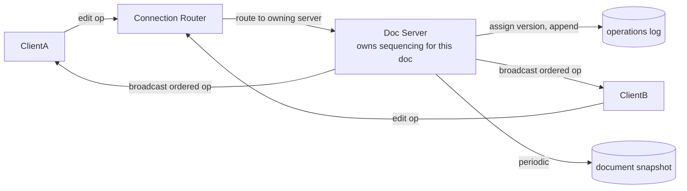

## Overview

- **Real-world analog:** Google Docs, Notion's real-time editing
- **Difficulty:** Hard
- **Frontend counterpart:** [Collaborative Editor](/system-design/c/collaborative-editor)
  covers the client-side CRDT/OT integration and local-first editing feel — this chapter
  is the server that has to actually sequence concurrent edits from many clients into
  one consistent document, and persist it without rewriting the whole document on every
  keystroke.

Many clients can type into the same document at the same instant. The server's job is
turning that chaos into one agreed-upon sequence of changes — and doing it without
storing the entire document body freshly on every single keystroke, which is the naive
approach that falls over immediately at any real scale.

## Clarifying Questions & Requirements

> **Ask these first:** does the server need to be the authority for conflict
> resolution (server-authoritative OT), or can clients merge changes among themselves
> (peer-oriented CRDT)? Is full edit history/version recovery required?

| | In scope | Out of scope |
|---|---|---|
| **Functional** | Accept concurrent edits from multiple clients, merge them into one consistent document, persist state, support version history | Rich media embedding, comment threads (related but separate subsystems) |
| **Non-functional** | Every client converges to the same document state; persistence doesn't require rewriting the full document on every change | Fully peer-to-peer editing with no server involved at all |

Assume: a server-authoritative model (most production collaborative editors use one,
even those built on CRDTs internally), since it also simplifies permissions and access
control, which a pure peer-to-peer model complicates.

## Back-of-Envelope Estimation

| | Estimate |
|---|---|
| Keystrokes/sec in an actively co-edited document | Tens, from a handful of concurrent editors — genuinely small |
| Documents open for editing concurrently, platform-wide | Can be very large (hundreds of thousands) |
| Per-document load | Almost always tiny; the scaling challenge is the *number* of documents, not the load on any one |

This is a wide, shallow scaling problem — millions of lightly-loaded independent
documents — rather than a narrow, deep one. That shapes the sharding strategy directly.

## API Design

Mostly a persistent connection protocol (WebSocket), not request/response REST:

```
WS   /docs/{id}/edit         →  bidirectional stream of ops
GET  /docs/{id}/snapshot      →  200 {content, version}
GET  /docs/{id}/history        →  200 [versions]
```

## Data Model & Storage

```
documents
  id             uuid PK
  content         text        -- latest materialized snapshot
  version         bigint

operations
  doc_id          uuid
  version          bigint     -- monotonic per document, same ordering pattern as team chat
  op               json        -- the actual edit operation
  PRIMARY KEY(doc_id, version)
```

| Choice | Why |
|---|---|
| **An append-only operations log as the source of truth, with periodic snapshots**, not persisting the full document body on every edit | Persisting the whole document on every keystroke is write amplification proportional to document size on every single character typed. Appending just the small operation (insert "x" at position N) is a tiny, cheap write regardless of document size — the full document state is reconstructed by replaying operations from the last snapshot, and periodic snapshots (every N operations) bound how many ops ever need replaying |
| **A single server instance owns sequencing for a given document**, with other servers proxying connections to it, rather than any server accepting edits for any document | Assigning a strict version/order to concurrent edits needs one authority per document — the same reasoning as team chat's per-channel sequence numbers. Given the wide-shallow load shape (many documents, each lightly loaded), pinning each document's sequencing to one server and sharding documents across many such servers scales by adding servers, not by making any single server handle more |

## High-Level Architecture



## Deep Dives

**1. Server-authoritative sequencing resolves concurrent edits deterministically.**
When two clients edit near-simultaneously, both operations arrive at the server that
owns that document's sequencing, which assigns them a strict order (the next two
version numbers) and transforms or merges them as needed (the actual OT/CRDT merge
logic) before broadcasting the resulting ordered operations back to every connected
client. Every client ends up applying the same operations in the same order, which is
what guarantees convergence — this is the property the frontend counterpart's CRDT/OT
integration is built to consume.

**2. Snapshots bound replay cost without losing the operations log's benefits.** Without
periodic snapshots, reconstructing a long-lived, heavily-edited document's current state
means replaying its entire operation history from the beginning — fine for a young
document, increasingly expensive for an old one. A snapshot taken every, say, 500
operations means replay only ever needs to process the operations since the most recent
snapshot, bounding reconstruction cost regardless of a document's total edit history.

**3. Sharding by document, not by user or by shard-of-users.** Because a single
document's load is nearly always small, and the platform-wide challenge is the sheer
count of concurrently-open documents, routing each document's WebSocket connections to
whichever server currently owns its sequencing (via a lookup/routing layer) scales
horizontally just by adding more document-owning server instances — no single server
needs to hold state for more documents than it can comfortably handle in memory.

**4. Presence and cursor position are ephemeral state, and deliberately never touch the
durable operations log.** Where each collaborator's cursor currently sits changes many
times per second and has no value once the session ends — writing it through the same
durable, ordered append path as actual document edits would inflate the op log with
high-frequency data that's worthless for reconstruction or history. Presence and cursor
updates are instead broadcast directly between currently-connected clients via the
document's owning server, held only in memory, and simply vanish on disconnect.

## Bottlenecks & Failure Modes

| Bottleneck | Mitigation | Tradeoff accepted |
|---|---|---|
| Write amplification from persisting full document state per edit | Append-only op log with periodic snapshots | Reconstructing current state requires replaying ops since the last snapshot |
| A document-owning server going down mid-session | Reconnect and re-route to a new owning server, replaying from the last durable snapshot + op log | A brief reconnection interruption for clients editing that specific document |
| Very large document count platform-wide | Shard by document across many owning servers | A routing/lookup layer is needed to find which server currently owns a given document |

## Why Not X?

**Why not persist the full document body on every single edit for simplicity?**
Correct, but the write cost scales with document size on every keystroke rather than
with the size of the actual edit — for a large document with frequent small edits, this
is enormously wasteful compared to appending just the operation itself.

**Why not a fully peer-to-peer model with no server-authoritative sequencing at all?**
CRDTs make peer-to-peer merge mathematically sound without a central authority, but a
real product still needs the server for permissions, access control, and durable
persistence — most production collaborative editors keep a server in the loop even when
using CRDT-style merge logic internally, specifically because those concerns don't
disappear just because the merge algorithm doesn't strictly require a central authority.

**Why not persist cursor and presence updates the same way as document edits, for a
uniform data model?** Cursor position changes far more frequently than document content
and has zero value after the session ends — persisting it through the durable op log
would multiply write volume for data that's pure noise from a reconstruction-and-history
standpoint. Treating it as ephemeral, in-memory-only state broadcast directly between
clients is both cheaper and more honest about what that data actually is.

## Interview Signals

| | Strong answer | Weak answer |
|---|---|---|
| Persistence | Uses an operations log with snapshots, not full-document writes per edit | Persists the entire document body on every keystroke |
| Sequencing | Assigns one authority per document for ordering, explains why | Doesn't address how concurrent edits get a consistent order at all |
| Scaling shape | Recognizes this as a wide-shallow problem (many light documents) and shards accordingly | Designs for a narrow-deep problem (one document with extreme load) that doesn't match the actual access pattern |

**Common failure modes:** persisting full document state on every edit; no per-document
sequencing authority; treating this as a raw-throughput scaling problem rather than a
connection-count/document-count one.

## Glossary Links

This question draws on: CRDT — linked on first mention above; Operational Transformation
— linked on first mention above.
