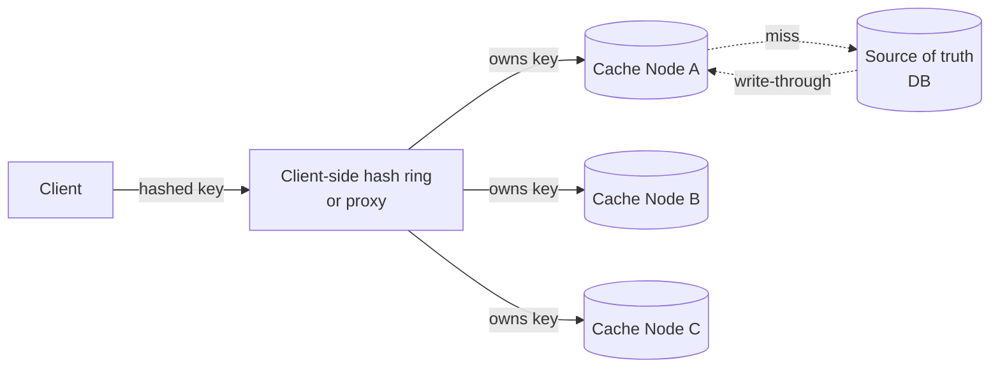

## Overview

- **Real-world analog:** Memcached, a self-hosted Redis Cluster
- **Difficulty:** Medium-Hard

Building a *single-node* cache is a data structures exercise: a hash map with
eviction. Building a *distributed* one is a systems exercise, because the interesting
problems only show up once the cache is bigger than one machine's memory — which node
owns which key, what happens when a node dies mid-request, and how you add capacity
without invalidating everything you already cached. This question is really "design
consistent hashing, correctly, under failure" wearing a cache costume.

## Clarifying Questions & Requirements

> **Ask these first:** is this a cache-aside library the app calls, or a standalone
> service? What's the read:write ratio? Is losing cached data on a node failure
> acceptable (it's a cache, source of truth lives elsewhere), or do we need
> replication? What's the value size distribution — mostly small (session tokens) or
> large (rendered pages)?

| | In scope | Out of scope |
|---|---|---|
| **Functional** | GET/SET/DELETE by key, TTL-based expiry, LRU eviction under memory pressure | Persistence to disk, cross-region replication |
| **Non-functional** | Sub-millisecond p99 for a hit, horizontal scaling by adding nodes, graceful handling of node failure | A strict consistency model between cache and source of truth (a cache is inherently a staleness tradeoff) |

Assume: 1TB of hot data, values averaging 2KB, and a 10:1 read:write ratio typical of a
cache sitting in front of a database.

## Back-of-Envelope Estimation

| | Estimate |
|---|---|
| Total hot dataset | 1TB |
| Nodes at 32GB usable RAM each | 1TB / 32GB ≈ 32 nodes (before replication overhead) |
| Reads at 10:1 vs. 50K writes/sec | ≈ 500K reads/sec across the cluster |
| Per-node throughput needed | 500K / 32 ≈ 15,625 ops/sec/node — comfortably inside what an in-memory hash map can do |
| Network, not CPU, is the real constraint | At 2KB/value and 500K reads/sec, that's ~1GB/sec of response payload cluster-wide — this is where capacity planning actually bites |

The throughput-per-node number is almost never the bottleneck for an in-memory store;
network bandwidth and the blast radius of losing a node are the real design drivers.

## API Design

```
GET    /cache/{key}            → 200 {value} | 404
SET    /cache/{key}  {value, ttl?}   → 200
DELETE /cache/{key}            → 204
```

In practice this is a binary protocol over a persistent connection (Memcached's own
wire protocol, or Redis's RESP), not JSON-over-HTTP — the API shape above is for
clarity, but a real answer should say out loud that HTTP's per-request overhead is
disqualifying at this request rate.

## Data Model & Storage

Each node holds an in-memory hash table: `key → {value, expires_at, last_accessed}`.
There's no schema to design here — the interesting data-model decision is entirely
about **which node owns which key**, not what a record looks like.

| Choice | Why |
|---|---|
| **Consistent hashing to assign keys to nodes**, not `hash(key) % N` | `% N` remaps *almost every key* when a node is added or removed — a cluster resize becomes a near-total cache flush. Consistent hashing remaps only the keys owned by the node that joined or left, roughly `1/N` of the keyspace |
| **Virtual nodes (100-200 per physical node) on the hash ring**, not one point per physical node | A physical node mapped to a single ring position gets a wildly uneven share of keyspace by chance; hundreds of virtual points per node average out to a near-even distribution, and rebalancing after a node change spreads across many other nodes instead of dumping it all on one neighbor |
| **In-memory only, no disk persistence** | Persisting a cache defeats its purpose — the source of truth already lives durably elsewhere; a lost node's data is regenerated on the next read-through miss, which is strictly simpler than replaying a write-ahead log |

## High-Level Architecture



Two legitimate variants exist here, and a strong answer names both: **client-side
hashing**, where every application server keeps a copy of the ring and talks to cache
nodes directly (Memcached's classic model — no proxy hop, but every client must agree
on the same ring), versus a **routing proxy layer** (closer to Redis Cluster / Twemproxy)
that centralizes the hashing logic at the cost of an extra network hop.

## Deep Dives

**1. Consistent hashing under node failure — what actually moves.** When node B fails,
its keys don't vanish from the ring's *assignment* — they logically belong to the next
node clockwise on the ring. Clients (or the proxy) detect B is unreachable, recompute
ownership for B's former range, and start routing those keys to the next node — which
now serves them as cold cache misses until repopulated from the source of truth. No
other node's assignments change. This is the entire point of consistent hashing over
modulo hashing: failure affects `~1/N` of the keyspace, not all of it.

**2. The hot-key problem — consistent hashing doesn't save you from a viral key.** A
single celebrity's profile, or a flash-sale product, can get so many reads that the one
node owning that key saturates regardless of how evenly the rest of the keyspace is
distributed — hashing guarantees even *key* distribution, not even *load* distribution.
The standard mitigation is **local caching at the client** for known-hot keys (a small
in-process cache with a short TTL in front of the distributed cache), which trades a
short staleness window for removing the hot key from the network entirely on most
requests.

**3. Thundering herd on a popular key's expiry.** When a hot key's TTL lapses, every
concurrent request that was reading it now misses simultaneously and stampedes the
source of truth at once — potentially bad enough to take down the database the cache
was protecting. The fix is **request coalescing**: the first request past expiry
acquires a short-lived lock (or marks the key "recomputing"), fetches the fresh value,
and repopulates the cache while every other concurrent request either waits briefly on
that in-flight fetch or is served the stale value for a few more seconds — either is
better than N simultaneous database hits for identical data.

## Bottlenecks & Failure Modes

| Bottleneck | Mitigation | Tradeoff accepted |
|---|---|---|
| A node failing mid-cluster | Consistent hashing limits blast radius to `~1/N` of keys, which repopulate as cold misses | A temporary latency/DB-load spike on that fraction of keys until they're re-cached |
| Hot key saturating one node | Client-side local cache for known-hot keys | A short staleness window on that specific key |
| Cache-stampede on expiry of a popular key | Request coalescing / single-flight fetch | Some requests wait briefly instead of all hitting the DB in parallel |
| Cluster resize causing uneven rebalance | Virtual nodes (100-200 per physical node) on the ring | Slightly more bookkeeping per node to track its virtual positions |

## Why Not X?

**Why not just replicate every key to every node instead of partitioning?** Full
replication trades partition tolerance for memory: at 1TB of hot data, every node would
need to hold the entire dataset, which is exactly the "buy a bigger single machine"
problem this design exists to avoid. Partitioning via consistent hashing lets total
capacity scale linearly with node count instead of being capped by one machine's RAM.

**Why not use the primary database's own query cache instead of a separate caching
tier?** A database-level cache is invalidated by writes to that specific database and
scoped to its own process memory — it doesn't give you an independently scalable,
shared cache layer that multiple services or read replicas can all benefit from, and it
can't be sized or placed independently of the database itself.

**Why not skip consistent hashing and just accept the full-remap cost of `% N` on
resize?** At small scale this is a legitimate simplification — but the moment cluster
resizes happen routinely (autoscaling, planned capacity changes) rather than as rare
events, a full remap on every resize means a full cold-cache period on every resize,
which defeats the purpose of having a cache during exactly the traffic spikes that
usually trigger a resize in the first place.

## Interview Signals

| | Strong answer | Weak answer |
|---|---|---|
| Partitioning | Proposes consistent hashing unprompted and explains virtual nodes | Proposes `hash(key) % N` without recognizing the resize problem |
| Failure handling | Explains exactly which keys are affected when a node dies, and why | Treats node failure as "somehow handled" without tracing the mechanism |
| Hot keys | Raises the hot-key problem without being prompted — recognizes hashing solves distribution, not load | Assumes even key distribution implies even load |
| Thundering herd | Names request coalescing or a similar single-flight pattern | Doesn't recognize the stampede risk at all |

**Common failure modes:** proposing modulo hashing without acknowledging the resize
cost; conflating "distributed" with "replicated" when discussing data safety on a cache
whose whole point is that losing it is recoverable; not distinguishing the hot-key
problem from key distribution; forgetting that a cache miss under a stampede can take
down the system the cache is meant to protect.

## Glossary Links

This question draws on: Consistency model — linked on first mention above (the
cache-vs-source-of-truth staleness tradeoff stated in the requirements section).
