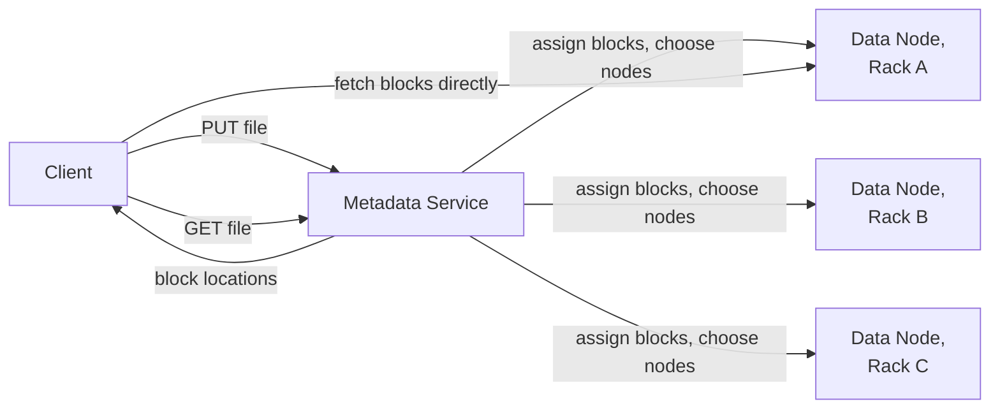

## Overview

- **Real-world analog:** HDFS, the internals behind S3
- **Difficulty:** Hard
- **Frontend counterpart:** [File Upload & Sharing](/system-design/c/file-upload-sharing)
  covers the client-side upload UX and progress tracking — this chapter is the storage
  system underneath that has to durably hold petabytes of file data across thousands of
  disks without losing a byte when individual disks (routinely) fail.

Disks fail constantly at this scale — not as a rare edge case, but as an expected,
continuous background event. The entire design exists to make that routine failure
invisible to anyone reading or writing files, while keeping storage cost from spiraling
out of control.

## Clarifying Questions & Requirements

> **Ask these first:** what's the durability target (how many simultaneous failures
> must be survived)? Is the workload mostly large sequential files, or many small ones?
> Read-heavy, write-heavy, or write-once-read-many?

| | In scope | Out of scope |
|---|---|---|
| **Functional** | Store large files durably, split across many nodes, retrieve by path/key, tolerate node and disk failures | A full POSIX filesystem interface (assume a simpler get/put object model) |
| **Non-functional** | Survive multiple simultaneous node failures without data loss, storage overhead kept reasonable relative to raw data size | Low-latency small random writes (this system is optimized for large, mostly-sequential access) |

Assume: files are chunked into large blocks (64-128MB), each block replicated or
erasure-coded across nodes, with a separate service tracking block locations.

## Back-of-Envelope Estimation

| | Estimate |
|---|---|
| Total raw data | Exabytes across a large deployment |
| Block size | 64-128MB, deliberately large to keep metadata volume manageable |
| Replication factor (hot data) | 3x — tolerates 2 simultaneous node failures per block |
| Metadata size | Proportional to file/block *count*, not to total data size |

That last row is the counterintuitive one — it's the source of a genuine scaling trap
covered in the deep dives below.

## API Design

```
PUT  /files/{path}      {data}                    → 201 (chunked into blocks, replicated)
GET  /files/{path}                                  → 200 (blocks fetched and reassembled)
GET  /files/{path}/blocks                            → 200 [{blockId, nodeLocations}]
```

## Data Model & Storage

```
metadata_service
  file_path       text PK
  block_ids        text[]      -- ordered list of block IDs composing this file

block_locations
  block_id         text PK
  node_ids         text[]      -- which nodes hold a copy (or a shard, for erasure coding)
```

| Choice | Why |
|---|---|
| **Replication (3x) for hot/frequently-accessed data, erasure coding (e.g., Reed-Solomon) for cold data** | Replication is simple and cheap to read from (any full copy serves a read) but costs 200% storage overhead. Erasure coding needs only ~50% overhead for similar durability, but reconstructing a lost shard requires reading and computing from several other shards — expensive per-reconstruction, and expensive if reads themselves need reconstruction. Using replication where access is frequent and reconstruction cost would be paid often, and erasure coding where data is rarely touched, gets the storage savings where they matter and avoids the reconstruction cost where it would actually hurt |
| **A dedicated, memory-resident metadata service tracking block-to-node mapping**, not a general-purpose relational database | Looking up which nodes hold a given block needs to happen on every single read and write, at very high volume — an in-memory-resident structure purpose-built for this lookup pattern is dramatically faster than a general relational engine not tuned specifically for it |
| **Block placement spread across racks/availability zones, not clustered on nearby nodes** | If all three replicas of a block happen to sit in the same rack, a single rack-level failure (a shared power or network failure, not just one disk) could lose every copy simultaneously — placing replicas across failure domains means a single rack or AZ failure still leaves at least one surviving copy |

## High-Level Architecture



## Deep Dives

**1. Replication vs. erasure coding is a genuine, workload-dependent tradeoff, not a
strictly-better-or-worse choice.** Replication's simplicity (read from any surviving
copy) makes it the right default for actively-accessed data where reconstruction after a
failure needs to be fast and cheap. Erasure coding's storage efficiency makes it the
right choice for cold, rarely-touched archival data, where the higher reconstruction
cost on failure is paid rarely enough that the storage savings dominate over the system's
lifetime.

**2. The metadata service is a potential single point of failure precisely because
everything depends on it, and needs its own high-availability design.** An active-
standby pair sharing a durable edit log (every metadata change is appended to the log
before being applied, so a standby can replay it to catch up and take over) is a common
pattern — or a distributed metadata store using its own consensus mechanism for full
horizontal scaling of the metadata layer itself, at added operational complexity.

**3. Rack/AZ-aware block placement is what actually delivers the durability the
replication factor promises.** A naïve placement strategy (pick any 3 random nodes)
can still, by chance, put all 3 replicas in the same failure domain — placement logic
that explicitly spreads replicas across racks or availability zones is what converts
"3x replication" into "survives a rack failure," not just "survives 2 random node
failures," which is a meaningfully weaker guarantee.

**4. What breaks at 10x — metadata service memory, not storage capacity, becomes the
first ceiling for workloads with many small files.** Because metadata size scales with
block/file *count* rather than total data volume, a workload storing billions of small
files can exhaust the metadata service's memory (each file/block needs an in-memory
entry) long before the underlying storage cluster is anywhere near its capacity limit —
a genuinely counterintuitive bottleneck that surprises teams expecting storage capacity
to be the limiting factor.

## Bottlenecks & Failure Modes

| Bottleneck | Mitigation | Tradeoff accepted |
|---|---|---|
| Metadata service memory exhaustion under many small files | Encourage/enforce larger block sizes, or batch small files together at the application layer | Small-file-heavy workloads need explicit accommodation, not just "it works by default" |
| Correlated failure within a single rack/AZ | Rack/AZ-aware placement across failure domains | Slightly more complex placement logic than naive random selection |
| Metadata service as a single point of failure | Active-standby with a shared durable edit log, or a distributed metadata store | Added operational complexity for the metadata layer's own HA |

## Why Not X?

**Why not always use erasure coding, since it's more storage-efficient?**
Reconstruction after a failure is significantly more expensive under erasure coding
(reading and computing from multiple other shards) than under simple replication
(reading one surviving full copy) — for frequently-accessed, hot data where
reconstruction gets triggered often, that cost outweighs the storage savings.

**Why not use a general-purpose relational database for block-location metadata
instead of a specialized service?** At the lookup volume this system operates at (every
single read and write needs a block-location lookup), a purpose-built, memory-resident
structure significantly outperforms a general relational engine not tuned for this
specific, extremely narrow access pattern.

**Why not replicate every block to every node for maximum durability?** Storage cost
multiplies directly by node count — at any meaningful cluster size this is absurdly
wasteful. A fixed, modest replication factor (2-3x) or erasure coding achieves strong
durability against multiple simultaneous failures without that unbounded cost.

## Interview Signals

| | Strong answer | Weak answer |
|---|---|---|
| Durability strategy | Distinguishes replication (hot) from erasure coding (cold) with a clear reason | Applies one durability strategy uniformly regardless of access pattern |
| Metadata scaling | Identifies metadata size as scaling with file count, not data volume | Assumes storage capacity is always the binding constraint |
| Placement | Explains rack/AZ-aware placement as necessary for real durability guarantees | Assumes random node selection is sufficient for replica placement |

**Common failure modes:** using one storage strategy regardless of access pattern; not
recognizing the small-file metadata scaling trap; naive replica placement with no
failure-domain awareness.

## Glossary Links

No shared-glossary terms apply directly to this chapter's core mechanisms.
