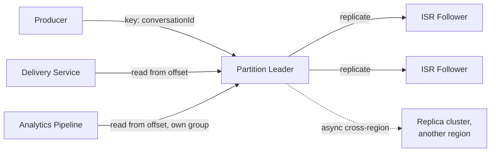

## Overview

- **Real-world analog:** Kafka, and the backend messaging infrastructure behind
  WhatsApp's global scale
- **Difficulty:** Hard
- **Frontend counterpart:** [Chat & Messaging](/system-design/c/chat-messaging) and this
  course's own [Real-Time Chat](/backend-interviews/c/team-chat) chapter cover a single
  application's messaging backend. This chapter is one level lower — the durable,
  partitioned log infrastructure that a system like team-chat would actually be built
  on top of, at a scale spanning multiple regions.

Team chat's per-channel sequence number works because one server owns sequencing for one
channel. At WhatsApp's actual scale — billions of messages/day, globally distributed
users — no single server can own sequencing for everything, and the messages themselves
need to survive individual broker failures durably. This is the infrastructure layer
that makes that possible: a distributed, replicated, partitioned commit log.

## Clarifying Questions & Requirements

> **Ask these first:** what delivery guarantee is required — at-least-once, or
> exactly-once? Single-region or must the system tolerate a full region failure? How
> many consumers read the same stream of messages?

| | In scope | Out of scope |
|---|---|---|
| **Functional** | Durable, ordered, partitioned message storage; multiple consumers reading independently; cross-region replication | Building a specific chat application on top (that's `team-chat`) |
| **Non-functional** | No message loss on a single broker failure, ordering preserved within a partition, tolerate a full region outage | Perfect global exactly-once end-to-end (achievable per-hop, genuinely hard end-to-end across an entire pipeline) |

Assume: a topic partitioned across many brokers, each partition replicated for
durability, deployed across multiple regions for WhatsApp-scale global reach.

## Back-of-Envelope Estimation

| | Estimate |
|---|---|
| Messages/day globally | 100B+ |
| Peak throughput | Millions of messages/sec across all partitions |
| Replication factor | 3x, standard for surviving up to 2 simultaneous broker failures per partition |
| Cross-region replication lag | Seconds, given the physical latency between regions |

At this scale, no single partition or broker can carry meaningful fractions of total
throughput — the entire design is built around horizontal partitioning from the start.

## API Design

```
PRODUCE  topic, partitionKey, payload            → {partition, offset}
CONSUME  topic, partition, fromOffset             → stream of messages
COMMIT   consumerGroup, partition, offset          → 204
```

## Data Model & Storage

Each partition is an append-only log on disk: `offset → message`. There's no relational
schema — the log itself, plus per-consumer-group offset tracking, is the entire data
model.

| Choice | Why |
|---|---|
| **Partitioning by a key** (e.g., conversation ID), not round-robin | Round-robin partitioning would scatter one conversation's messages across many partitions, losing the ordering guarantee within that conversation — keying by conversation ID ensures every message for the same conversation lands in the same partition, which is where ordering is actually guaranteed |
| **Replicated partitions with a leader and in-sync replica set (ISR)**, not a single copy per partition | A partition living on exactly one broker means that broker's failure loses every message it hadn't yet been read — an ISR (a leader plus replicas that are caught up) means the leader only acknowledges a write once it's durably replicated to enough of the ISR, so a single broker's failure doesn't lose acknowledged data |
| **Consumer group offsets tracked per group, not per individual consumer**, so multiple independent applications can read the same log at their own pace | Different consumers (say, a delivery-confirmation service and an analytics pipeline) need to read the same messages independently without affecting each other's progress — offset tracking scoped per consumer group is what makes that possible without duplicating the underlying log |

## High-Level Architecture



## Deep Dives

**1. Partition leadership itself needs consensus to assign safely.** Every partition
has exactly one leader at a time, and deciding which broker holds that role — and
detecting when it needs to change, on broker failure — is itself a small consensus
problem, typically delegated to a coordination service (ZooKeeper historically, a
Raft-based controller in newer designs). Two brokers simultaneously believing they lead
the same partition would let both accept writes independently, silently diverging the
log — exactly the split-brain scenario a leader-election mechanism exists to prevent.

**2. `acks=all` versus `acks=1` is a direct, explicit durability-vs-latency tradeoff.**
`acks=1` returns success once the partition leader has written the message locally —
fast, but a leader failure before replication completes can lose that message entirely.
`acks=all` waits for the full in-sync replica set to acknowledge before returning
success — slower, but a message once acknowledged survives losing any single replica in
that set. A strong answer states which one WhatsApp-scale messaging needs (durability
matters enormously for messages people expect to never lose) rather than picking a
default without justification.

**3. Exactly-once delivery is achieved per-hop through idempotent producers, not by
magic.** A producer retry after a network timeout risks writing the same message twice.
Assigning each producer a unique ID and each message a monotonically increasing sequence
number per producer lets the broker detect and silently drop an exact duplicate on
retry — deduplicating at the point of write, rather than requiring every downstream
consumer to implement its own deduplication logic.

**4. Cross-region replication lag means a user's "home region" matters.** A message
produced in one region takes real, physical time (seconds) to replicate to another —
routing a user's reads and writes consistently to their nearest/home region (rather than
load-balancing arbitrarily across regions) avoids a user seeing their own just-sent
message appear to "disappear" because a subsequent read landed on a region the write
hadn't yet reached.

## Bottlenecks & Failure Modes

| Bottleneck | Mitigation | Tradeoff accepted |
|---|---|---|
| A hot partition (one very active conversation) | Partition count sized well above broker count, allowing rebalancing | Uneven partition key distribution can still create hotspots regardless of count |
| Broker failure losing unacknowledged writes | ISR replication with `acks=all` for durability-critical topics | Higher write latency than `acks=1` |
| Cross-region replication lag causing apparent inconsistency | Home-region routing for a given user's reads/writes | Users far from their home region see higher latency |

## Why Not X?

**Why not synchronous replication to every replica before acknowledging a write?**
Waiting on every replica (rather than a quorum-sized ISR) means the slowest replica
determines write latency for everyone, and a single slow or unreachable replica could
stall writes entirely — an ISR-based quorum tolerates a bounded number of slow/failed
replicas without either sacrificing durability or making the slowest node the ceiling
on the whole system's latency.

**Why not at-least-once delivery with deduplication left to each consumer?** Technically
workable, but it means every single consumer of the log has to correctly implement its
own deduplication logic, multiplying the chance of a bug somewhere in that duplicated
effort — broker-level idempotent producers solve the problem once, centrally, instead
of N times independently.

**Why not run a single global cluster instead of per-region clusters with async
replication?** A single global cluster means every write pays cross-region latency to
reach a majority of replicas if they're spread globally — per-region clusters keep
write latency local, at the cost of the eventual-consistency window during cross-region
replication, a tradeoff that matches how users actually interact (mostly with people
and infrastructure in their own region).

## Interview Signals

| | Strong answer | Weak answer |
|---|---|---|
| Partitioning | Explains keying by conversation/entity ID for ordering, not round-robin | Partitions arbitrarily with no ordering rationale |
| Durability | States the `acks=1` vs `acks=all` tradeoff explicitly and picks one with justification | Doesn't address what happens to an unacknowledged write on leader failure |
| Exactly-once | Explains idempotent producers via producer ID + sequence number | Claims exactly-once without any mechanism, or pushes all dedup responsibility to consumers |

**Common failure modes:** no partitioning strategy tied to ordering requirements; no
discussion of the acks/durability tradeoff; claiming exactly-once delivery with no
underlying mechanism.

## Glossary Links

This question draws on: Message ordering — linked on first mention above; Idempotency —
linked on first mention above.
