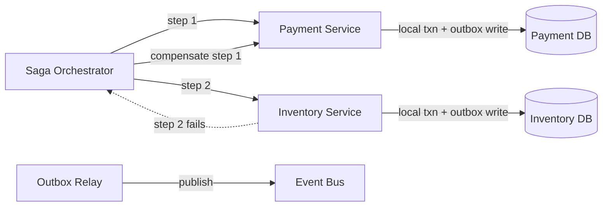

## Overview

- **Real-world analog:** the coordination layer behind any checkout or order flow that
  spans multiple microservices, each with its own database
- **Difficulty:** Hard

Once a "transaction" spans multiple independently-owned services and databases, there's
no single ACID transaction that can wrap the whole thing — each service can only
guarantee atomicity within its own local database. This chapter is about the patterns
that get correctness anyway, without a global lock that would defeat the whole reason
services were split apart in the first place.

## Clarifying Questions & Requirements

> **Ask these first:** how many services participate in a typical multi-step
> transaction? Is strict atomicity required, or is eventual consistency with a defined
> compensation path acceptable? Does the flow need central visibility/tracking, or can
> it be fully decentralized?

| | In scope | Out of scope |
|---|---|---|
| **Functional** | Coordinate a multi-step operation across services, roll back correctly on partial failure, reliably publish events alongside local state changes | Building the individual services' own business logic |
| **Non-functional** | No service is blocked holding locks waiting on another service's response; failure partway through is recoverable | Global ACID-style atomicity across services (explicitly not achievable without the costs 2PC brings — see Deep Dives) |

Assume: an order flow spanning payment, inventory, and shipping services, each with its
own independent database, needing to either complete all three steps or cleanly
compensate for whichever succeeded before a failure.

## Back-of-Envelope Estimation

This is a correctness-and-availability design more than a raw-throughput one — the
estimation exercise that matters is really about failure-mode probability: at meaningful
transaction volume, partial failures (step 2 of 3 succeeding, then a timeout) are a
routine, expected occurrence, not a rare edge case, and the design has to treat them that
way.

## API Design

```
POST /orders                 → triggers a saga: reserve payment → reserve inventory → schedule shipping
POST /orders/{id}/compensate  → triggers compensating actions for whichever steps completed
```

## Data Model & Storage

```
saga_state
  saga_id         uuid PK
  current_step     text
  status           enum('in_progress','completed','compensating','failed')

outbox              -- written in the same local transaction as the actual state change
  id, aggregate_id, event_type, payload, published: bool
```

| Choice | Why |
|---|---|
| **Sagas — a sequence of local transactions, each with its own compensating action**, not two-phase commit across services | 2PC requires every participant to hold locks and block, waiting for the coordinator's final decision, from the moment they vote "ready" — at internet scale, with services that need to remain independently available and scale independently, this blocking behavior (and the coordinator itself being a single point of failure) is usually unacceptable. A saga instead lets each step commit locally and immediately, with an explicit compensating action defined for undoing it if a later step fails |
| **The transactional outbox pattern for publishing events**, not a separate publish call after the local database write | Writing to the local database and then separately calling out to publish an event are two operations that can fail independently — a crash between them means either a state change with no event published, or in rarer cases, other ordering problems. Writing the event to an `outbox` table in the *same local transaction* as the state change guarantees they succeed or fail together; a separate relay process then reliably publishes from the outbox to the event bus |

## High-Level Architecture



## Deep Dives

**1. Two-phase commit's blocking behavior is the specific reason it's rarely used at
this scale, and it's worth being precise about why.** In the prepare phase, every
participant votes "ready" and then *holds its locks open*, waiting for the coordinator's
commit-or-abort decision. If the coordinator crashes after collecting votes but before
broadcasting the decision, participants are left blocked indefinitely, holding locks,
unable to independently decide whether to commit or abort — a single coordinator failure
can stall multiple services simultaneously.

**2. A saga replaces one global atomic commit with a sequence of local commits, each
individually reversible.** There's no instant where the whole multi-step operation is
atomically all-or-nothing across services — instead, each step commits locally and
immediately (no cross-service blocking), and if a later step fails, previously
completed steps are explicitly undone via their own compensating transaction (refund the
payment, release the inventory reservation) rather than a single global rollback. This
means failure handling has to be designed per-step, not assumed away by a transaction
boundary.

**3. The outbox pattern closes the exact gap where "did the state change and the event
both happen" would otherwise be ambiguous.** Without it, a crash between committing a
local database change and publishing the corresponding event leaves the system in an
observably inconsistent state — other services relying on that event never receive it,
even though the local change did happen. Writing both the state change and the outbox
event in one local transaction, then relaying from the outbox asynchronously, guarantees
the event is eventually published if and only if the state change actually committed.

**4. Orchestration versus choreography is a real architectural fork with opposite
tradeoffs, not a matter of taste.** Orchestration (a central saga coordinator explicitly
calling each step in sequence) gives clear visibility into the whole flow and a single
place to reason about failure handling, at the cost of that coordinator being a
dependency every step relies on. Choreography (each service reacts to events published
by the previous step, with no central coordinator) removes that central dependency and
keeps services more decoupled, at the cost of the overall flow becoming much harder to
trace, debug, or reason about once it involves more than a few steps or any branching
logic.

## Bottlenecks & Failure Modes

| Bottleneck | Mitigation | Tradeoff accepted |
|---|---|---|
| 2PC coordinator crash blocking all participants | Sagas avoid a blocking coordinator entirely | Each step needs an explicit, correctly-implemented compensating action |
| Dual-write inconsistency between DB state and published events | Transactional outbox pattern | An extra relay process and outbox table to operate |
| A saga with many steps becoming hard to reason about | Orchestration for complex/branching flows | The orchestrator itself becomes a dependency for every step |

## Why Not X?

**Why not use 2PC everywhere for correctness and conceptual simplicity?** The blocking
behavior and coordinator single-point-of-failure make it a poor fit for services that
need to scale and remain available independently — this specific cost is why sagas
became the practical default for multi-service transactions at internet scale, despite
sagas being conceptually more complex to design correctly.

**Why not perform the database write and publish the event as two separate calls
without an outbox?** A crash or failure between the two calls leaves the system
observably inconsistent — either a committed state change with no corresponding event
ever published, or (less commonly, depending on ordering) an event published for a
change that didn't actually commit. The outbox's single local transaction is what
prevents both failure modes.

**Why not use choreography for every saga, to avoid a central coordinator entirely?**
A saga with many steps or complex branching logic becomes genuinely difficult to trace
and debug without a central place showing the whole flow's current state — for anything
beyond a few simple steps, the visibility orchestration provides is usually worth its
added coupling.

## Interview Signals

| | Strong answer | Weak answer |
|---|---|---|
| 2PC vs. sagas | Explains the specific blocking mechanism that makes 2PC costly at scale | Dismisses 2PC as "slow" without explaining the actual mechanism |
| Compensation | Designs explicit compensating actions per step, not a generic "rollback" | Assumes a saga can simply "roll back" the way a single-database transaction would |
| Event consistency | Proposes the transactional outbox pattern for the dual-write problem | Publishes events via a separate call with no consideration of partial failure |

**Common failure modes:** proposing 2PC without acknowledging its blocking cost at
scale; no compensating-transaction design for saga failure handling; a dual-write
pattern with no mechanism preventing state/event divergence on failure.

## Glossary Links

No shared-glossary terms apply directly to this chapter's core mechanisms.
