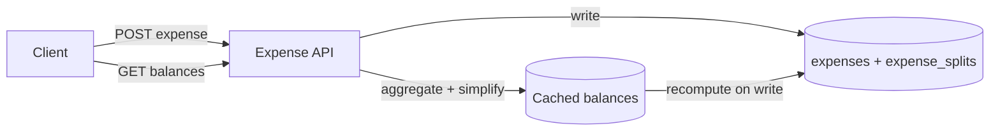

## Overview

- **Real-world analog:** Splitwise
- **Difficulty:** Medium

The API surface looks trivial — add an expense, split it, show balances — but "show
balances" hides a genuinely interesting graph problem: a group of six friends can
accumulate dozens of individual IOUs that collapse down to two or three actual payments
once you simplify who-owes-whom, and getting that simplification right (and keeping it
consistent when an expense is edited) is the real design question.

## Clarifying Questions & Requirements

> **Ask these first:** equal splits only, or exact/percentage splits too? Multiple
> currencies? Can an expense be edited or deleted after the fact, and how does that
> affect already-computed balances?

| | In scope | Out of scope |
|---|---|---|
| **Functional** | Create a group, add an expense with a split, show pairwise and simplified balances | Actual payment processing/settlement (just tracking who owes what) |
| **Non-functional** | Balances stay correct after edits/deletes, simplification is deterministic | Real-time push of balance changes to every group member instantly |

Assume: groups of 2-20 people, expenses can be edited after creation, and splits can be
equal, exact-amount, or percentage-based.

## Back-of-Envelope Estimation

This is a low-volume system by request count — expenses number in the dozens per group
per month, not thousands per second. The design priority here is correctness of the
balance computation under edits, not raw throughput.

## API Design

```
POST /groups                              → 201 {groupId}
POST /groups/{id}/expenses  {amount, paidBy, splitType, splits[]}   → 201 {expenseId}
PUT  /expenses/{id}          {...}                                   → 200
GET  /groups/{id}/balances                                            → 200 {pairwise[], simplified[]}
```

## Data Model & Storage

```
expenses
  id            uuid PK
  group_id      uuid
  paid_by       uuid
  amount        decimal
  created_at    timestamp

expense_splits
  expense_id    uuid FK
  user_id       uuid
  owed_amount   decimal
```

| Choice | Why |
|---|---|
| **`expense_splits` as individual rows per (expense, person), not a derived-only balance table** | The ledger of who-owes-what-on-which-expense is the source of truth — if only a running net balance per pair were stored, editing or deleting one expense would have no way to correctly "undo" its effect on the balance without replaying the full history |
| **Balances computed from the ledger, not stored as the primary record** | Storing balances as the canonical record and updating them incrementally on every expense change is exactly the kind of derived state that drifts out of sync with its source over time (a missed update, a bug in the increment logic) — computing from the immutable ledger on read (with caching, see Deep Dives) keeps one source of truth |

## High-Level Architecture



## Deep Dives

**1. Pairwise balances vs. the simplified debt graph.** The raw ledger naturally
produces pairwise balances (Alice owes Bob $30, Bob owes Carol $20, Carol owes Alice
$10) — but a group's actual settle-up experience is much better with the *minimum
number of transactions* that resolve the same net positions, which is a graph
minimization problem (treat each person's net balance as a node value; greedily match
the largest debtor against the largest creditor until all net to zero). This is
recomputed from the pairwise ledger, not stored as its own mutable state, precisely so
it can't drift from the source of truth.

**2. Editing a past expense without corrupting history.** Because `expense_splits` rows
are the actual source of truth (not an incrementally-updated balance), editing an
expense is just updating its split rows and recomputing balances downstream — there's
no separate "undo the old effect, apply the new one" logic to get wrong, because
balances were never stored as running state to begin with.

**3. Caching the aggregate without losing correctness on write.** Recomputing every
group's full balance graph on every single balance-page view is unnecessary work for
data that only changes on an expense write. A cache invalidated (or eagerly
recomputed) specifically for the affected group on every expense create/edit/delete
keeps reads fast without ever risking a stale balance being treated as authoritative —
the ledger underneath is always available to recompute from if the cache is ever wrong.

## Bottlenecks & Failure Modes

| Bottleneck | Mitigation | Tradeoff accepted |
|---|---|---|
| Recomputing balances on every read | Cache per group, invalidated on write | A tiny window where a cache read could race a concurrent write, acceptable given this system's low stakes and low concurrency |
| Balance drift from an incrementally-updated running total | Derive balances from the immutable ledger, never store them as the primary record | Slightly more computation per read, in exchange for structural correctness |

## Why Not X?

**Why not store a running net-balance-per-pair and update it incrementally on every
expense?** This is exactly the kind of derived state that drifts: an edit or delete has
to correctly reverse the old effect before applying the new one, and any bug or missed
update leaves balances silently wrong with no way to detect or recover, since the
history that produced them isn't kept. Deriving from an immutable ledger sidesteps the
whole class of bug.

**Why not show only pairwise balances and skip the simplification?** Technically
sufficient, but a group of even five people can accumulate a dozen pairwise debts that
all net down to two or three actual payments — showing the unsimplified graph creates
more actual money transfers than necessary to settle the same net positions.

## Interview Signals

| | Strong answer | Weak answer |
|---|---|---|
| Data model | Treats the expense ledger as the immutable source of truth, balances as derived | Stores balances as mutable running totals updated on each write |
| Simplification | Recognizes debt simplification as a distinct problem from balance computation | Conflates "show balances" with "show the minimum settle-up transactions" |
| Edits | Explains why editing the ledger doesn't require special undo logic | Designs an explicit "reverse the old expense's effect" step |

**Common failure modes:** storing balances as the primary mutable record instead of
deriving them; no handling for edits/deletes corrupting previously-computed state; not
distinguishing pairwise balances from the simplified settle-up graph.

## Glossary Links

This question draws on: Change log — linked on first mention above (the expense ledger
as an append-oriented source of truth that derived state is computed from).
