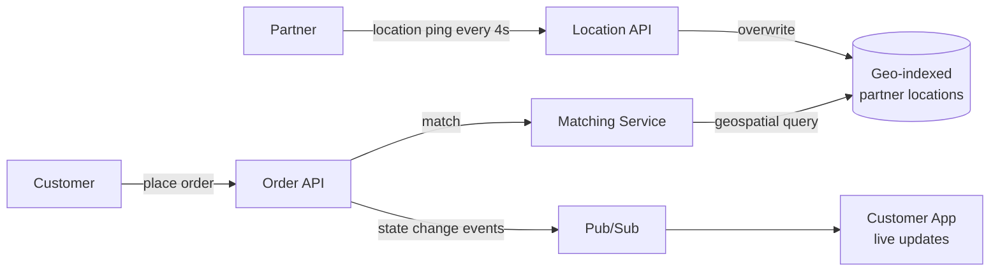

## Overview

- **Real-world analog:** Swiggy, DoorDash, Uber Eats
- **Difficulty:** Medium

Three independent parties — customer, restaurant, delivery partner — each with their own
app and their own view of one shared order, all needing a consistent picture of its state
in near-real-time. The interesting engineering isn't any single piece; it's keeping three
asynchronous, independently-failing clients converged on the same truth.

## Clarifying Questions & Requirements

> **Ask these first:** how often does a delivery partner's location need to update?
> Does the system assign a partner automatically, or do partners claim orders? What
> happens if no partner is available near a restaurant?

| | In scope | Out of scope |
|---|---|---|
| **Functional** | Place an order, match a delivery partner, track live location, update order state | Restaurant menu management, payment processing itself |
| **Non-functional** | Near-real-time location updates (seconds, not minutes), correct partner-to-order matching under contention | Route optimization / multi-stop delivery batching (a further optimization layer) |

Assume: a partner's location updates every 3-5 seconds while on an active delivery, and
matching needs to happen within seconds of order placement.

## Back-of-Envelope Estimation

| | Estimate |
|---|---|
| Active deliveries at peak | 500,000 concurrent orders in a large market |
| Location pings (every 4 sec × 500K active partners) | ≈ 125,000 writes/sec |
| Order state reads (customer app polling/subscribing) | Far exceeds writes — every active order is watched continuously |

The location-ping write volume is the standout number — 125K/sec of tiny, latest-value-
only writes is a fundamentally different problem than the order-placement write path.

## API Design

```
POST /orders                    {restaurantId, items[]}       → 201 {orderId}
POST /delivery/{partnerId}/location  {lat, lng}                → 204
GET  /orders/{id}/status         (or a WebSocket subscription)  → {state, partnerLocation}
```

## Data Model & Storage

```
orders
  id             uuid PK
  state          enum('placed','accepted','preparing','picked_up','delivered')
  partner_id     uuid nullable
  restaurant_id  uuid

partner_locations   -- latest-value only, not an append log
  partner_id     uuid PK
  lat, lng       float
  updated_at     timestamp
```

| Choice | Why |
|---|---|
| **`partner_locations` as a latest-value overwrite, not an append-only log** | For live tracking, only the current position matters — appending every ping would grow a table by 125K rows/sec for data nobody queries historically in the live-tracking path. A separate, decoupled analytics pipeline (out of scope here) can consume the same ping stream for historical route data without the live-tracking store paying that cost |
| **A geospatial index (geohash or a dedicated geo data structure) on active partner locations**, not a full table scan for matching | Finding the nearest available partner to a restaurant needs to answer "who's within N km of this point" fast, repeatedly, under continuous location updates — a geospatial index turns that into a bounded-radius lookup instead of scanning every active partner's coordinates on every match attempt |

## High-Level Architecture



## Deep Dives

**1. Matching without scanning every partner.** At order placement, the matcher needs
the nearest *available* partner to the restaurant. A geohash-based index (or an
equivalent spatial data structure) buckets partners into cells, so the query becomes
"scan the handful of cells near this point" instead of every active partner citywide —
turning an O(n) scan into something close to O(1) relative to total partner count.

**2. Location writes are pure overwrites, and that's the whole optimization.** Because
only the current position matters for live tracking, every ping is a write to the same
key (`partner_id`), not a new row — this keeps the geo-indexed store's size bounded by
active-partner count, not by ping volume over time, which is what makes 125K writes/sec
tractable on a store sized for hundreds of thousands of partners rather than billions of
historical pings.

**3. Order state as a single authoritative field, fanned out via events, not polled.**
Three separate apps (customer, restaurant, partner) all need to react to the same state
transition. Publishing an event on every state change and letting each app subscribe
(WebSocket or push) avoids every client polling the order API repeatedly, and keeps all
three views converged on the same authoritative state at roughly the same time, rather
than each app discovering a change at its own independent polling interval.

**4. Partner reassignment has to keep all three apps converged, not just two.** If an
assigned partner cancels mid-delivery, the system re-matches to a new partner — but the
customer and restaurant apps were both already showing the *first* partner's name and
live location. The reassignment has to be its own explicit event in the same state-
change stream every app subscribes to, not a silent backend update, or one of the three
apps ends up displaying a partner who's no longer actually delivering the order.

## Bottlenecks & Failure Modes

| Bottleneck | Mitigation | Tradeoff accepted |
|---|---|---|
| 125K/sec location write volume | Overwrite-only geo-indexed store, not an append log | Historical route data needs a separate pipeline if ever required |
| Matching under high local demand (many orders, few partners in an area) | Widen the search radius progressively if no partner found nearby | Slightly longer matching time in undersupplied areas |
| Three-party state fan-out getting out of sync | Single authoritative state field, event-driven push to all subscribers | If the pub/sub layer drops an event, a client can briefly show stale state until the next update or a periodic reconciliation poll |

## Why Not X?

**Why not have each client poll for order status on an interval?** Works, but at this
scale it means every active order generates continuous polling traffic from three
separate clients regardless of whether anything changed — event-driven push only sends
data when the state actually changes, which is both lower load and lower latency for
the update to actually reach the client.

**Why not persist every location ping durably as its own row?** Live tracking only ever
needs the latest position — an append-only log optimizes for a query pattern ("show me
history") that the live-tracking feature doesn't need, at the cost of unbounded storage
growth for a feature that doesn't benefit from it.

**Why not let the restaurant pick which delivery partner fulfills each order, instead of
the platform matching centrally?** A restaurant only sees the partners physically near
it, not a citywide view of availability, ongoing deliveries, or partner idle time — the
platform's matching service has visibility a single restaurant fundamentally doesn't,
and centralizing matching is what allows the widen-search-radius fallback and consistent
fairness rules across every restaurant on the platform.

## Interview Signals

| | Strong answer | Weak answer |
|---|---|---|
| Location writes | Recognizes latest-value-only semantics and designs an overwrite store | Treats every ping as a row to persist indefinitely |
| Matching | Proposes a geospatial index for nearest-partner queries | Proposes scanning all partners' coordinates per match |
| Multi-party sync | Uses event-driven push for state changes across three apps | Has each app poll independently with no coordination |

**Common failure modes:** an append-only location table with no bound on growth; a
full-scan matching algorithm; no consideration of how three separate clients stay in
sync on shared order state.

## Glossary Links

This question draws on: Backpressure — linked on first mention above (the geo-indexed
store designed to absorb sustained high-frequency location writes without falling
behind).
