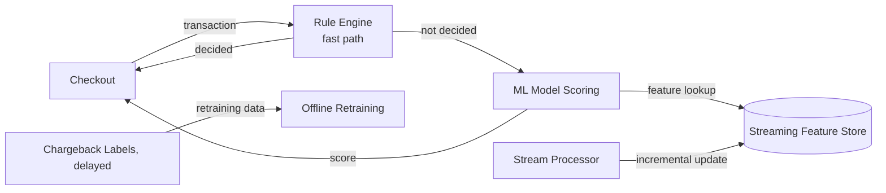

## Overview

- **Real-world analog:** the real-time fraud scoring behind any payment processor or
  marketplace checkout
- **Difficulty:** Hard

Two constraints fight each other here: the decision has to happen inside a sub-100ms
checkout latency budget, and the best signal for whether a transaction is actually fraud
often doesn't arrive until days later, as a chargeback. The whole architecture is built
around reconciling "decide fast, with incomplete information" against "learn correctly,
from information that arrives late."

## Clarifying Questions & Requirements

> **Ask these first:** what's the latency budget for a decision at checkout? Should the
> system block, flag-for-review, or just score transactions? How is ground truth
> (confirmed fraud) obtained, and how delayed is it typically?

| | In scope | Out of scope |
|---|---|---|
| **Functional** | Score a transaction in real time, combine rule-based and ML-based signals, feed confirmed outcomes back into retraining | Building the ML model architecture itself (assume a trained model is available to score against) |
| **Non-functional** | Sub-100ms scoring latency at checkout volume, handle label delay of days without stalling the feedback loop | Zero false positives (a real, explicit business tradeoff — see Why Not X) |

Assume: fraud labels (confirmed via chargeback) typically arrive 30-90 days after a
transaction, and the checkout flow has a hard 100ms budget for a fraud decision.

## Back-of-Envelope Estimation

| | Estimate |
|---|---|
| Transactions/sec at peak | Tens of thousands |
| Scoring latency budget | ~100ms, shared across rules + model inference + feature lookup |
| Feature freshness needed | Minutes-old aggregates (e.g., "transactions by this card in the last hour") computed incrementally, not queried live |
| Label delay | Days to months for confirmed fraud (chargebacks) |

The 100ms budget is the single hardest constraint — it rules out anything requiring a
live database query against historical transaction volume at read time.

## API Design

```
POST /score        {transactionId, amount, cardToken, merchantId, ...}   → 200 {score, decision}
POST /labels        {transactionId, outcome: 'confirmed_fraud'|'legitimate'}  → 204 (feeds retraining)
```

## Data Model & Storage

```
feature_store   -- precomputed, incrementally updated aggregates
  entity_id       text   -- card, user, or device
  window          text   -- e.g. "1h", "24h"
  feature_values  json   -- transaction count, total amount, distinct merchants, etc.
  updated_at      timestamp

transactions
  id, score, decision, features_used, created_at

labels    -- arrives much later than the transaction
  transaction_id, outcome, labeled_at
```

| Choice | Why |
|---|---|
| **A streaming feature store, incrementally updated, not features computed live from a transaction-history database at scoring time** | Querying "how many transactions has this card made in the last hour" live against a transaction history table, at checkout volume and inside a 100ms budget, is not viable — a stream processor maintains these aggregates incrementally as transactions occur, so scoring just reads an already-computed value instead of computing it on demand |
| **Two-tier scoring: cheap rules first, ML model only if rules don't already decide** | Running a full ML model inference on every single transaction, even ones a simple rule could reject or approve outright (a known-fraudulent card, a trusted long-standing customer under a normal amount), wastes the model's latency and compute budget on cases that don't need it |

## High-Level Architecture



## Deep Dives

**1. Feature freshness comes from stream processing, not query-time aggregation.** A
stream processor consumes the live transaction stream and maintains rolling aggregates
per card/user/device — "transactions in the last hour," "distinct merchants in the last
24h" — updating them incrementally as each new transaction arrives, rather than scanning
historical data on demand. Scoring reads these precomputed values as a fast key lookup,
turning what would be an expensive aggregation query into a cache hit.

**2. The two-tier design is a latency-budget allocation strategy, not just an
optimization.** Rules are near-instant (a lookup against a blocklist, a simple
threshold check) and can reject or approve the obvious cases immediately. Only
transactions that rules can't confidently decide fall through to the more expensive ML
model — this means the *average* transaction's latency is dominated by the cheap rule
path, and the expensive model path only has to fit its own budget for the minority of
genuinely ambiguous cases.

**3. Delayed labels require a proxy-signal feedback loop, not waiting for ground
truth.** Waiting 30-90 days for a confirmed chargeback before updating the model means
the model can drift for months against evolving fraud patterns with no correction. A
practical mitigation uses faster proxy signals — a transaction disputed by the customer,
a card reported stolen, a merchant-flagged refund — as weaker but much faster training
signal, blended with the slower, more authoritative chargeback labels once they arrive.

**4. The false-positive/false-negative tradeoff is a business decision encoded as a
threshold, not a fixed accuracy target.** Blocking a legitimate transaction (false
positive) has a real cost — a frustrated customer, lost revenue, support burden.
Missing actual fraud (false negative) has a different cost — the chargeback itself plus
processing fees. The score threshold that separates "approve" from "block" or
"review" is tuned against those two costs explicitly, and a strong answer treats it as a
tunable business lever, not a number the ML model determines on its own.

## Bottlenecks & Failure Modes

| Bottleneck | Mitigation | Tradeoff accepted |
|---|---|---|
| Live feature computation blowing the latency budget | Streaming, incrementally-updated feature store | Features can lag the true real-time state by the stream processor's own small latency |
| Model inference latency for ambiguous transactions | Two-tier design — cheap rules handle the majority, model only scores the remainder | Rules need regular tuning as fraud patterns shift, adding operational overhead |
| Model staleness from delayed ground-truth labels | Faster proxy signals blended into the training pipeline alongside slow confirmed labels | Proxy signals are noisier than confirmed fraud, requiring careful weighting |

## Why Not X?

**Why not query the transaction-history database live for each scoring decision?**
Directly conflicts with the 100ms budget at checkout scale — a live aggregation query
against a large transaction history table, done synchronously for every single
transaction, would be one of the slowest operations in the entire request, not one of
the fastest.

**Why not skip rules and use only the ML model for every transaction?** Rules provide a
fast, cheap, and explainable path for the (often large) fraction of transactions that
are obviously fine or obviously fraudulent — skipping them means paying full model
inference cost and latency on every transaction, and losing the explainability rules
provide, which matters for both operational debugging and regulatory requirements around
explainable decisions.

**Why not wait for confirmed chargeback labels before ever updating the model?**
A model retrained only on labels that arrive 30-90 days later reacts to fraud pattern
shifts months too slowly — by the time confirmed labels reflect a new fraud pattern, that
pattern has had months to cause damage. Faster proxy signals exist specifically to close
that feedback gap, even at the cost of noisier training data.

## Interview Signals

| | Strong answer | Weak answer |
|---|---|---|
| Latency budget | Designs feature access as precomputed lookups, not live queries | Proposes querying transaction history live at scoring time |
| Two-tier design | Explains why cheap rules run before expensive model inference | Runs the full model on every transaction regardless of obviousness |
| Label delay | Names the delayed-label problem and proposes proxy signals | Assumes the model can be retrained promptly on confirmed fraud labels alone |

**Common failure modes:** live feature computation against historical data at scoring
time; no rules layer, paying model-inference cost on every transaction; ignoring the
label-delay problem entirely.

## Glossary Links

No shared-glossary terms apply directly to this chapter's core mechanisms.
