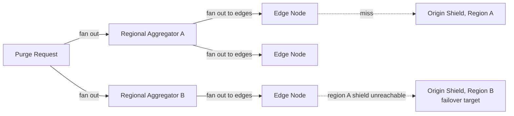

## Overview

- **Real-world analog:** Cloudflare or Akamai's full global network, not a single-region
  deployment
- **Difficulty:** Hard
- **Frontend counterpart:** none directly — this chapter extends this course's own
  [Content Delivery Network](/backend-interviews/c/cdn) (SDE-2) chapter, which already
  covers routing, cache-key design, and origin shielding for a CDN in general. This
  chapter is what changes once "hundreds of PoPs" becomes "thousands, across every
  populated region, with purges that must reach all of them."

The SDE-2 chapter already establishes that purge is eventually consistent, not
synchronous — the right call at any scale. What it doesn't cover is *how* a purge
actually reaches thousands of globally distributed edge nodes without either a single
control-plane system trying to talk to all of them directly, or a full region going dark
and quietly serving no one until someone notices.

## Clarifying Questions & Requirements

> **Ask these first:** how many edge PoPs, roughly, and how are they grouped
> geographically? What's the target purge propagation time — seconds, or a stricter
> sub-second requirement? What should happen to a region's edge traffic if that
> region's origin/shield becomes unreachable?

| | In scope | Out of scope |
|---|---|---|
| **Functional** | Propagate a purge to thousands of globally distributed edge nodes, route around a failed region | The single-PoP caching mechanics themselves (already covered by the SDE-2 chapter) |
| **Non-functional** | Purge reaches every edge node within a stated SLA, a full region failure doesn't take down that region's traffic — it reroutes | Sub-second purge propagation everywhere (achievable, but at real architectural cost — see Deep Dives) |

Assume: thousands of edge PoPs grouped into a smaller number of regional clusters, and a
target purge propagation SLA of a few seconds globally.

## Back-of-Envelope Estimation

| | Estimate |
|---|---|
| Edge PoPs | Thousands, grouped into tens of regional clusters |
| Purge propagation target | A few seconds, globally |
| Purges/sec at peak | Hundreds to thousands, across all customers of the CDN |
| Regional origin/shield count | One or more per region, not a single global origin |

The gap between "thousands of individual edges" and "tens of regions" is the structural
fact the whole propagation design is built around.

## API Design

Same purge interface as the SDE-2 chapter — `POST /purge {urls[] | tags[]}` — the
difference is entirely in the propagation mechanism behind it.

## Data Model & Storage

No new schema beyond the SDE-2 chapter's cache-key model — the addition here is a
propagation topology, not new data:

```
regional_clusters
  region_id      text PK
  edge_node_ids   text[]
  origin_shield    text     -- this region's own shield/origin endpoint
```

| Choice | Why |
|---|---|
| **Hierarchical purge propagation — control plane to regional aggregators, aggregators to their own edge nodes**, not a flat fan-out from one central system to every edge directly | A single control-plane system maintaining connections to (or making calls against) thousands of individual edges doesn't scale cleanly and becomes a chokepoint for every purge globally. A two-tier fan-out (central to ~tens of regional aggregators, each aggregator to its own hundreds of edges) bounds the fan-out factor at each hop and lets regions propagate in parallel |
| **Per-region origin shields, syncing with each other or a canonical origin asynchronously**, not a single global origin | A single global origin means every cache miss anywhere in the world pays the physical latency to reach one location — regional shields let a miss in any region resolve against a nearby origin, at the cost of a brief propagation window when origin content changes and needs to reach every regional shield |

## High-Level Architecture



## Deep Dives

**1. Hierarchical propagation is what makes purge scale to thousands of edges without
one system becoming the bottleneck for every purge globally.** Each hop only has to
fan out to a bounded, manageable number of downstream targets — the control plane
talks to tens of regional aggregators, not thousands of individual edges, and each
aggregator's own fan-out to its region's edges happens independently and in parallel
with every other region's. Total propagation time is bounded by the depth of the
hierarchy (two hops) rather than growing with total edge count.

**2. Regional origin shields trade a small propagation delay for dramatically lower
miss latency.** Instead of every regional shield hitting one canonical origin on every
miss, each region's shield serves its own region's misses from its own local origin
copy, syncing with a canonical source (or peer shields) asynchronously — origin content
changes take a short, bounded window to propagate to every regional shield, but the vast
majority of miss traffic never leaves its own region, which is the whole latency benefit
of having regional infrastructure in the first place.

**3. A full region failure needs region-level health detection, not just per-node
health checks.** If a region's origin shield becomes unreachable, that region's edge
nodes need to detect this and fail over to the nearest healthy region's shield — this
requires monitoring at the region level (is this whole cluster reachable), not just
individually noticing that many nodes independently can't reach their local shield,
which would be a slower, more chaotic way to discover the same underlying event.

**4. Purge SLA (seconds vs. sub-second) is a genuine architectural fork, not a tuning
parameter.** Hitting "a few seconds" globally is achievable with the hierarchical,
mostly-asynchronous propagation described above. Pushing toward sub-second global purge
requires pre-warmed, persistent connections between every propagation tier (rather than
opening a connection per purge), tighter batching, and often accepting meaningfully
higher baseline infrastructure cost to keep that propagation path always primed — a real
tradeoff to name explicitly rather than promising casually.

## Bottlenecks & Failure Modes

| Bottleneck | Mitigation | Tradeoff accepted |
|---|---|---|
| Flat fan-out from one system to thousands of edges | Hierarchical propagation through regional aggregators | An extra propagation tier to operate and monitor |
| Every miss hitting one distant global origin | Per-region origin shields, async-synced | A short propagation window for origin content changes to reach every region |
| A full region losing its origin/shield connectivity | Region-level health detection with failover to the nearest healthy region | Edge nodes in the failed region temporarily see higher miss latency reaching a farther shield |

## Why Not X?

**Why not a flat fan-out from one central purge system directly to every edge node
worldwide?** A single system maintaining persistent connections to, or making calls
against, thousands of individual edges doesn't scale operationally and creates one
chokepoint for every purge in the entire system — hierarchical propagation exists
specifically to avoid that.

**Why not a single global origin instead of per-region shields?** Every cache miss
anywhere in the world would pay the physical latency to reach one location, undermining
much of the benefit of having geographically distributed edge infrastructure at all —
regional shields keep the common case (a miss) local.

**Why not treat a region failure the same as any single node failure, using the same
per-node health checks?** A whole-region failure affects the routing decision for
potentially thousands of edge nodes simultaneously — relying on each node to
independently and redundantly discover the same regional outage is slower and noisier
than detecting the region-level event once and rerouting everyone affected by it
together.

## Interview Signals

| | Strong answer | Weak answer |
|---|---|---|
| Purge propagation | Proposes a hierarchical, two-tier fan-out and explains why it scales | Proposes a flat fan-out from one system to every edge |
| Origin topology | Uses regional shields with async sync, not one global origin | Assumes a single global origin is sufficient at this scale |
| Region failure | Detects and reroutes at the region level, not per-node | Only checks individual edge-node health, missing coordinated region-level failure |

**Common failure modes:** a flat purge fan-out that doesn't scale to thousands of edges;
a single global origin ignoring the latency cost for distant regions; no region-level
failure detection or rerouting strategy.

## Glossary Links

No shared-glossary terms apply directly to this chapter's core mechanisms.
