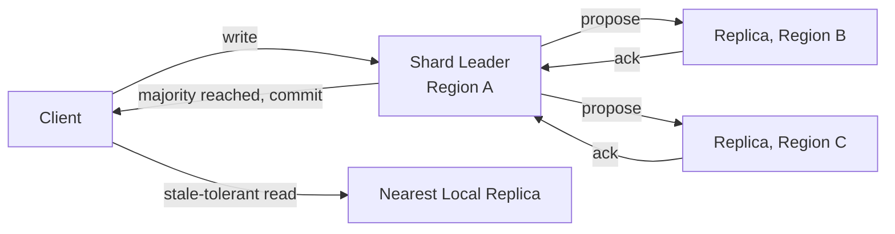

## Overview

- **Real-world analog:** Google Spanner, CockroachDB
- **Difficulty:** Hard

Every other question in this course assumes a database that's fast to reach. This one
removes that assumption: a database that must survive losing an entire region, while
still giving strongly consistent reads and writes — which means every write has to
achieve consensus across machines that are, physically, hundreds of milliseconds apart
in the worst case.

## Clarifying Questions & Requirements

> **Ask these first:** does every read need strong consistency, or can some reads
> tolerate slightly stale data for lower latency? How many regions, and what's the
> acceptable behavior if one region becomes unreachable?

| | In scope | Out of scope |
|---|---|---|
| **Functional** | Strongly consistent writes replicated across regions, configurable read consistency (strong vs. stale local reads) | Building the query language/SQL layer itself |
| **Non-functional** | Survive a full region outage without data loss, explicit and stated behavior during a network partition | Zero write-latency increase from cross-region consensus (physically impossible — the honest answer names the cost) |

Assume: data is sharded, each shard replicated across three or more regions, and writes
require majority agreement before being considered committed.

## Back-of-Envelope Estimation

| | Estimate |
|---|---|
| Cross-region round-trip latency | 50-150ms depending on region distance |
| Write latency with cross-region consensus | Bounded below by the round-trip to a majority of replicas — often 100ms+ |
| Read latency (local, stale-tolerant) | Single-digit milliseconds, served from the nearest replica |
| Shards per cluster | Thousands, each independently replicated and independently reaching consensus |

The headline number to internalize: cross-region consensus latency is a physical
constraint, not an engineering shortfall — no amount of optimization removes the speed
of light from the write path.

## API Design

```
BEGIN TRANSACTION
  READ / WRITE  (with a configurable consistency level per read)
COMMIT           → requires majority quorum ack across replicas
```

## Data Model & Storage

Data is range- or hash-sharded, each shard independently replicated to a fixed set of
regions, with its own consensus group.

| Choice | Why |
|---|---|
| **Per-shard consensus (a Raft or Paxos group per shard), not one global consensus group for the whole database** | A single global consensus group would serialize every write in the entire database through one agreement process — sharding the consensus itself, so each shard's replicas only need to agree among themselves, lets unrelated shards commit writes fully independently and in parallel |
| **A hybrid logical clock or a bounded-uncertainty physical clock (Spanner's TrueTime) for global write ordering**, not plain Lamport clocks alone | Determining a globally consistent commit order across regions needs more than "happened-before" causality tracking — a clock that bounds its own uncertainty (TrueTime waits out the uncertainty window before committing) or a hybrid logical clock (combining physical time with a logical counter) gives a total order that's both globally meaningful and doesn't require a single physical clock authority |
| **Configurable read consistency — strong reads go to the shard's leader/quorum, stale-tolerant reads go to the nearest local replica** | Forcing every read through the same consensus path as writes wastes the entire benefit of having geographically local replicas — most reads (a user viewing their own recently-loaded page) can tolerate a small staleness window in exchange for much lower latency, while some reads (checking current account balance before a transfer) genuinely need the strong guarantee |

## High-Level Architecture



## Deep Dives

**1. Majority quorum, not full replication, determines both availability and
durability.** A write only needs acknowledgment from a majority of a shard's replicas
(2 of 3, say) before it's considered committed — this means the system tolerates losing
a minority of replicas (including an entire region, if replicas are placed across
regions) without losing any committed write, while never waiting on the slowest replica
if it's outside the majority actually needed.

**2. Clock uncertainty has to be bounded and waited out, not assumed away.** Spanner's
TrueTime API doesn't return a single timestamp — it returns an interval representing the
maximum possible clock uncertainty, and a transaction commits only after waiting out
that interval, guaranteeing that any transaction which could have observed the commit
happened strictly after it. This "commit-wait" is a deliberate, explicit latency cost
paid specifically to make external consistency (global ordering that matches real-world
causality) achievable at all.

**3. What breaks at 10x — cross-shard transactions become the bottleneck, not
single-shard throughput.** A transaction touching only one shard scales beautifully with
shard count. A transaction touching multiple shards (say, a transfer between two
accounts on different shards) needs a distributed commit protocol across those shards'
consensus groups — as write volume grows, cross-shard transaction rate becomes the
harder scaling problem, which is why schema and sharding-key design that minimizes
cross-shard transactions matters far more here than in a single-region system.

**4. A network partition forces an explicit CAP choice, stated out loud.** If a region
is cut off from the majority, that region's replicas can still serve stale local reads
(if the design allows it) but cannot participate in committing new writes — the majority
side continues operating normally. This is a deliberate choice of consistency over
availability for the minority side, and a strong answer states this explicitly as the
system's stance rather than treating a partition as an unhandled edge case.

## Bottlenecks & Failure Modes

| Bottleneck | Mitigation | Tradeoff accepted |
|---|---|---|
| Cross-region write latency | Per-shard consensus, sized to a bounded set of replicas, not all regions | Writes to a given shard are still bounded by that shard's specific majority latency |
| Cross-shard transactions at high write volume | Sharding-key design that minimizes multi-shard transactions | Some queries that would be simple in a single-shard model need explicit cross-shard coordination |
| Minority-side partition | Explicit unavailability for writes on the minority side (consistency over availability) | Users in a partitioned minority region temporarily can't write |

## Why Not X?

**Why not asynchronous multi-master replication with last-write-wins conflict
resolution?** Silently loses data on genuine write conflicts (two regions writing to the
same record before either replication completes) — last-write-wins simply discards one
of the two writes with no signal to either client that this happened, which is
unacceptable for data where losing a write silently is a real business risk.

**Why not run a single region and accept the latency for distant users?** Defeats the
system's actual purpose — no cross-region durability against a regional outage, and
significantly worse latency for every user not near that one region, which is precisely
the two problems a globally distributed database exists to solve.

**Why not make everything eventually consistent to simplify the system?** Works for data
where staleness is genuinely tolerable, but breaks correctness for use cases needing
strong guarantees — a financial ledger or inventory count that's "eventually correct"
can present a wrong balance or oversell stock in the meantime, which is exactly the
failure mode strong consistency exists to prevent.

## Interview Signals

| | Strong answer | Weak answer |
|---|---|---|
| Sharded consensus | Explains per-shard consensus groups, not one global agreement process | Proposes a single global consensus mechanism for the whole database |
| Clock handling | Names the clock-uncertainty problem and a real mechanism (TrueTime/HLC) for solving it | Assumes wall-clock timestamps are sufficient for global ordering |
| CAP positioning | States explicitly what happens during a partition and why | Doesn't address partition behavior, or claims both full consistency and full availability with no tradeoff |

**Common failure modes:** proposing a single global consensus group instead of
per-shard sharded consensus; ignoring clock synchronization as a real problem; no
explicit statement of CAP tradeoffs during a partition.

## Glossary Links

This question draws on: Consistency model — linked on first mention above; Version skew
— linked on first mention above.
