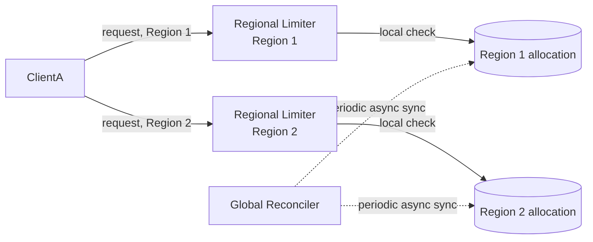

## Overview

- **Real-world analog:** the rate limiting behind any API operating across multiple
  global data centers
- **Difficulty:** Hard
- **Frontend counterpart:** none directly — this chapter extends this course's own
  [Rate Limiter](/backend-interviews/c/rate-limiter) (SDE-1) chapter, which designs
  correct enforcement for a single region. This chapter is what changes when "single
  region" stops being true.

The SDE-1 rate limiter's Redis-backed token bucket is correct and fast — within one
region. The moment a client's traffic is distributed across multiple regions (a mobile
app hitting whichever data center is nearest), enforcing one global limit per client
means somehow keeping multiple regional counters honest about a shared budget, without
paying a cross-region round-trip on every single request — which would undo the entire
point of having regional enforcement points in the first place.

## Clarifying Questions & Requirements

> **Ask these first:** how many regions? Is slight over-admission during a partition
> acceptable, or must the global limit be strictly enforced even under failure? How
> unevenly is traffic expected to be distributed across regions?

| | In scope | Out of scope |
|---|---|---|
| **Functional** | Enforce a single global limit per client across multiple regional enforcement points | The single-region enforcement mechanism itself (already covered by the SDE-1 chapter) |
| **Non-functional** | No cross-region synchronous call on the request hot path; graceful, explicit behavior during a region partition | Perfectly precise global enforcement at every instant (an explicit, accepted approximation — see Deep Dives) |

Assume: 5 regions, uneven traffic distribution across them, and a requirement that a
partitioned region continues serving (with its own bounded allocation) rather than
failing closed entirely.

## Back-of-Envelope Estimation

| | Estimate |
|---|---|
| Regions | 5 |
| Global limit per client | e.g., 10,000 requests/min |
| Cross-region sync interval | Seconds, not per-request |
| Traffic skew across regions | Can vary significantly by time of day/region population |

The core tension: sync too rarely, and a client's actual usage diverges meaningfully
from the true global count; sync too often, and the network overhead approaches the cost
of just doing the check synchronously per-request, defeating the design's purpose.

## API Design

Same observable contract as the SDE-1 chapter — `429` + `Retry-After` on rejection — the
difference is entirely in how the limit is coordinated behind that interface across
regions.

## Data Model & Storage

```
regional_allocation
  region          text
  client_id        text
  allocated_budget  int     -- this region's share of the client's global limit
  used              int     -- local count against that allocation, reset per window
```

| Choice | Why |
|---|---|
| **Each region enforces its own allocated sub-budget locally**, with periodic async reconciliation against actual cross-region usage, rather than a synchronous global check per request | A synchronous cross-region check on every request reintroduces exactly the latency cost the single-region design worked to avoid — local enforcement against a pre-allocated share keeps every request's rate-limit check local and fast, with periodic reconciliation correcting allocations based on real observed traffic patterns |
| **Allocation weighted by observed historical traffic share per region**, not an equal split across regions | An equal split (limit / region count) badly under-serves a region that legitimately gets more of a given client's traffic and over-allocates to a quiet region — weighting allocation by recent observed traffic share lets each region's budget better match its actual share of real usage |

## High-Level Architecture



## Deep Dives

**1. A fully synchronous global counter defeats the entire purpose of regional
enforcement.** If every request has to check and update a single global counter located
in one region, every request anywhere in the world pays that region's round-trip latency
— exactly what regional deployment is meant to avoid. The whole design only makes sense
if the common case (checking the limit) stays local, with global coordination happening
out-of-band.

**2. Sharding the limit itself into per-region allocations sidesteps cross-region
coordination on the hot path entirely.** Rather than trying to keep a live global count
synchronized, each region simply enforces its own slice of the total budget
independently — this is a deliberate choice to trade perfect global accuracy for
complete elimination of cross-region coordination during normal request handling, with
periodic reconciliation adjusting future allocations based on real usage rather than
trying to correct the past in real time.

**3. What happens during a region partition is a direct, explicit CAP tradeoff.** If a
region can't reach the reconciliation process, it can't get an updated allocation — the
design choice is to let it continue enforcing its last known allocation (prioritizing
availability) rather than failing closed and rejecting all traffic (which would
prioritize strict global accuracy at the cost of legitimate requests being blocked
during a routine, temporary partition). The system briefly risks slight global
over-admission in exchange for regions staying operational independently.

**4. Reconciliation frequency is the actual tuning knob for accuracy-vs-overhead, and
should be stated as a number, not left vague.** A 10-second reconciliation interval means
allocations can lag true usage by up to that long — for most rate-limiting use cases
(protecting infrastructure from abuse, not enforcing a hard billing cap), that's an
entirely acceptable approximation. A system where exact enforcement genuinely matters
(a hard-capped free tier tied to billing) might need tighter reconciliation, accepting
more overhead for less slack.

## Bottlenecks & Failure Modes

| Bottleneck | Mitigation | Tradeoff accepted |
|---|---|---|
| Cross-region latency if checks were synchronous | Local enforcement against a pre-allocated regional budget | Global accuracy is approximate, bounded by the reconciliation interval |
| Uneven traffic distribution mismatching static allocations | Allocation weighted by observed historical traffic share, periodically updated | A sudden shift in a client's regional traffic pattern is under-served until the next reconciliation |
| Region partition cutting off reconciliation | Region continues enforcing its last known allocation (availability over strict accuracy) | Possible slight global over-admission during the partition window |

## Why Not X?

**Why not a single global Redis instance that every region calls synchronously?** Adds
a cross-region network round-trip to every single request in the system and makes that
one instance both a latency bottleneck and a single point of failure for rate limiting
everywhere — precisely the two problems regional, locally-enforced allocation is
designed to avoid.

**Why not simply multiply the single-region limit by the number of regions, with no
coordination at all?** A client distributing requests evenly across all regions would
then receive N times their intended global limit — this doesn't actually enforce a
global limit at all, it just relabels a much larger effective limit as if it were the
original one.

**Why not rely purely on periodic reconciliation with no per-region allocation cap in
between?** Without a bounded local allocation, a region has no independent limit to
enforce between reconciliation cycles — the effective limit during that gap becomes
unbounded, a bigger and less predictable risk than the bounded over-admission the
allocation-based approach accepts.

## Interview Signals

| | Strong answer | Weak answer |
|---|---|---|
| Coordination model | Proposes per-region allocation with async reconciliation, not synchronous global checks | Proposes a single global counter checked on every request regardless of region |
| Partition behavior | States explicitly what happens to enforcement during a region partition | Doesn't address partition behavior at all |
| Accuracy tradeoff | Names reconciliation interval as the explicit accuracy-vs-overhead tuning knob | Treats the system as either perfectly accurate or completely broken, with no middle ground |

**Common failure modes:** a synchronous global check on every request; no allocation
strategy accounting for uneven regional traffic; no stated behavior for a region
partition.

## Glossary Links

This question draws on: Atomic compare-and-set — linked on first mention above (implied
in the per-region local enforcement, inherited from the SDE-1 chapter's mechanism).
