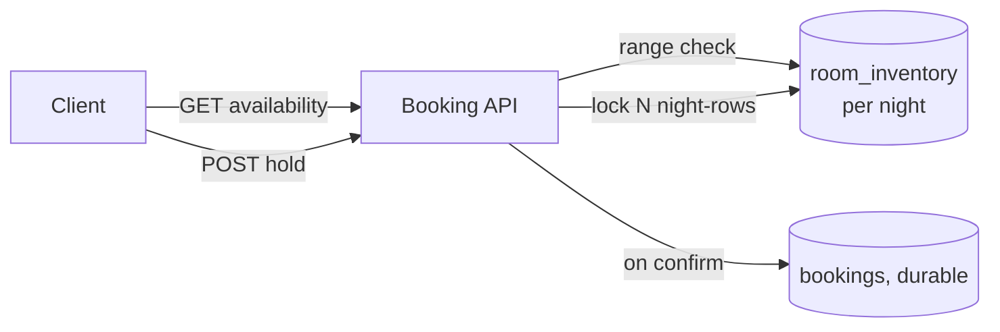

## Overview

- **Real-world analog:** Booking.com, Marriott's own reservation backend
- **Difficulty:** Medium
- **Frontend counterpart:** [Travel Booking](/system-design/c/travel-booking) covers the
  search/filter/booking-flow UI — this chapter is the inventory system underneath that
  has to guarantee the same room-night is never sold twice.

The seat-booking problem's cousin, made harder by one dimension: a hotel room isn't
booked as a single atomic unit, it's booked across a *range of nights*, and two bookings
for overlapping-but-not-identical date ranges on the same room both have to be checked
against each other correctly.

## Clarifying Questions & Requirements

> **Ask these first:** is overbooking an acceptable business strategy (as it often is in
> hospitality), or must availability be exact? Can a booking be modified/extended?
> Multi-room bookings?

| | In scope | Out of scope |
|---|---|---|
| **Functional** | Search availability for a date range, hold a room during checkout, confirm/cancel a booking | Dynamic pricing, loyalty program logic |
| **Non-functional** | No two confirmed bookings for the same room on overlapping nights (unless overbooking is a deliberate policy) | Perfectly real-time price updates across every OTA (out-of-band system concern) |

Assume: bookings span 1-14 nights, holds during checkout last 10 minutes, and the
business has chosen to allow a small, deliberate overbooking margin.

## Back-of-Envelope Estimation

| | Estimate |
|---|---|
| Rooms across a chain | Tens of thousands |
| Nights of inventory to track | Rooms × ~400 days rolling window ≈ tens of millions of room-nights |
| Peak search QPS | High — most traffic is availability search, not the booking write itself |
| Booking writes | Orders of magnitude lower than search reads |

The read:write skew is extreme — availability search dwarfs actual bookings, which
argues strongly for a read-optimized inventory representation.

## API Design

```
GET  /availability?roomType=&checkIn=&checkOut=      → 200 {available: bool, price}
POST /holds           {roomId, checkIn, checkOut}     → 201 {holdId, expiresAt} | 409
POST /holds/{id}/confirm {paymentToken}                → 200 | 410 Gone
POST /bookings/{id}/cancel                              → 204
```

## Data Model & Storage

```
room_inventory
  room_id       uuid
  date          date
  status        enum('available','held','booked')
  PRIMARY KEY(room_id, date)

bookings
  id            uuid PK
  room_id       uuid
  check_in      date
  check_out     date
  status        enum('held','confirmed','cancelled')
```

| Choice | Why |
|---|---|
| **A row per (room, date), not a row per booking with a date-range check** | Checking "does this new range overlap any existing booking's range" requires a range-overlap query and is genuinely awkward to lock correctly under concurrency. A per-night row turns availability into a simple existence check per date in the range — check and lock each night's row individually (or in one transaction covering the whole range), which is both easier to reason about and easier to lock correctly |
| **Holds as their own short-TTL state on the inventory row**, distinct from `booked` | Same reasoning as the seat-booking question: a hold is a temporary, expiring claim that shouldn't require an active cleanup process — native TTL expiry (or an equivalent check at read time) releases it automatically |

## High-Level Architecture



## Deep Dives

**1. Locking a date range atomically, not night by night.** Holding nights one at a
time risks succeeding on 3 of 5 nights and failing on the 4th, leaving a partial hold
that has to be unwound — the same partial-failure problem seat-booking solves with a
single atomic multi-key operation. Here, that means locking all `room_id, date` rows for
the requested range inside one transaction (or one atomic multi-key operation if using a
KV store), so the hold either succeeds for the whole range or fails cleanly with nothing
committed.

**2. Overbooking as a deliberate, bounded policy — not a bug.** Hotels routinely sell a
small percentage more rooms than they have, betting on no-shows and cancellations, and
maintain a waitlist/compensation policy (upgrade or refund + rebooking) for the rare case
that bet doesn't pay off. Modeling this means the inventory check isn't a strict
"available count > 0" but "confirmed count < physical count × overbooking factor" — a
deliberate design decision the system should make explicit, not something the data model
should try to prevent by construction.

**3. Search reads shouldn't touch the same rows the booking write path locks.** At the
extreme read:write skew here, running every availability search against the same
row-level-locked inventory table as active bookings would create needless contention. A
read-optimized, slightly-stale materialized view or cache of "is this room type
available for these dates" — refreshed on every booking/cancellation event — serves
search traffic without contending with the transactional write path at all.

## Bottlenecks & Failure Modes

| Bottleneck | Mitigation | Tradeoff accepted |
|---|---|---|
| Partial-range hold failure | Single transaction (or atomic multi-key op) covering the whole date range | Slightly more complex locking logic than per-night holds |
| Search read load contending with booking writes | Separate read-optimized availability view, refreshed asynchronously | Search results can be seconds stale relative to the true booking state |
| Hold expiry during a slow payment | Native TTL expiry on held nights, no polling sweep | A slow payment can legitimately lose the hold — must be a stated, explicit tradeoff |

## Why Not X?

**Why not model each booking as a single row with a date-range column and check for
range overlaps on write?** Correct in principle, but overlap-checking under concurrency
is genuinely harder to lock safely than a set of individual per-night rows — the
per-night model turns a range-overlap problem into N simple existence checks, which is
easier to reason about and easier to make atomic.

**Why not guarantee zero overbooking instead of accepting a deliberate margin?** Zero
overbooking is achievable but leaves real revenue on the table given predictable
no-show/cancellation rates — the business tradeoff most hotel chains actually make is a
small, calculated overbooking margin backed by a compensation policy, not perfect
inventory conservatism.

## Interview Signals

| | Strong answer | Weak answer |
|---|---|---|
| Data model | Uses per-night rows, recognizing the range-overlap locking problem | Models bookings as raw date ranges and hand-waves the overlap check |
| Atomicity | Locks the whole date range as one transaction, avoiding partial holds | Locks nights one at a time with no rollback plan |
| Overbooking | Treats it as an explicit, bounded business policy | Either ignores it or treats any overbooking as a bug to eliminate |

**Common failure modes:** date-range overlap checks with no locking strategy; per-night
holds with no atomicity across the range; no read/write path separation despite an
extreme read:write skew.

## Glossary Links

This question draws on: Atomic compare-and-set — linked on first mention above.
