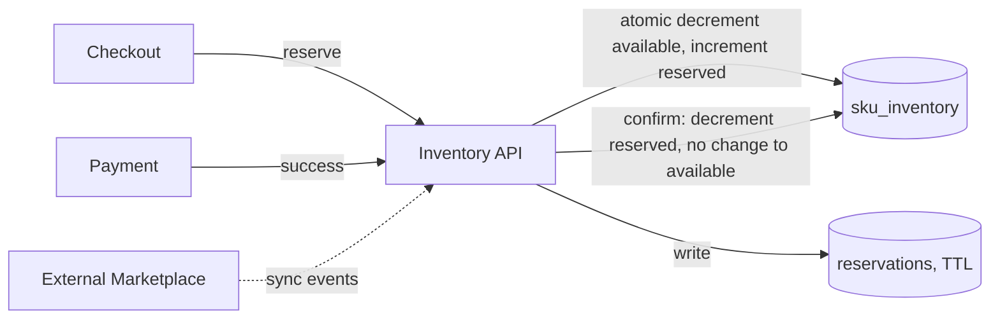

## Overview

- **Real-world analog:** the stock-tracking backend behind any multi-warehouse
  e-commerce operation
- **Difficulty:** Medium
- **Frontend counterpart:** [E-Commerce Marketplace](/system-design/c/ecommerce-marketplace)
  covers the storefront's product listing and cart UX — this chapter is the inventory
  system underneath that has to stay correct when the same SKU is sold through multiple
  channels at once.

The core failure mode this design exists to prevent is overselling — confirming an order
for a unit of stock that's already been claimed by another concurrent order, across
possibly multiple warehouses and multiple sales channels (the company's own site plus
third-party marketplaces) all writing against the same underlying inventory.

## Clarifying Questions & Requirements

> **Ask these first:** single warehouse or multi-warehouse? Does inventory sync with
> external marketplace channels, and how fast? Is a small oversell rate an acceptable
> tradeoff for looser coordination, or must it be exactly zero?

| | In scope | Out of scope |
|---|---|---|
| **Functional** | Reserve stock during checkout, confirm on payment, release on cart abandonment, allocate across warehouses | Demand forecasting, automated reordering |
| **Non-functional** | No oversell under concurrent checkouts for the same SKU | Perfect real-time sync with every external marketplace channel (near-real-time is the realistic target) |

Assume: multiple warehouses hold overlapping SKUs, and the same inventory is sold
through both the company's own site and at least one external marketplace.

## Back-of-Envelope Estimation

| | Estimate |
|---|---|
| SKUs tracked | Hundreds of thousands, across multiple warehouses each |
| Checkout attempts/sec at peak (sale event) | Thousands, concentrated on a small number of popular SKUs |
| External channel sync lag | Seconds to minutes, depending on the marketplace's own API |

The concentration on a small number of popular SKUs during a sale is the load-shaping
detail — this is a hot-key problem, structurally similar to the ones in the distributed-
cache and ticket-booking chapters.

## API Design

```
POST /inventory/reserve   {sku, warehouseId, quantity}   → 201 {reservationId} | 409 (insufficient stock)
POST /inventory/reservations/{id}/confirm                 → 200
POST /inventory/reservations/{id}/release                 → 204
```

## Data Model & Storage

```
sku_inventory
  sku            text
  warehouse_id   uuid
  available      int
  reserved       int
  PRIMARY KEY(sku, warehouse_id)

reservations
  id             uuid PK
  sku            text
  warehouse_id   uuid
  quantity       int
  expires_at     timestamp
  status         enum('active','confirmed','released')
```

| Choice | Why |
|---|---|
| **A `reserve → confirm` two-step flow, not an immediate decrement on add-to-cart or an immediate decrement only on payment** | Decrementing on add-to-cart holds real inventory hostage for abandoned carts that never convert. Decrementing only on payment success allows overselling: two concurrent checkouts can both pass an availability check before either completes payment, and both attempt to claim the last unit. A time-bounded reservation — this is precisely an inventory hold — atomically claims stock the moment checkout starts and releases it automatically if payment doesn't complete within the TTL |
| **`available` and `reserved` as separate counters, not one field decremented directly** | Keeping them separate lets the system distinguish "how much can a new checkout claim right now" (`available`) from "how much is currently held by in-flight checkouts" (`reserved`) — both numbers are independently useful for display (available) and for reconciliation/monitoring (reserved), and merging them into one mutated field loses that distinction |

## High-Level Architecture



## Deep Dives

**1. The reservation is an atomic compare-and-set against `available`, exactly like
every other contended-resource claim in this course.** `UPDATE sku_inventory SET
available = available - N, reserved = reserved + N WHERE sku = ? AND warehouse_id = ?
AND available >= N` — the condition on the `WHERE` clause is what makes this safe:
the update only succeeds if enough stock was still actually available at write time,
and returns zero rows affected (interpreted as `409`) otherwise. No separate
check-then-write.

**2. Multi-channel sync is inherently eventually consistent, and the design has to
say so explicitly.** When the same SKU sells through both the company's own site and an
external marketplace, the two systems' views of available stock can briefly diverge —
a sale on the marketplace channel takes a few seconds to propagate back and decrement
local inventory. The mitigation isn't eliminating this lag (usually not fully possible
given external API constraints) but bounding its blast radius: a small buffer of
reserve stock held back from external channels specifically to absorb this sync-lag
risk, and an automated oversell-detection process that flags and handles the rare case
where it happens anyway (typically: cancel one of the conflicting orders and notify the
customer).

**3. Multi-warehouse allocation is a separate decision from reservation correctness.**
Given several warehouses hold the same SKU, which one fulfills a given order is its own
question — nearest-to-customer for shipping speed, or lowest-cost warehouse, or whichever
has enough single-warehouse stock to avoid a split shipment. This routing decision can
be optimized independently of the reservation mechanism itself, which just needs to
correctly claim stock at whichever warehouse is chosen.

**4. A returned item doesn't go straight back into `available`.** Restocking after a
return often needs a quality check, or at minimum a deliberate decision about whether
the returned unit is sellable — crediting it directly back to `available` on receipt
assumes it's immediately resellable, which isn't always true. Modeling returns as their
own state (`returned → inspecting → available` or `returned → damaged/disposed`) keeps
the inventory count honest rather than optimistically incrementing it the moment a
package arrives back at a warehouse.

## Bottlenecks & Failure Modes

| Bottleneck | Mitigation | Tradeoff accepted |
|---|---|---|
| Concurrent checkouts on a hot SKU during a sale | Atomic conditional decrement, same pattern as every other contended-resource question in this course | Brief contention on very popular SKUs at peak, not a correctness risk |
| Multi-channel sync lag causing oversell | Reserve buffer for external channels + automated oversell detection/cancellation flow | A small amount of held-back stock is unavailable to any channel as a safety margin |
| Abandoned reservations holding stock | TTL-based automatic release, same pattern as seat/hotel holds elsewhere in this course | A short window where truly abandoned stock still shows as reserved |

## Why Not X?

**Why not decrement stock immediately when an item is added to a cart?** Effectively
takes inventory out of circulation for every abandoned cart, which for typical e-commerce
abandonment rates would mean a large fraction of "sold out" items are actually just
sitting in carts nobody completed — a real revenue cost, not just a technicality.

**Why not decrement only at payment success and skip the reservation step entirely?**
Reopens the exact race the reservation exists to prevent: two concurrent checkouts can
both pass an availability check before either pays, and both can succeed at payment,
overselling the same unit. The reservation is what closes that window.

**Why not treat all warehouses as a single unified stock pool, ignoring physical
location?** A unified count can't answer "can this order ship as one package or does it
need to split across warehouses," and loses the ability to route fulfillment to the
warehouse nearest the customer for shipping speed and cost — per-warehouse granularity
is what makes both of those genuinely important decisions possible.

## Interview Signals

| | Strong answer | Weak answer |
|---|---|---|
| Reservation model | Uses a time-bounded reserve-then-confirm flow with an explicit TTL | Decrements stock either too early (add-to-cart) or too late (payment only) |
| Concurrency | Uses an atomic conditional update for the reservation, not check-then-write | Checks availability, then writes, as two separate steps |
| Multi-channel | Explicitly acknowledges sync lag as eventually consistent and designs a mitigation | Assumes all channels see inventory changes instantly |

**Common failure modes:** decrementing stock at the wrong point in the checkout flow;
a check-then-write race on the reservation itself; no acknowledgment that multi-channel
inventory sync is inherently laggy.

## Glossary Links

This question draws on: Inventory hold — linked on first mention above.
