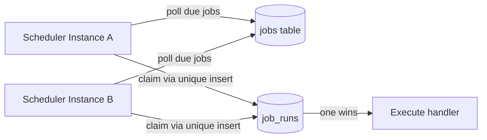

## Overview

- **Real-world analog:** cron, but distributed across many machines — closer to
  Airflow's or Kubernetes CronJob's scheduling core
- **Difficulty:** Medium

A single-machine `cron` is a solved problem. The interview question is what happens the
moment you need this to survive a machine dying: run it on multiple instances for
availability, and now every one of them wants to fire the same scheduled job at the same
moment — the whole design is about preventing that.

## Clarifying Questions & Requirements

> **Ask these first:** at-least-once or exactly-once execution? Are job handlers
> idempotent? What happens to jobs missed during scheduler downtime — skip, or catch up?

| | In scope | Out of scope |
|---|---|---|
| **Functional** | Register a job with a cron-style schedule, execute at the scheduled time, retry on failure | Building the job handlers themselves — assume they're arbitrary functions/webhooks |
| **Non-functional** | Exactly one execution per scheduled run, even with multiple scheduler instances running for HA | Sub-second scheduling precision — minute-level granularity is standard and sufficient |

Assume: tens of thousands of scheduled jobs, running on a horizontally-scaled scheduler
fleet for availability, with handlers that may or may not be idempotent.

## Back-of-Envelope Estimation

| | Estimate |
|---|---|
| Scheduled jobs | 50,000 distinct job definitions |
| Executions/minute at peak (many jobs share common schedules like "every hour") | Thousands, clustered around common cron boundaries (`:00`, `:15`, etc.) |
| Scheduler instances | 3-5, for availability, all capable of triggering any job |

The clustering around common schedule boundaries (everyone's hourly job firing at the
top of the hour) is a real load-shaping detail worth naming.

## API Design

```
POST /jobs        {cronExpr, handlerUrl, retryPolicy}   → 201 {jobId}
GET  /jobs/{id}/runs                                      → 200 [{startedAt, status}]
DELETE /jobs/{id}                                          → 204
```

## Data Model & Storage

```
jobs
  id             uuid PK
  cron_expr      text
  handler_url    text
  next_run_at    timestamp
  last_run_at    timestamp

job_runs
  id             uuid PK
  job_id         uuid FK
  scheduled_for  timestamp
  started_at     timestamp
  status         enum('running','succeeded','failed')
  UNIQUE(job_id, scheduled_for)
```

| Choice | Why |
|---|---|
| **`UNIQUE(job_id, scheduled_for)` on `job_runs`** | This single constraint is what actually prevents duplicate execution: any scheduler instance attempting to trigger a job for a given scheduled time first tries to insert a `job_runs` row for that (job, time) pair — the insert succeeds for exactly one instance, and every other instance's insert fails, telling them someone else already claimed this run |
| **`next_run_at` computed and stored, not the cron expression evaluated fresh on every scheduler tick** | Storing the precomputed next-fire time turns "which jobs are due" into a simple indexed range query (`WHERE next_run_at <= now()`) instead of every scheduler instance re-parsing and evaluating every job's cron expression on every tick |

## High-Level Architecture



## Deep Dives

**1. Claiming a run without a distributed lock service.** The naive fix for "don't let
two instances run the same job" is a distributed lock (Redis, ZooKeeper, etcd) held for
the duration of execution. A simpler and often sufficient alternative: the
`UNIQUE(job_id, scheduled_for)` insert *is* the lock — whichever instance's insert
succeeds owns that run, and it never needs to be explicitly released, because the next
scheduled time is a different row entirely. This avoids operating a separate locking
service just for this.

**2. Catching up after scheduler downtime.** If every instance is down for 20 minutes
and a job was scheduled to run every 5 minutes during that window, does it fire 4 times
on recovery, once, or not at all? This has to be an explicit policy per job, not an
accident of the recovery code: a `catch_up: false` default (only the next future run
fires, missed runs are simply skipped) is usually right for jobs like "send a daily
digest," while `catch_up: true` might matter for something like "process the backlog of
pending transactions."

**3. Retry semantics require idempotent handlers.** At-least-once execution means a job
can run twice in rare failure scenarios (the scheduler crashes after marking a run
`succeeded` but before the handler's side effect fully lands, or a retry after a timeout
whose original attempt actually completed). The scheduler can guarantee *triggering*
exactly once under normal operation via the unique-run-claim, but true exactly-once
*effects* require the handler itself to be idempotent — the scheduler's contract should
say this explicitly rather than implying a guarantee it can't fully make on its own.

## Bottlenecks & Failure Modes

| Bottleneck | Mitigation | Tradeoff accepted |
|---|---|---|
| Duplicate execution across scheduler instances | `UNIQUE(job_id, scheduled_for)` claim via insert | None significant — this is close to free correctness |
| Load clustering at common cron boundaries (`:00`, `:15`) | Jitter — add a small random offset to `next_run_at` for non-time-critical jobs | Slightly less predictable exact firing time for jittered jobs |
| Handler failure requiring retry | Exponential backoff with a bounded max attempt count, tracked per `job_runs` row | Failed jobs can take longer to fully resolve or alert |

## Why Not X?

**Why not a distributed lock service instead of a unique-constraint claim?** Works, but
adds an operational dependency (ZooKeeper/etcd/a Redis lock) and lock-expiry edge cases
(what if the lock holder crashes mid-execution and never releases it) that the
unique-insert approach avoids by construction — there's nothing to release, because each
scheduled run is a distinct row, not a resource held across time.

**Why not just run the scheduler as a single instance to avoid the problem entirely?**
Gives up availability — a single scheduler instance is a single point of failure for
every scheduled job in the system, which is a bigger risk than the coordination problem
solved by having multiple instances race safely for each run.

## Interview Signals

| | Strong answer | Weak answer |
|---|---|---|
| Duplicate prevention | Uses a unique constraint as a lightweight claim mechanism | Proposes an external distributed lock without weighing the simpler alternative |
| Missed-run policy | Names catch-up-vs-skip as an explicit per-job decision | Doesn't consider what happens after scheduler downtime at all |
| Guarantee boundary | States clearly that exactly-once triggering ≠ exactly-once effects | Claims the system guarantees exactly-once execution without qualification |

**Common failure modes:** no mechanism preventing duplicate triggers across instances;
treating retry/idempotency as the scheduler's problem rather than the handler's; no
policy for missed runs after downtime.

## Glossary Links

This question draws on: Idempotency — linked on first mention above; Exponential
backoff — linked on first mention above.
