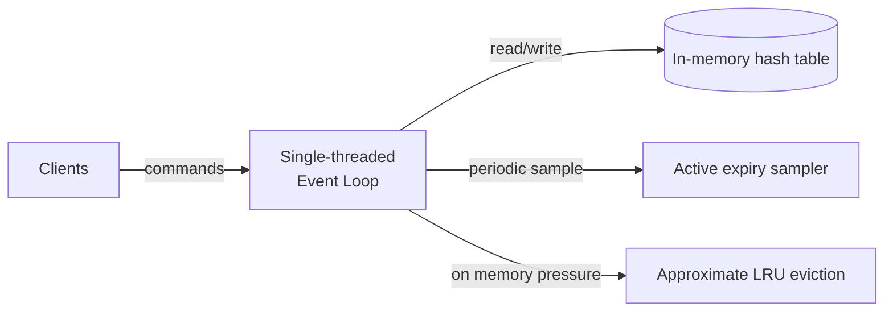

## Overview

- **Real-world analog:** the internals of Redis or Memcached on a single node
- **Difficulty:** Medium

Every other question in this course *uses* a key-value store as a building block. This
one asks you to build one — a genuinely different exercise, because now the constraints
are memory layout, single-node concurrency, and eviction under pressure, not
distribution across a cluster (that's the separate `distributed-cache` question).

## Clarifying Questions & Requirements

> **Ask these first:** does data need to survive a restart, or is pure in-memory
> acceptable? What eviction policy when memory fills up? Single-threaded or
> multi-threaded access model?

| | In scope | Out of scope |
|---|---|---|
| **Functional** | GET/SET/DEL, TTL-based expiry, eviction under a memory limit | Cross-node replication, clustering (see `distributed-cache`) |
| **Non-functional** | O(1) average-case operations, bounded memory usage, low tail latency | Full ACID transactions across multiple keys |

Assume: single-node, in-memory, with an optional TTL per key and a hard memory ceiling
that triggers eviction once reached.

## Back-of-Envelope Estimation

| | Estimate |
|---|---|
| Target throughput | 100K+ ops/sec on a single node — this is the whole point of an in-memory store |
| Memory ceiling | Whatever's provisioned (e.g., 16-64GB), fully configurable |
| Per-op latency budget | Microseconds, not milliseconds — anything slower defeats the purpose |

The estimation exercise here is really about internal data-structure complexity
(O(1) vs. O(log n) vs. O(n) per operation), not network capacity planning.

## API Design

```
GET    key           → value | nil
SET    key value [EX ttl]
DEL    key
EXPIRE key ttl
```

A binary or text wire protocol over a persistent connection — not HTTP, whose
per-request overhead would dominate at this operation rate.

## Data Model & Storage

The core structure is a hash table: `key → {value, expires_at}`. The interesting design
decisions aren't in that schema — they're in how expiry and eviction are implemented
around it.

| Choice | Why |
|---|---|
| **Single-threaded event loop for command execution**, not fine-grained per-key locking | A single thread processing commands one at a time from a queue never has a race condition on the hash table itself — no locks needed at all for correctness. The cost (only using one CPU core for command execution) is real, but for operations this cheap, lock overhead in a multi-threaded design often costs more than it saves |
| **Lazy expiry (check `expires_at` on access) combined with active sampling**, not a full periodic sweep of every key | Checking every key on a fixed interval to find expired ones is O(n) per sweep and wasteful at scale — lazy checking catches expired keys the moment they're accessed, and a periodic *sample* of a small random subset of keys (rather than all of them) catches keys that are never accessed again but should still eventually free their memory |
| **Approximate LRU via random sampling, not an exact LRU linked list** | An exact LRU (a doubly-linked list reordered on every access) adds per-key memory overhead and a write on every single read, even a cache hit. Approximate LRU — sample a handful of random keys, evict whichever has the oldest last-access time among just that sample — gets most of the benefit of true LRU at a fraction of the bookkeeping cost, which is the real technique Redis itself uses |

## High-Level Architecture



## Deep Dives

**1. Why single-threaded is a legitimate design, not a limitation.** The operations
themselves (hash lookup, insert, delete) are so cheap that the overhead of
fine-grained locking to allow true multi-threaded concurrent access can exceed the cost
of just doing everything on one thread and queuing requests. The real throughput ceiling
in this design usually isn't CPU — it's network I/O, which can be handled by separate
I/O threads even while command *execution* stays single-threaded, giving most of the
benefit of concurrency without any locking complexity in the data structure itself.

**2. Why active expiry can't be a full sweep.** With millions of keys, iterating all of
them on a timer to find expired ones is wasted work scaling with total key count, most
of which aren't expired. Sampling a small random subset (say, 20 keys) each cycle,
expiring whatever's found expired, and repeating the cycle again immediately if more
than a threshold fraction were expired, bounds the work per cycle regardless of total
key count while still reclaiming memory from keys nobody's actively reading.

**3. Why approximate LRU is the right eviction tradeoff, precisely stated.** Exact LRU
requires touching a shared linked-list structure on every read to move the accessed key
to the front — a write on every read undermines a big part of what makes reads cheap in
the first place. Approximate LRU only does bookkeeping (comparing a sampled few keys'
last-access times) at eviction time, which is far rarer than read time, in exchange for
occasionally evicting a not-quite-least-recently-used key — a cost most workloads don't
even notice.

## Bottlenecks & Failure Modes

| Bottleneck | Mitigation | Tradeoff accepted |
|---|---|---|
| Single CPU core ceiling on command execution | I/O handled by separate threads; only execution is single-threaded | Command execution throughput is capped by one core's speed |
| Memory pressure at scale | Approximate LRU eviction sampling | Occasionally evicts a not-quite-oldest key |
| Expired keys never being accessed again, holding memory forever | Active sampling-based expiry sweep | Small constant background CPU cost |

## Why Not X?

**Why not multi-threaded with per-key locks for true parallelism?** Viable, and some
systems do this, but lock acquisition/release overhead on operations this cheap can
exceed the actual work being done, and it reintroduces the entire class of concurrency
bugs (deadlock, lock contention hotspots on popular keys) that a single-threaded design
avoids by construction.

**Why not exact LRU — it's the theoretically correct answer?** It is more precise, but
the cost (a linked-list write on every read, plus per-key overhead to store list
pointers) is disproportionate to the benefit for most real workloads, where an
approximately-recently-used key being evicted instead of the exact least-recently-used
one is indistinguishable in practice.

## Interview Signals

| | Strong answer | Weak answer |
|---|---|---|
| Concurrency model | Explains why single-threaded execution avoids locking entirely, and where the real throughput ceiling is | Assumes multi-threading is automatically better without weighing the lock-overhead cost |
| Expiry | Proposes lazy + sampled active expiry, not a full periodic sweep | Proposes iterating every key on a timer |
| Eviction | Names approximate LRU and explains the sampling tradeoff | Assumes exact LRU with no discussion of its overhead |

**Common failure modes:** assuming more threads is strictly better without weighing lock
overhead; a full-table sweep for expiry; exact LRU with no acknowledgment of its cost.

## Glossary Links

This question draws on: Backpressure — linked on first mention above (I/O threads
buffering commands ahead of a single execution thread).
