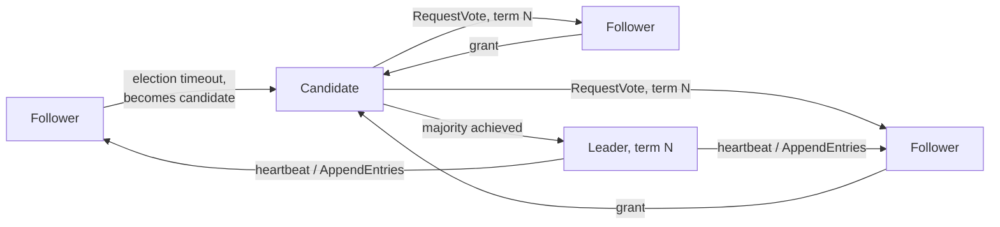

## Overview

- **Real-world analog:** ZooKeeper, etcd — the coordination primitive underneath most
  distributed systems in this course, including the consensus mechanisms in
  `distributed-messaging` and `global-database`
- **Difficulty:** Hard

Several chapters in this course have quietly depended on "one node is the leader for
this shard/partition/document, and everyone agrees on who." This chapter builds that
primitive itself — a cluster-wide distributed lock on the leader role — the generic
mechanism that lets a cluster of nodes agree on exactly one leader, detect when it
fails, and elect a new one, all without ever risking two nodes simultaneously believing
they're in charge.

## Clarifying Questions & Requirements

> **Ask these first:** how many nodes participate? What must happen during a network
> partition — does the majority side keep operating? How quickly must a failed leader
> be detected and replaced?

| | In scope | Out of scope |
|---|---|---|
| **Functional** | Elect exactly one leader among a set of nodes, detect leader failure, re-elect | Building the actual replicated state machine/log that sits on top of leadership (that's what `distributed-messaging` and `global-database` do with this primitive) |
| **Non-functional** | Never allow two nodes to simultaneously believe they're leader (no split-brain), recover automatically from a leader failure | Sub-millisecond failover (a few hundred milliseconds to a few seconds is the realistic, accepted target) |

Assume: a 5-node cluster, needing to tolerate up to 2 simultaneous node failures while
still maintaining a single agreed-upon leader.

## Back-of-Envelope Estimation

| | Estimate |
|---|---|
| Cluster size | 5 nodes (a common choice — odd-sized, tolerates 2 failures) |
| Quorum required | 3 of 5 (a strict majority) |
| Election timeout | Hundreds of milliseconds to a few seconds, tuned to balance fast failover against false-positive elections from transient network blips |
| Heartbeat interval | A fraction of the election timeout, so a genuine failure is distinguishable from one missed heartbeat |

This is a small-N problem by design — leader election clusters are deliberately kept
small (5, sometimes 7 nodes), because every write needs a majority of *all* participants,
not because the system can't coordinate more.

## API Design

Not a client-facing API in the traditional sense — the "interface" is the protocol
between cluster nodes themselves:

```
RequestVote(term, candidateId)         → grant | reject
AppendEntries(term, leaderId, entries) → ack | reject (also serves as the heartbeat)
```

## Data Model & Storage

Each node persists:

```
current_term      -- monotonically increasing, incremented on every new election
voted_for          -- which candidate this node voted for in the current term
log                -- the replicated log entries (if this primitive is backing one)
```

| Choice | Why |
|---|---|
| **Majority quorum (strict majority of all nodes), not a fixed threshold or "whoever responds first"** | A majority quorum is what mathematically guarantees at most one leader can be elected per term — two disjoint majorities cannot both exist among the same fixed set of nodes, so if one candidate wins a majority of votes, no other candidate can simultaneously win a different majority in the same term |
| **A monotonically increasing term number attached to every message**, not relying on wall-clock time or message arrival order | Any node receiving a message (a vote request, a heartbeat) carrying an older term than its own current term rejects it outright — this is what lets a node that was partitioned away and had a stale view of leadership correctly recognize, the moment it reconnects, that its old belief is outdated, without needing synchronized clocks |

## High-Level Architecture



## Deep Dives

**1. Majority quorum is the actual mechanism that prevents split-brain, and it's worth
stating precisely why.** In a 5-node cluster, a majority is any 3 nodes. If a candidate
wins votes from 3 nodes in term N, no other candidate can simultaneously win a *different*
3-node majority in that same term — any two sets of 3 nodes out of 5 must overlap by at
least one node, and that overlapping node can only vote for one candidate per term. This
overlap-guarantee, not any timing assumption, is what makes split-brain mathematically
impossible within a single term.

**2. The term counter is how the cluster detects and heals from a stale leader after a
partition.** If a leader is partitioned away from the majority, the majority side times
out (no heartbeats arriving) and elects a new leader with a higher term number. When the
network partition heals and the old leader reconnects, it receives a message carrying a
higher term than its own, immediately recognizes it's stale, and steps down to follower
— this self-correction is entirely driven by comparing term numbers, with no external
intervention needed.

**3. Log replication reuses exactly the same majority-quorum logic as leader election
itself.** A leader only considers a log entry committed once a majority of nodes have
durably stored it — the identical "majority agreement" primitive used to elect the
leader is reused to decide when data is safely committed, which is precisely the same
mechanism `global-database`'s cross-region consensus relies on for write durability.

**4. A network partition forces the same explicit CAP choice seen throughout this
course's distributed systems questions.** The majority-side partition can elect (or
retain) a leader and continue accepting writes normally. The minority side, unable to
reach a majority for any vote, cannot elect a leader and correctly refuses to accept new
writes at all — this is consistency chosen over availability for the minority side, a
deliberate design stance, not an oversight or a bug to be fixed later.

## Bottlenecks & Failure Modes

| Bottleneck | Mitigation | Tradeoff accepted |
|---|---|---|
| Split-brain from two simultaneous leaders | Majority quorum makes this mathematically impossible within a single term | Requires a majority of nodes to be reachable for any leadership decision at all |
| A partitioned-away stale leader continuing to believe it leads | Monotonic term numbers, compared and rejected on every message | Brief window before the stale leader detects staleness and steps down |
| Minority-side unavailability during a partition | Explicit, accepted consistency-over-availability choice for the minority | Minority-side clients cannot write until the partition heals or majority is restored |

## Why Not X?

**Why not let any node simply declare itself leader without an election?** Guarantees
split-brain the instant two nodes make conflicting claims — nothing prevents both from
believing they lead simultaneously, since there's no mechanism forcing agreement among
the cluster at all.

**Why not use a fixed, pre-assigned leader instead of dynamic election?** A single point
of failure with no automatic recovery — if that specific node fails, the cluster has no
leader and no built-in mechanism to choose a new one, defeating the purpose of building
a highly-available coordination primitive in the first place.

**Why not let the minority-side partition continue serving writes, for better
availability?** Risks two independently-progressing, diverging histories of "committed"
data that can't be safely reconciled when the partition heals — for a primitive whose
entire purpose is being an unambiguous source of truth about leadership and ordering,
that correctness risk is unacceptable.

## Interview Signals

| | Strong answer | Weak answer |
|---|---|---|
| Split-brain prevention | Explains majority quorum's overlap guarantee precisely | Says "use a quorum" without explaining why it actually prevents split-brain |
| Stale leader recovery | Names the term-number mechanism for detecting and correcting a stale leader | Has no mechanism for a partitioned leader to recognize it's no longer valid |
| Partition behavior | States the CAP tradeoff explicitly — majority available, minority not | Assumes the system remains fully available on both sides of a partition |

**Common failure modes:** no mechanism preventing split-brain beyond "assume it won't
happen"; no way for a stale leader to detect and correct itself; no explicit partition-
behavior stance.

## Glossary Links

This question draws on: Distributed lock — linked on first mention above (leadership
itself is a form of a distributed, cluster-wide exclusive claim).
