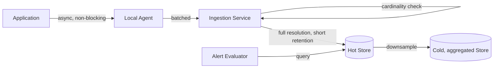

## Overview

- **Real-world analog:** the ingestion pipeline behind Datadog, Prometheus + Grafana,
  or an internal observability stack
- **Difficulty:** Medium-Hard
- **Frontend counterpart:** [Analytics Dashboard](/system-design/c/analytics-dashboard)
  covers the client-side event capture and dashboard rendering — this chapter is the
  backend that has to ingest, store, and query that volume without the storage bill or
  the cardinality of the data itself becoming unmanageable.

Every service in this entire course, in production, would be emitting logs and metrics
into whatever system this chapter designs. The two problems that make this hard and
distinct from a normal storage system: the write volume is enormous and mostly
low-value, and a single careless design decision (tagging a metric with something
high-cardinality) can silently make the whole system unusably expensive.

## Clarifying Questions & Requirements

> **Ask these first:** logs, metrics, or both? What's the retention requirement, and
> does it differ by data age (hot vs. cold)? Do alerts need to fire within seconds of
> an anomaly, or is a short delay acceptable?

| | In scope | Out of scope |
|---|---|---|
| **Functional** | Ingest structured logs and time-series metrics, support querying/dashboards, evaluate alert rules | Distributed tracing (a related but distinct data model) |
| **Non-functional** | Ingestion must never block the application's request path, storage cost must scale sub-linearly with raw event volume | Millisecond-precision alerting (seconds-level is the realistic, acceptable target) |

Assume: thousands of services each emitting logs and metrics continuously, with
retention needs that differ sharply by data age (recent data queried often, old data
rarely).

## Back-of-Envelope Estimation

| | Estimate |
|---|---|
| Log volume | Billions of log lines/day across the fleet |
| Metric data points | Millions/sec if every service emits fine-grained metrics naively |
| Storage if kept at full resolution forever | Grows unboundedly and dominates cost within months |
| Retention need | Full detail for days, aggregated/downsampled for months to years |

The gap between "volume if naively logged" and "volume actually needed" is enormous —
most of the design is about closing that gap deliberately.

## API Design

```
POST /logs        {service, level, timestamp, fields{}}     → 202 (batched ingest)
POST /metrics      {name, tags{}, timestamp, value}          → 202 (batched ingest)
GET  /metrics/query?name=&range=&groupBy=                     → 200 {series}
```

## Data Model & Storage

```
metrics   -- time series, keyed by name + tag set
  metric_name    text
  tags           map<text,text>
  timestamp       timestamp
  value           float

logs      -- structured, indexed by service + time
  service         text
  level           enum
  timestamp        timestamp
  fields          json
```

| Choice | Why |
|---|---|
| **A hard limit on tag cardinality per metric**, enforced at ingestion, not left to emit freely | A metric tagged with something high-cardinality (a request ID, a user ID) creates a distinct time series *per unique tag value* — millions of them, most queried never — which explodes both storage and query cost. Enforcing a cardinality budget at ingestion (reject or drop tags beyond a threshold) is the single highest-leverage guardrail in the whole system |
| **Downsampling by data age — full resolution for a short recent window, progressively coarser aggregates for older data** | Almost all real queries are either "what's happening right now" (needs full resolution) or "what was the trend over months" (doesn't need per-second precision for that). Storing everything at full resolution forever pays for precision that's essentially never used once data ages past a few days |
| **Asynchronous, batched ingestion via local agents**, not synchronous writes from the application process | An application blocking its own request path on a logging or metrics write turns an operational concern into a user-facing latency cost. Local agents batch events and ship them asynchronously, so the application's own hot path is never waiting on the observability system at all |

## High-Level Architecture



## Deep Dives

**1. Cardinality control has to happen at ingestion, not after the fact.** Once a
million distinct time series exist because of an unbounded tag, deleting them doesn't
undo the storage and indexing cost already paid, and doesn't prevent it from happening
again the next time someone adds a similarly unbounded tag. A cardinality budget
enforced at write time (reject the tag, or bucket it into a smaller set of values) is
the only point where this is cheap to fix.

**2. Downsampling is a deliberate loss of precision, traded for cost, and the design
should say exactly what's lost.** A common tiering: raw data at full resolution for 7
days, 5-minute aggregates for 90 days, hourly aggregates beyond that. A dashboard
querying a 6-month trend genuinely doesn't need per-second data to show that trend
correctly — but a debugging session looking at what happened 10 seconds before an
incident does, which is exactly why the short full-resolution window exists alongside
the long downsampled one, not instead of it.

**3. Async ingestion means the observability system itself can degrade without taking
the application down with it.** If the ingestion pipeline is backed up or briefly
unavailable, local agents buffer (with a bounded buffer and a documented drop policy
once full) rather than blocking the application. Losing some observability data during
an ingestion-side incident is a real cost, but it's a strictly better failure mode than
observability infrastructure being able to cause application-level outages.

**4. Alert evaluation runs against rollups on an interval, not against every raw data
point as it arrives.** Continuously streaming every incoming point through every alert
rule's evaluation logic is far more compute than most alerts actually need — the
overwhelming majority don't require sub-second detection. Evaluating rules against
short-interval aggregates (say, every 30 seconds) trades a small, bounded detection
delay for a large reduction in evaluation cost, reserving true streaming evaluation only
for the small set of alerts where that delay genuinely isn't acceptable.

## Bottlenecks & Failure Modes

| Bottleneck | Mitigation | Tradeoff accepted |
|---|---|---|
| Unbounded metric cardinality | Hard cardinality budget enforced at ingestion | Some legitimately useful high-cardinality breakdowns require an explicit exception process |
| Storage cost growing unboundedly with data age | Tiered downsampling by age | Precision loss on old data, by design |
| Ingestion pipeline backpressure | Local agent buffering, async and non-blocking from the app | Data loss risk during a sustained ingestion-side outage, bounded by buffer size |

## Why Not X?

**Why not keep everything at full resolution — storage is cheap?** Storage cost isn't
the only cost — query performance also degrades as time-series count and data volume
grow, and most of that precision is never actually queried once data ages past the
window where anyone's actively debugging something. The cost is real even when storage
itself is cheap.

**Why not write logs and metrics synchronously to guarantee nothing is ever lost?**
Makes the observability system a dependency of every request's latency and availability
— the exact inversion of what an observability system should be. A brief data-loss risk
during an ingestion outage is a far smaller cost than application requests failing
because a logging call couldn't complete.

**Why not evaluate every alert rule against every incoming data point in true real
time?** Technically gives the lowest possible detection latency, but at the ingestion
volumes this system handles, streaming evaluation of every rule against every point is
a large, mostly unnecessary compute cost — interval-based evaluation against rollups
gets acceptable detection latency for the vast majority of alerts at a fraction of the
cost, with true streaming reserved for the minority that actually need it.

## Interview Signals

| | Strong answer | Weak answer |
|---|---|---|
| Cardinality | Identifies unbounded tags as the primary cost/scaling risk and enforces limits at ingestion | Doesn't mention cardinality at all |
| Downsampling | Proposes a tiered retention strategy tied to actual query patterns | Assumes all data should be kept at full resolution indefinitely |
| Ingestion path | Makes ingestion async and non-blocking relative to the application | Has the application write synchronously to the observability system |

**Common failure modes:** no cardinality guardrails, allowing an unbounded tag to
explode cost; full-resolution retention with no downsampling strategy; synchronous
logging/metrics calls on the application's critical path.

## Glossary Links

This question draws on: Downsampling — linked on first mention above; Backpressure —
linked on first mention above.
