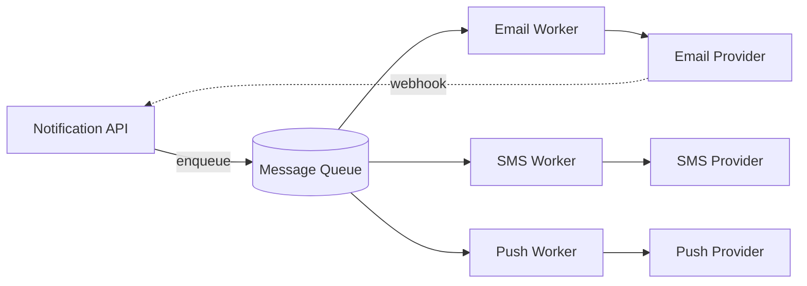

## Overview

- **Real-world analog:** the notification-sending backend behind any app that emails,
  texts, or pushes you
- **Difficulty:** Medium
- **Frontend counterpart:** [Notification System](/system-design/c/notification-system)
  covers the inbox UI, unread state, and delivery to an open tab — this chapter is the
  service that actually gets a message out to email/SMS/push in the first place.

The hard part isn't sending one notification — it's sending millions, through three
unreliable third-party providers, without double-sending any of them when a worker
crashes mid-delivery and retries.

## Clarifying Questions & Requirements

> **Ask these first:** which channels (email/SMS/push, or all three)? Best-effort or
> does every notification need a delivery guarantee? Can a user configure channel
> preferences? Do notifications need templating/localization?

| | In scope | Out of scope |
|---|---|---|
| **Functional** | Send via email/SMS/push, per-channel templates, delivery status tracking | Building the actual email/SMS infrastructure — assume SendGrid/Twilio/FCM as providers |
| **Non-functional** | At-least-once delivery, no duplicate sends on retry, provider outages don't cascade | Real-time in-app delivery to an open session (that's the frontend counterpart's job) |

Assume: 200M notifications/day across all channels, highly bursty (a marketing blast or
an incident alert can spike 100x above baseline in seconds).

## Back-of-Envelope Estimation

| | Estimate |
|---|---|
| Daily volume | 200M/day ≈ 2,300/sec average |
| Peak (campaign blast) | 50,000+/sec for short bursts |
| Provider throughput limits | Most email/SMS providers rate-limit *you* — often far below your peak send rate |
| Storage (90-day retention) | 200M/day × 90 × ~1KB/record ≈ 18TB |

The provider rate limit, not your own infrastructure, is usually the real ceiling — the
design has to smooth bursts down to what SendGrid or Twilio will actually accept.

## API Design

```
POST /notifications        {userId, channel, templateId, data}   → 202 {notificationId}
GET  /notifications/{id}                                          → 200 {status, sentAt}
POST /notifications/batch  {userIds[], templateId, data}          → 202 {batchId}
```

`202 Accepted`, not `200`, because sending is asynchronous — the API confirms the
request was queued, not delivered.

## Data Model & Storage

```
notifications
  id             uuid PK
  user_id        uuid
  channel        enum('email','sms','push')
  template_id    uuid
  status         enum('queued','sent','delivered','failed')
  dedup_key      text UNIQUE
  created_at     timestamp

user_channel_prefs
  user_id        uuid
  channel        enum
  enabled        bool
```

| Choice | Why |
|---|---|
| **`dedup_key` as a unique constraint, generated by the caller** | The system guarantees at-least-once delivery to a queue, which means a worker can process the same message twice after a crash-and-retry — a unique key lets the write path reject (or no-op) a duplicate send instead of the user getting two emails |
| **Status as an explicit state machine, not a boolean "sent"** | `queued → sent → delivered/failed` distinguishes "we handed it to the provider" from "the provider confirmed delivery," which matters because provider webhooks for delivery confirmation arrive asynchronously and separately from the send call |

## High-Level Architecture



Per-channel workers, not one generic worker, because each provider has its own rate
limit, retry semantics, and failure mode — mixing them behind one worker pool means a
Twilio outage can starve email sends waiting on the same worker capacity.

## Deep Dives

**1. Idempotent fan-out under at-least-once delivery.** A queue guarantees the message
is processed at least once, not exactly once — a worker can crash after calling the
provider's send API but before acknowledging the queue message, causing a redelivery
and a second real send. The `dedup_key` unique constraint turns this into a safe no-op:
the worker attempts an insert-or-check against `dedup_key` before calling the provider,
and skips the send entirely if that key was already processed.

**2. Provider abstraction and failover.** Each channel worker talks to providers
through a common interface (`send(to, body) → providerMessageId`), so a provider
outage — Twilio down, say — can fail over to a secondary SMS provider without changing
anything upstream of the worker. This only works if templates and rendering happen
*before* the provider-specific call, not inside it.

**3. Smoothing bursts to provider rate limits.** A 50,000/sec campaign blast against a
provider that accepts 5,000/sec would just get throttled or rejected wholesale. Workers
pull from the queue at a rate matched to the provider's actual limit (a token bucket per
provider), letting the queue absorb the burst and drain it over time instead of the
burst hitting the provider directly.

## Bottlenecks & Failure Modes

| Bottleneck | Mitigation | Tradeoff accepted |
|---|---|---|
| Provider rate limit during a campaign blast | Token-bucket-limited queue drain per provider | Some notifications are delivered minutes late during a large blast |
| Worker crash mid-send | `dedup_key` unique constraint makes retries safe | One extra write (the dedup check) on every send |
| One provider outage | Per-channel worker pools with failover to a secondary provider | Extra integration and cost of maintaining a secondary provider relationship |

## Why Not X?

**Why not send synchronously from the API request, skipping the queue?** Ties the
caller's request latency to the slowest provider's response time, and gives up any
retry story — if the provider call fails, there's no queued message to retry, only a
failed HTTP response the caller has to notice and re-trigger itself.

**Why not one shared worker pool for all channels instead of per-channel pools?**
Couples unrelated failure domains — a slow or down SMS provider would starve email
workers competing for the same pool capacity, when the two have nothing to do with each
other.

## Interview Signals

| | Strong answer | Weak answer |
|---|---|---|
| Delivery guarantee | Names at-least-once explicitly and designs the dedup key around it | Assumes exactly-once without justifying how |
| Provider limits | Identifies the provider's rate limit, not their own infra, as the bottleneck | Only discusses their own server capacity |
| Failure isolation | Separates channels so one provider outage doesn't affect others | One generic "send" pipeline for everything |

**Common failure modes:** treating delivery as synchronous and fire-and-forget with no
retry path; no dedup mechanism despite an at-least-once queue; conflating "sent" with
"delivered" in the data model.

## Glossary Links

This question draws on: Idempotency — linked on first mention above.
