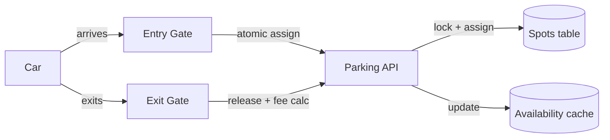

## Overview

- **Real-world analog:** any multi-level garage with entry/exit gates and digital
  ticketing
- **Difficulty:** Easy-Medium

Another finite-resource-assignment problem in the same family as seat booking and hotel
rooms, at a smaller scale — the design challenge is atomically assigning one specific
physical spot to one specific vehicle, and doing it fast enough that a car isn't idling
at the gate waiting for a database round-trip.

## Clarifying Questions & Requirements

> **Ask these first:** multiple spot types (compact/large/handicap/EV)? Real-time
> availability display per level? Reservations ahead of arrival, or walk-up only?

| | In scope | Out of scope |
|---|---|---|
| **Functional** | Assign a spot on entry, calculate fee on exit, track per-level/per-type availability | Payment processing itself, license-plate recognition |
| **Non-functional** | Never assign the same spot to two vehicles, sub-second gate response time | Reservation systems (assume walk-up only for the core design) |

Assume: a multi-level structure, several spot types, and entry/exit gates that need a
near-instant assignment decision.

## Back-of-Envelope Estimation

| | Estimate |
|---|---|
| Total spots | A few thousand across levels for a large structure |
| Peak entry rate | Tens of vehicles/minute at a busy entrance during rush hour |
| Assignment latency budget | Must be near-instant — a car physically blocks the gate lane while waiting |

Low absolute volume, but a hard latency requirement on the write path, since a slow
assignment decision has a physical queue of cars behind it.

## API Design

```
POST /entries        {vehicleType}                 → 201 {ticketId, spotId}
POST /exits           {ticketId}                    → 200 {feeAmount}
GET  /availability                                   → 200 {byLevel: {level: {type: count}}}
```

## Data Model & Storage

```
spots
  id            uuid PK
  level         int
  type          enum('compact','large','handicap','ev')
  status        enum('available','occupied')

tickets
  id            uuid PK
  spot_id       uuid FK
  vehicle_type  enum
  entry_time    timestamp
  exit_time     timestamp nullable
  fee           decimal nullable
```

| Choice | Why |
|---|---|
| **Individual `spots` rows, not just a per-type count** | The gate needs to hand the driver a specific spot to park in, not just confirm "a compact spot exists somewhere" — the same reasoning as per-copy rows in library management or per-seat rows in seat booking |
| **In-memory/cache layer for per-level availability counts**, backed by the durable `spots` table | The availability display (`GET /availability`) is read far more often than spots change status, and doesn't need per-request consistency down to the second — a cached count refreshed on every assignment/release event is both fast and accurate enough |

## High-Level Architecture



## Deep Dives

**1. Atomic spot assignment under concurrent arrivals.** Two cars arriving at different
entrances within the same second, both being routed to the same available compact spot,
is exactly the last-copy race seen elsewhere in this course — an atomic check-and-set on
the chosen spot's row (`available → occupied`, conditioned on it still being available at
write time) resolves it the same way: one assignment succeeds, the other transaction
retries against a different available spot.

**2. Choosing which spot to assign, not just any available one.** A naive "pick any
available row of the right type" can leave cars scattered unpredictably across a
structure. A better assignment strategy picks the *nearest available spot on the lowest
occupied level*, which keeps the structure filling in a predictable, spot-findable
pattern rather than randomly — a UX concern that shows up as a real backend query
(`ORDER BY level, spot_number LIMIT 1 FOR UPDATE`), not just a frontend one.

**3. Fee calculation as a pure function of entry/exit time, computed at exit, not
tracked continuously.** There's no need to update a running fee counter while a car is
parked — `exit_time - entry_time`, run through a rate table, computed once at the exit
gate, is both simpler and correct, avoiding any need to keep per-parked-vehicle state
in sync in real time.

## Bottlenecks & Failure Modes

| Bottleneck | Mitigation | Tradeoff accepted |
|---|---|---|
| Concurrent assignment race on the last spot of a type | Row-level lock / atomic check-and-set on the chosen spot | Brief serialization at very high concurrency, negligible at this volume |
| Gate latency under the assignment lock | Keep the assignment transaction minimal — no unrelated work inside it | None significant |
| Availability display staleness | Cache refreshed on every assign/release event, not a live count query | Display can lag actual state by the propagation delay of that event, typically sub-second |

## Why Not X?

**Why not a single "spots available" integer per type instead of per-spot rows?** Can't
tell the driver *which* spot to go to, and reintroduces the same check-then-decrement
race a per-row lock avoids — the same argument as the library-management and
seat-booking questions in this course.

**Why not assign spots randomly among available ones for simplicity?** Technically
correct, but produces a worse real-world outcome — cars scattered unpredictably makes
the structure harder to navigate and harder to reason about for occupancy planning.
Nearest-available-first costs one `ORDER BY` clause and meaningfully improves the
physical experience.

## Interview Signals

| | Strong answer | Weak answer |
|---|---|---|
| Concurrency | Names the last-spot race explicitly and locks at the row level | Doesn't consider concurrent assignment at all |
| Assignment strategy | Chooses spots deliberately (nearest-first), not arbitrarily | Picks "any available spot" with no ordering logic |
| Fee calculation | Computes fee once at exit as a pure function of duration | Tracks a running fee counter while the vehicle is parked |

**Common failure modes:** a bare per-type counter instead of per-spot rows; no handling
for concurrent assignment; unnecessary real-time fee tracking during the parked
duration.

## Glossary Links

This question draws on: Atomic compare-and-set — linked on first mention above.
