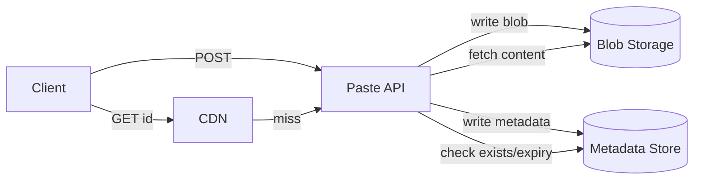

## Overview

- **Real-world analog:** Pastebin, GitHub Gist (text mode)
- **Difficulty:** Easy

Structurally close to the URL shortener — generate a short ID, store a blob, serve it
back fast — but the payload here can be a full source file instead of a few hundred
bytes, which changes where you store it and how a viral paste behaves under load.

## Clarifying Questions & Requirements

> **Ask these first:** maximum paste size? Do pastes expire? Public, unlisted, or with
> access control? Syntax highlighting — client-side or server-rendered?

| | In scope | Out of scope |
|---|---|---|
| **Functional** | Create a paste, retrieve by ID, optional expiry, optional custom syntax hint | Real-time collaborative editing, version history |
| **Non-functional** | Fast retrieval even for large pastes, handle a viral/high-traffic paste gracefully | Full-text search across all pastes |

Assume: pastes up to 1MB, 90% expire within 30 days or are never revisited, and a small
fraction go viral and get read millions of times.

## Back-of-Envelope Estimation

| | Estimate |
|---|---|
| Writes | 1M new pastes/day ≈ 12/sec average |
| Reads | 10M/day ≈ 115/sec average, with viral spikes far above that on individual pastes |
| Average size | ~10KB (mostly code snippets, some larger logs) |
| Daily storage | 1M × 10KB ≈ 10GB/day |

Unlike the URL shortener, storage volume actually matters here — 10GB/day compounds,
and large individual objects change the storage decision.

## API Design

```
POST /pastes         {content, expiresAt?, syntax?}   → 201 {pasteId, url}
GET  /pastes/{id}                                       → 200 {content, syntax, createdAt}
DELETE /pastes/{id}                                      → 204
```

## Data Model & Storage

```
pastes
  id            varchar(8)  PK
  content_ref   text        -- pointer into blob storage, not the content itself
  size_bytes    int
  syntax        varchar(20)
  created_at    timestamp
  expires_at    timestamp nullable
```

| Choice | Why |
|---|---|
| **Content in blob storage (S3-style), with only a pointer in the metadata row** | A relational or KV store optimized for small records degrades badly once individual values regularly hit hundreds of KB — large rows bloat replication traffic and page cache efficiency for every other small record sharing that store. Blob storage is built for exactly this size profile |
| **A separate metadata store (KV, keyed by paste ID) for the row above** | The metadata lookup (does this ID exist, is it expired) needs to be fast and cheap on every read; fetching straight from blob storage for that check would mean a full object-store round-trip just to answer "does this exist" |
| **CDN in front of blob storage for reads**, not the metadata store | Once a paste is created, its content is immutable — an ideal cache candidate. A CDN absorbs a viral paste's read traffic without it ever reaching origin storage repeatedly |

## High-Level Architecture



## Deep Dives

**1. Where the size threshold actually matters.** Below a few KB, storing content
directly in the metadata row is simpler and avoids a second round-trip. Above that, the
row-bloat cost outweighs the convenience. A pragmatic design: inline content under, say,
4KB directly in the metadata store, and only push to blob storage above that threshold —
most pastes stay on the fast, simple path, and only the minority of large ones pay for
the extra hop.

**2. A viral paste is a read-scaling problem, not a write-scaling one.** Once content
is written, it's immutable, so the entire read path can be cached aggressively with no
invalidation concerns — a CDN cache with a long TTL handles a paste going viral without
any special-casing, because "this content will never change" is a much stronger
guarantee than most caching problems get to assume.

**3. Expiry as lazy deletion, not an active sweep.** Checking `expires_at` on every read
and returning 404 for an expired-but-not-yet-purged paste is enough for correctness; an
actual storage-reclamation sweep (deleting the blob) can run on its own schedule,
decoupled from the read path, since a slightly-late physical deletion costs storage, not
correctness.

## Bottlenecks & Failure Modes

| Bottleneck | Mitigation | Tradeoff accepted |
|---|---|---|
| Viral paste read load | CDN caching on immutable content | None significant — this is close to a free win given immutability |
| Large-object writes bloating a general-purpose store | Blob storage for anything above a size threshold, inline below it | Two storage systems to operate instead of one |
| Abuse (spam pastes, malware hosting) | Rate limiting on creation, content scanning (out of scope for the core design) | Extra infrastructure not covered by the happy-path design |

## Why Not X?

**Why not store everything in the relational/KV metadata store regardless of size?**
Works fine at small scale, but large values (hundreds of KB to 1MB) degrade a store
tuned for small, frequent records — bigger pages, worse cache hit rates for every other
row, slower replication. Splitting by size threshold keeps the common case fast and
isolates the expensive case.

**Why not skip the CDN and rely on the origin cache alone?** An origin-level cache still
means every cache miss (or every reader in a region far from origin) pays full
round-trip latency; a CDN puts cached, immutable content physically closer to readers
and absorbs load the origin never has to see at all.

## Interview Signals

| | Strong answer | Weak answer |
|---|---|---|
| Storage split | Explains the size threshold for blob vs. inline storage with a reason | Puts every paste, regardless of size, in the same store without discussion |
| Immutability | Recognizes that immutable content makes caching nearly free | Designs cache invalidation logic for content that never changes |
| Expiry | Treats expiry as lazy/read-time, not a required active process | Over-engineers a real-time deletion sweep unnecessarily |

**Common failure modes:** storing large blobs directly in a relational row; not
recognizing that immutability simplifies the caching story significantly; missing the
threshold decision between inline and blob storage entirely.

## Glossary Links

This question draws on: Signed URL — linked on first mention above (relevant if blob
storage access is gated behind time-limited signed links rather than public objects).
