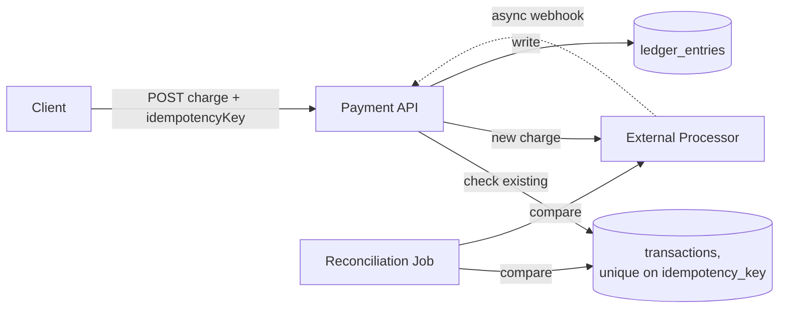

## Overview

- **Real-world analog:** Stripe, the payment layer behind any checkout
- **Difficulty:** Hard
- **Frontend counterpart:** [Flash Sale Checkout](/system-design/c/flash-sale-checkout)
  covers the client-side checkout flow under contention — this chapter is the backend
  discipline that makes a payment safe to retry without ever double-charging a card.

Almost every other system in this course can tolerate an occasional inconsistency and
fix it later. A payment system can't — "we accidentally charged the customer twice" is
not a bug you patch after the fact, it's money that has to be found and returned. That
single constraint shapes nearly every decision here.

## Clarifying Questions & Requirements

> **Ask these first:** does the system process cards directly, or integrate with a
> third-party processor (Stripe/Adyen-style)? Is refund/partial-refund in scope? What's
> the reconciliation requirement — daily, real-time?

| | In scope | Out of scope |
|---|---|---|
| **Functional** | Charge a payment method, record the transaction, handle refunds, reconcile against the processor's own records | Actual card processing/PCI-scoped storage (assume a third-party processor handles that, we only store tokens) |
| **Non-functional** | Never double-charge on retry, every dollar amount is auditable and traceable, survive the processor being temporarily unreachable | Sub-second settlement (settlement timing is largely dictated by the processor and banking rails, not this system) |

Assume: an external payment processor handles the actual card transaction, and this
system is responsible for orchestrating the charge, recording it correctly, and
reconciling.

## Back-of-Envelope Estimation

| | Estimate |
|---|---|
| Transactions/day | 5M |
| Peak rate | Several thousand/sec during a sale event |
| Ledger entries per transaction | At least 2 (double-entry — see Data Model) |
| Reconciliation window | Processor webhooks can arrive seconds to minutes after the charge call returns |

The gap between "the charge call returned" and "the processor's webhook confirms it"
is the single most important timing detail in this whole design.

## API Design

```
POST /charges       {amount, paymentMethodToken, idempotencyKey}   → 200 {chargeId, status}
POST /charges/{id}/refund  {amount}                                  → 200
GET  /charges/{id}                                                    → 200 {status, ledgerEntries}
```

`idempotencyKey` is not optional — it's the caller's guarantee that retrying this exact
request is safe.

## Data Model & Storage

```
transactions
  id                uuid PK
  idempotency_key    text UNIQUE
  amount             decimal
  status             enum('pending','succeeded','failed')
  processor_ref      text nullable   -- the processor's own transaction ID

ledger_entries        -- double-entry: every transaction produces balanced debit/credit rows
  id                uuid PK
  transaction_id     uuid FK
  account            text            -- e.g. "customer_receivable", "revenue"
  amount             decimal         -- positive = debit, negative = credit
```

| Choice | Why |
|---|---|
| **`idempotency_key` as a unique constraint, required on every charge request** | A network failure between the client and this API leaves the caller genuinely unable to tell whether the charge succeeded — retrying without an idempotency key risks a real double-charge. With it, a retry with the same key returns the original result instead of processing a second charge, making retries always safe regardless of what actually happened on the first attempt |
| **Double-entry ledger, not a single running balance field** | A single balance that's incremented/decremented on each transaction can silently drift from reality with no way to detect it — a missed update, a bug, a race condition all look the same: a wrong number with no history to check it against. Double-entry bookkeeping (every transaction produces balanced debit and credit rows summing to zero) makes every state change independently auditable and makes drift detectable by definition — the books either balance or they don't |

## High-Level Architecture



## Deep Dives

**1. Idempotency is the entire safety mechanism, not an optimization.** When a charge
call times out from the client's perspective, the client cannot know whether the charge
actually went through on the server — the response was lost, not necessarily the
operation. Retrying with the same `idempotencyKey` lets the server recognize "I've seen
this exact request before" and return the original outcome instead of processing a
second charge. Without this, every network failure becomes a genuine risk of double-
billing.

**2. Reconciliation exists because the system's own record and the processor's record
can legitimately diverge.** A charge can succeed on the processor's side while the
webhook confirming it is delayed, lost, or arrives out of order relative to other
events. A periodic reconciliation job pulls the processor's own list of transactions for
a given window and diffs it against local records — catching cases where the local
system shows `pending` but the processor shows `succeeded` (or the reverse), and
correcting the local record rather than trusting either side blindly.

**3. Why the ledger, not a balance field, is the actual source of truth.** If a customer
disputes a charge six months later, or a bug is suspected in some past calculation, a
double-entry ledger lets you reconstruct exactly what happened and when — a balance
field only tells you the current number, with no way to verify how it got there or catch
a past error. This audit trail isn't a nice-to-have; for a payment system, it's often a
compliance requirement.

**4. An idempotency key alone isn't sufficient — it has to be scoped and compared
against the full request.** A key needs to be unique per merchant/client (two different
clients' `"order-123"` keys shouldn't collide with each other), needs its own expiry so
old keys can eventually be reused, and — critically — the server should reject a request
that reuses a known key but with a *different* amount or payment method than the
original, rather than silently returning the cached result for the wrong request. Just
checking "have I seen this key" without checking "does this request match what I
processed under this key" reopens a subtle class of bugs the key was supposed to close.

## Bottlenecks & Failure Modes

| Bottleneck | Mitigation | Tradeoff accepted |
|---|---|---|
| Ambiguous outcome on client timeout | Mandatory idempotency key on every charge | Clients must correctly generate and persist a unique key per logical charge attempt |
| Local state diverging from the processor's | Periodic reconciliation job | Divergence isn't caught instantly — only at the next reconciliation cycle |
| Processor temporarily unreachable | Queue and retry with backoff, don't block the caller indefinitely | Charges can be delayed rather than immediately confirmed during a processor outage |

## Why Not X?

**Why not just update a running balance field directly instead of a double-entry
ledger?** Loses auditability entirely — there's no way to verify a balance is correct or
reconstruct how it got to its current value, which is unacceptable for a system handling
real money and often a regulatory requirement in its own right.

**Why not skip reconciliation since the charge API already returns a definitive
success/failure?** The API's response only reflects what was known at that instant — the
processor's own async webhook can report a different final outcome later (a charge that
looked pending can settle successfully after the request already returned, or vice
versa). Reconciliation is what catches that class of divergence that no single request/
response pair can.

**Why not poll the processor for transaction status instead of relying on webhooks?**
Polling adds latency (bounded by the poll interval) to discovering a state change and
puts continuous, mostly-wasted load on the processor's API for transactions that haven't
changed — a webhook pushes the update the moment it happens, and polling still has a
role, but as the fallback reconciliation mechanism for the cases a webhook is lost, not
as the primary signal.

## Interview Signals

| | Strong answer | Weak answer |
|---|---|---|
| Idempotency | Treats it as mandatory and explains exactly what failure mode it prevents | Treats it as optional or doesn't mention it at all |
| Ledger design | Proposes double-entry bookkeeping and explains why a balance field isn't enough | Uses a single mutable balance field with no audit trail |
| Reconciliation | Explains why local and processor state can genuinely diverge, not just "in case of bugs" | Assumes the charge API's immediate response is always the final truth |

**Common failure modes:** no idempotency mechanism on the charge endpoint; a mutable
balance field instead of an auditable ledger; no reconciliation process against the
external processor's own records.

## Glossary Links

This question draws on: Idempotency — linked on first mention above.
