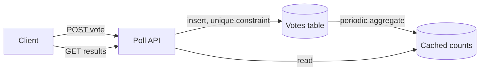

## Overview

- **Real-world analog:** Twitter/X polls, Slido, in-app voting features
- **Difficulty:** Easy-Medium
- **Frontend counterpart:** [Poll Widget](/system-design/c/poll-widget) covers the
  client-side vote UI and optimistic result updates — this chapter is the backend that
  keeps a single vote from being cast twice and survives a poll going viral.

Small data, small schema, and still a genuinely interesting concurrency problem: when a
poll closes or goes viral, thousands of writes land on the same handful of rows at once,
and "did this user already vote" has to be answered correctly under that exact load.

## Clarifying Questions & Requirements

> **Ask these first:** can a vote be changed after casting? Anonymous or tied to an
> account? Do results need to be live/real-time, or only visible after the poll closes?

| | In scope | Out of scope |
|---|---|---|
| **Functional** | Create a poll with options, cast one vote per user, show results | Ranked-choice or weighted voting schemes |
| **Non-functional** | No duplicate votes under concurrency, results available even during a traffic spike at close | Perfectly real-time result updates to every viewer (near-real-time is enough) |

Assume: a poll can go viral and receive 50,000 votes in the final minute before closing.

## Back-of-Envelope Estimation

| | Estimate |
|---|---|
| Steady-state votes | Low — most polls get modest traffic |
| Viral poll burst | Up to 1,000+ votes/sec in the closing minute |
| Result reads | Far exceed writes — everyone who votes also checks the result, plus many who don't vote at all |

The interesting number isn't average load, it's the closing-minute spike — that's where
a naive design breaks.

## API Design

```
POST /polls              {question, options[]}          → 201 {pollId}
POST /polls/{id}/vote     {optionId}                      → 200 | 409 Conflict (already voted)
GET  /polls/{id}/results                                   → 200 {counts, total}
```

## Data Model & Storage

```
polls
  id            uuid PK
  question      text
  closes_at     timestamp

options
  id            uuid PK
  poll_id       uuid FK
  text          text

votes
  poll_id       uuid
  user_id       uuid
  option_id     uuid
  voted_at      timestamp
  UNIQUE(poll_id, user_id)
```

| Choice | Why |
|---|---|
| **A `votes` row per vote, with a `UNIQUE(poll_id, user_id)` constraint**, not a bare per-option counter | The unique constraint is what actually prevents a double vote under concurrency — a database rejects the second insert outright rather than the application needing to check-then-insert itself, which would have the same race window as any other check-then-write pattern |
| **Cached, periodically-refreshed result counts**, not a live `COUNT(*)` on every result read | Reads vastly outnumber writes; recomputing an exact count from the `votes` table on every single result view does far more work than necessary when an eventually-consistent count refreshed every few seconds is indistinguishable to a user |

## High-Level Architecture



## Deep Dives

**1. Preventing a double vote is a database constraint, not application logic.** A
"check if this user already voted, then insert if not" done as two separate steps in
application code has the same race window every check-then-write pattern has under
concurrency. A `UNIQUE(poll_id, user_id)` constraint on the `votes` table makes the
database itself the source of truth: the second concurrent insert for the same user
fails outright, and the application just returns `409 Conflict` on that failure rather
than trying to prevent it upstream.

**2. Absorbing the closing-minute spike.** A poll's final minute can see the majority of
its total votes. The write path (insert a vote row, checked against the unique
constraint) is cheap and scales fine under this burst — what would *not* scale is
recomputing an exact aggregate count on every single result-page view during that same
spike. Decoupling reads (served from a periodically refreshed cache) from writes (going
straight to the source table) means the burst on one side doesn't degrade the other.

**3. Idempotent vote-changing.** If votes are allowed to be changed, `POST /vote` needs
to be an upsert (`INSERT ... ON CONFLICT (poll_id, user_id) DO UPDATE`) rather than a
plain insert — otherwise the unique constraint that correctly rejects a double vote also
incorrectly rejects a legitimate vote change.

## Bottlenecks & Failure Modes

| Bottleneck | Mitigation | Tradeoff accepted |
|---|---|---|
| Closing-minute write burst | Insert-only writes with a unique constraint; no read-modify-write on the hot path | None significant — this scales close to linearly |
| Result-read load during a viral moment | Cached, periodically refreshed aggregate counts | Displayed counts lag actual votes by a few seconds |
| Duplicate votes under concurrency | Database-level unique constraint, not app-level check-then-insert | None — this is strictly better than the alternative |

## Why Not X?

**Why not a single incrementing counter per option instead of a `votes` table?** A bare
counter can't enforce "one vote per user" at all — there's no row to check uniqueness
against. The per-vote row with a unique constraint is what makes double-vote prevention
possible in the first place; the counter can be derived from it, but not the reverse.

**Why not compute results live with `COUNT(*)` on every request?** Correct, but wasteful
at read volumes that vastly exceed writes — recomputing an exact count on every view
does the same aggregation work over and over for a number that only changes when a new
vote lands. A cache refreshed on a short interval gets the same practical result far
cheaper.

## Interview Signals

| | Strong answer | Weak answer |
|---|---|---|
| Double-vote prevention | Uses a database unique constraint, not application-level check-then-insert | Checks for an existing vote and inserts as two separate steps |
| Read/write split | Recognizes reads dominate and caches results instead of computing live | Runs a live aggregate query on every result view |
| Spike handling | Explains why insert-only writes scale through the closing-minute burst | Doesn't consider what happens when votes spike right before close |

**Common failure modes:** application-level double-vote checking instead of a database
constraint; live aggregation on every result read; no plan for the closing-minute burst.

## Glossary Links

This question draws on: Idempotency — linked on first mention above (the upsert pattern
for vote changes).
