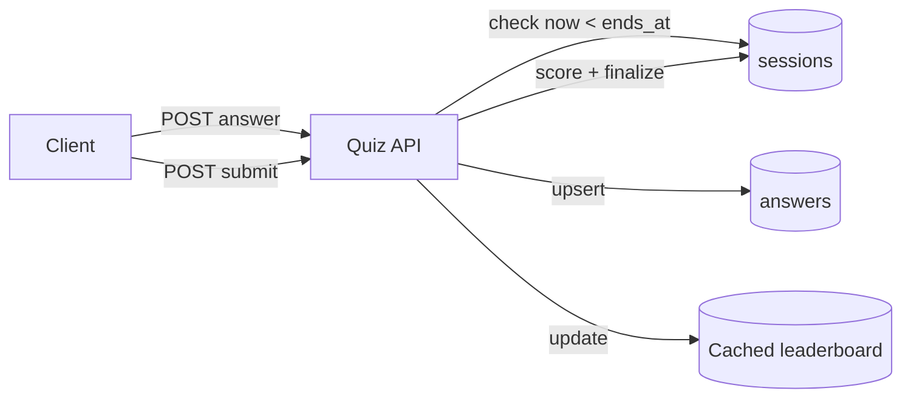

## Overview

- **Real-world analog:** Kahoot, Google Forms quizzes, online certification exams
- **Difficulty:** Easy-Medium

The functional surface is simple CRUD — questions, answers, scores — but the moment a
quiz is timed, the system has to decide who it trusts to know when time is up, and the
answer can't be "the client." That single decision (server-authoritative timing) is most
of what separates a real design from a toy one here.

## Clarifying Questions & Requirements

> **Ask these first:** is the quiz timed per-question or for the whole session? Can a
> user resume an interrupted session? Is there a live leaderboard during the quiz, or
> only final results?

| | In scope | Out of scope |
|---|---|---|
| **Functional** | Start a session, submit answers, compute a score, show a leaderboard | Building the question-authoring UI, proctoring/anti-cheat beyond timing |
| **Non-functional** | The server, not the client, is the source of truth for elapsed time | Sub-second global leaderboard updates for very large concurrent quizzes |

Assume: a session has a fixed duration, submissions after that duration are rejected,
and a leaderboard shows top scores after the quiz closes.

## Back-of-Envelope Estimation

| | Estimate |
|---|---|
| Concurrent quiz-takers | Up to tens of thousands for a popular live quiz |
| Submission burst at the deadline | A meaningful fraction of all participants submit in the final seconds |
| Leaderboard reads | Far exceed writes, especially right after results are revealed |

The deadline-clustering behavior (everyone submitting in the last few seconds) is the
load-shaping detail that matters most here, similar to the poll-closing spike in the
polling/voting question.

## API Design

```
POST /sessions            {quizId}                     → 201 {sessionId, startedAt, endsAt}
POST /sessions/{id}/answers {questionId, answer}         → 200 | 410 Gone (time expired)
POST /sessions/{id}/submit                                → 200 {score}
GET  /quizzes/{id}/leaderboard                            → 200 [{userId, score, rank}]
```

## Data Model & Storage

```
sessions
  id            uuid PK
  quiz_id       uuid
  user_id       uuid
  started_at    timestamp
  ends_at       timestamp
  submitted_at  timestamp nullable
  score         int nullable

answers
  session_id    uuid
  question_id   uuid
  selected      text
  UNIQUE(session_id, question_id)
```

| Choice | Why |
|---|---|
| **`ends_at` computed and stored at session start, checked server-side on every answer**, never trusted from the client | A client can report any elapsed time it wants — the only trustworthy timer is one anchored to a server-recorded start time and checked against the server's own clock on every write |
| **`UNIQUE(session_id, question_id)` on answers**, using upsert semantics for changed answers | Same pattern as the polling question — the constraint is what makes "one answer per question per session" a database guarantee instead of an application-level check with a race window |

## High-Level Architecture



## Deep Dives

**1. Server-authoritative timing is the load-bearing design decision.** Every answer
submission checks the current server time against the session's stored `ends_at` before
accepting it — a request arriving after that instant gets `410 Gone` regardless of what
timestamp or "time remaining" value the client sends. This single check is what makes
the whole timing system tamper-proof; anything relying on a client-reported elapsed time
is trivially bypassable by anyone who edits a request before sending it.

**2. Handling the deadline-clustering submission spike.** A meaningful fraction of
participants submit in the final seconds before `ends_at`. Because each submission is
just an upsert against a uniquely-keyed row (or a final `submit` call that's idempotent
if retried), the write path handles this burst the same way the polling question's vote
burst is handled — no read-modify-write contention, just inserts/upserts that scale
close to linearly.

**3. Scoring and leaderboard as a separate concern from submission.** Computing a
user's score at `submit` time (comparing stored answers against the answer key) and
writing it once to `sessions.score` means the leaderboard can be a simple, cacheable
query (`ORDER BY score DESC LIMIT N`) rather than something computed live from raw
answer rows on every leaderboard view — the expensive part of scoring only happens once
per session, not once per leaderboard read.

## Bottlenecks & Failure Modes

| Bottleneck | Mitigation | Tradeoff accepted |
|---|---|---|
| Deadline-clustering submission burst | Upsert-based answer writes with no contention-prone read-modify-write | None significant — scales close to linearly |
| Leaderboard read load right after results reveal | Cached, sorted leaderboard refreshed on score writes | Brief staleness immediately after a burst of finalizations |
| Client clock manipulation | Server-side `ends_at` check on every write, never trusting client time | None — this is a strict correctness requirement, not really a tradeoff |

## Why Not X?

**Why not let the client track elapsed time and self-report when it's out of time?**
Trivially bypassable — a client can simply not report expiry, or report a false elapsed
time, and keep submitting answers past the real deadline. Any timing constraint that
matters for correctness (as opposed to pure UX countdown display) has to be enforced
server-side.

**Why not compute the leaderboard live from raw answers on every read?** Works at small
scale, but recomputes the same aggregation repeatedly for a value that only changes when
a session finalizes — a cached, write-updated leaderboard serves the much higher read
volume without redoing that work on every view.

## Interview Signals

| | Strong answer | Weak answer |
|---|---|---|
| Timing authority | States explicitly that the server, not the client, enforces the deadline | Designs a client-side countdown as the actual enforcement mechanism |
| Deadline burst | Recognizes submissions cluster near the deadline and designs writes to handle it | Doesn't consider submission timing patterns at all |
| Leaderboard | Separates scoring (write-time) from leaderboard reads (cached) | Computes the leaderboard live from raw answer data on every request |

**Common failure modes:** trusting client-reported time for anything that affects
scoring validity; no dedicated handling for the deadline submission spike; live
leaderboard computation instead of a cached, score-derived one.

## Glossary Links

This question draws on: Idempotency — linked on first mention above (the final `submit`
call being safe to retry).
