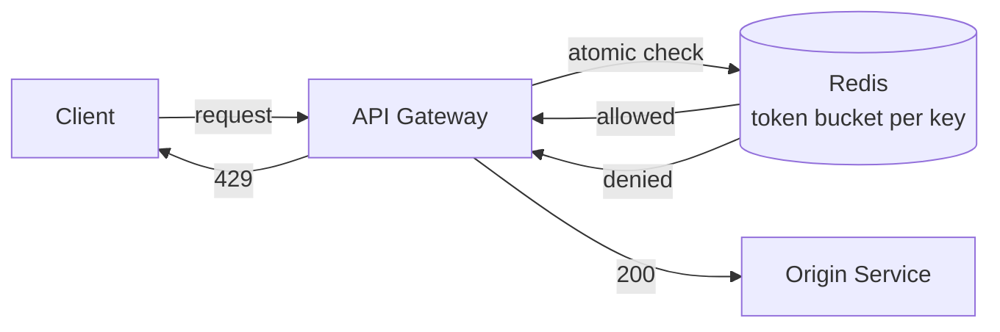

## Overview

- **Real-world analog:** the throttling layer in front of any public API (Stripe,
  GitHub, Twitter)
- **Difficulty:** Medium
- **Frontend counterpart:** [Rate Limiting & Dedup](/system-design/c/rate-limiting-dedup)
  covers the *client's* cooperative behavior on `429`s — that chapter explicitly puts
  server-side enforcement out of scope. This chapter is that enforcement.

Client-side rate limiting is a courtesy; this is the actual gate. The whole problem is
one sentence — "reject requests once a client exceeds N per window" — and the whole
difficulty is making that check atomic and cheap at high concurrency without it becoming
the bottleneck it's supposed to protect against.

## Clarifying Questions & Requirements

> **Ask these first:** limit per user, per IP, per API key, or a combination? Hard
> reject or queue-and-delay? Does the limit need to be exact, or is approximate
> acceptable at the edges? Single region or global?

| | In scope | Out of scope |
|---|---|---|
| **Functional** | Enforce a request-rate limit per key, return `429` + `Retry-After` on rejection | Billing/quota systems (monthly caps), request queuing |
| **Non-functional** | Sub-millisecond overhead per request, accurate under high concurrency, no single point of failure | Perfect global accuracy across every data center simultaneously (see the SDE-3 distributed version of this problem) |

Assume: a limit of 100 requests/minute per API key, enforced at a single-region API
gateway in front of ~10,000 distinct keys.

## Back-of-Envelope Estimation

| | Estimate |
|---|---|
| Peak request rate | 50,000 req/sec across all keys |
| Per-key state | A counter + timestamp per key per window ≈ tens of bytes |
| Total state (10K keys) | Trivially fits in a single Redis instance's memory |
| Check latency budget | Must add well under 1ms — it runs on every single request |

The state is tiny; the entire design challenge is concurrency correctness, not data
volume.

## API Design

The limiter isn't a public API itself — it's middleware in front of one. The
observable contract is the response it adds to every gated request:

```
Any request  →  200 (allowed)  +  X-RateLimit-Remaining, X-RateLimit-Reset
             →  429 (rejected) +  Retry-After
```

## Data Model & Storage

```
rate_limit:{key}   → count (int), TTL = window duration
```

A single Redis key per (client, window) pair — no relational schema at all.

| Algorithm | How it works | Cost |
|---|---|---|
| **Fixed window** | Increment a counter, reset every N seconds | Simplest and cheapest, but allows up to 2x the limit in a burst straddling a window boundary |
| **Sliding log** | Store every request timestamp, count entries in the trailing window | Perfectly accurate, but memory grows with request volume per key |
| **Sliding window counter** | Weighted average of current and previous fixed windows | Good accuracy, fixed memory — the common production compromise |
| **Token bucket** | Tokens refill at a fixed rate, each request consumes one | Naturally allows brief bursts up to the bucket size, smooth over time |

**Chosen: token bucket**, implemented as a Redis Lua script for atomicity — it allows
legitimate short bursts (a client firing 5 requests in the same second, still under
their per-minute budget) without the boundary-burst problem of a fixed window.

## High-Level Architecture



## Deep Dives

**1. The check-and-decrement has to be one atomic operation.** Reading the current
token count, then writing the decremented value as two separate Redis calls has a race
window: two concurrent requests can both read "1 token left," both decide to allow, and
both decrement — over-admitting by one. The fix is a single Lua script executed
atomically by Redis — an atomic compare-and-set over the whole read-modify-write, not
sequential GET then SET calls.

**2. Local in-memory approximation vs. a shared store.** Checking Redis on every single
request adds a network hop to every request in the system. A common optimization is
each gateway instance keeping a local approximate counter, syncing to the shared Redis
count periodically (every 100ms, say) rather than on every request — trading perfect
per-request accuracy for removing Redis from the hot path of every single call. Whether
this tradeoff is acceptable depends entirely on how strict "100 requests per minute"
actually needs to be.

**3. What happens when Redis itself is unavailable.** A rate limiter that hard-fails
closed (rejecting everything) when its own state store is down turns a Redis outage
into a total service outage for every client. Failing open (allowing all requests when
the limiter can't reach its state) is usually the safer default — it briefly loses the
protection the limiter provides, but that's a smaller blast radius than losing the
entire API.

## Bottlenecks & Failure Modes

| Bottleneck | Mitigation | Tradeoff accepted |
|---|---|---|
| Redis as a single dependency on every request | Local approximate counters synced periodically | Slightly less precise enforcement |
| Race condition on concurrent check-and-decrement | Atomic Lua script (single round-trip, single operation) | Marginally more complex than plain GET/SET |
| Redis outage | Fail open rather than fail closed | Temporarily unprotected against abuse during the outage window |

## Why Not X?

**Why not a fixed window counter — it's simpler?** It allows up to 2x the stated limit
in the worst case: a client can send the full limit in the last second of one window and
the full limit again in the first second of the next, doubling the effective burst
right at the boundary. Token bucket (or sliding window counter) doesn't have this gap.

**Why not enforce limits at the application layer instead of the gateway?** Pushes the
check past load balancing and routing, meaning over-limit traffic still consumes
connection and routing capacity before being rejected — enforcing at the gateway rejects
abusive traffic as early as possible, protecting everything behind it.

## Interview Signals

| | Strong answer | Weak answer |
|---|---|---|
| Algorithm choice | Compares fixed window, sliding window, and token bucket, and picks one with a stated reason | Jumps straight to "use Redis" without naming an algorithm |
| Atomicity | Identifies the check-then-set race and fixes it with an atomic operation | Writes GET then SET as two separate calls without noticing the race |
| Failure mode | States a fail-open vs. fail-closed decision explicitly | Never considers what happens when the rate limiter's own store is down |

**Common failure modes:** proposing a fixed-window counter without acknowledging the
boundary-burst problem; a non-atomic check-then-increment; no plan for the limiter's own
dependency failing.

## Glossary Links

This question draws on: Atomic compare-and-set — linked on first mention above.
