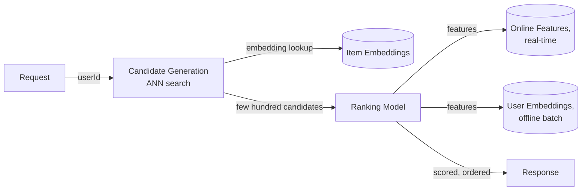

## Overview

- **Real-world analog:** Netflix's or Instagram's recommendation backend
- **Difficulty:** Hard

Nobody runs a heavy ranking model over an entire multi-million-item catalog for every
single request within a latency budget of tens of milliseconds — that's simply not
possible at these numbers. Every production recommendation system is really two systems
stacked: a cheap, fast one that narrows millions of items down to a few hundred
candidates, and an expensive, accurate one that ranks just those few hundred.

## Clarifying Questions & Requirements

> **Ask these first:** how large is the catalog? What's the acceptable end-to-end
> latency for generating recommendations? How should new users or new items with no
> interaction history be handled?

| | In scope | Out of scope |
|---|---|---|
| **Functional** | Generate personalized recommendations from a large catalog, blend recent behavior with long-term preference | Building the ML models themselves (assume trained embedding and ranking models are available) |
| **Non-functional** | Sub-100ms end-to-end latency for generating a recommendation set, handle a catalog too large to fully rank per-request | Perfect recommendation accuracy (a real, ongoing tuning problem, not a solved target) |

Assume: a catalog of millions of items, a latency budget in the tens of milliseconds,
and a mix of established users (rich interaction history) and brand-new ones (none).

## Back-of-Envelope Estimation

| | Estimate |
|---|---|
| Catalog size | Millions of items |
| Candidate set after generation | A few hundred to low thousands, narrowed from millions |
| Ranking model calls | Only against the narrowed candidate set, not the full catalog |
| Requests/sec at peak | Tens of thousands |

The gap between "millions" and "a few hundred" is the entire point of the two-stage
design — it's what makes a latency-budget-compliant system possible at all.

## API Design

```
GET /recommendations?userId=&context=            → 200 {items: [{itemId, score}]}
POST /interactions   {userId, itemId, action}      → 202 (feeds both online and offline feature pipelines)
```

## Data Model & Storage

```
user_embeddings      -- long-term preference vector, updated in offline batch
  user_id, embedding, updated_at

item_embeddings       -- content/collaborative embedding per item
  item_id, embedding

online_features        -- short-term signal, updated in near-real-time
  user_id, recent_interactions, session_context
```

| Choice | Why |
|---|---|
| **Two-stage retrieval-then-ranking**, not a single-stage full-catalog scoring pass | Scoring every catalog item with a full ranking model for every request is computationally infeasible within a tens-of-milliseconds budget at millions-of-items scale — a cheap candidate generator narrows the field first, and the expensive, accurate model only ever runs against a small candidate set |
| **Approximate nearest-neighbor (ANN) search for embedding-based candidate generation**, not exact k-nearest-neighbor | Exact kNN over high-dimensional embeddings across a large catalog doesn't scale to this latency budget — an ANN index (HNSW and similar structures) trades a small, usually imperceptible accuracy loss for a large speedup, making candidate generation fast enough to fit inside the overall latency budget |
| **A blend of offline batch-computed features (long-term preference) and online real-time features (this session's activity)**, not either alone | Long-term preference captures durable taste but misses what a user is doing *right now*, which is often highly predictive of immediate relevance (someone just watched three thrillers in a row is probably not looking for a children's show next) — combining both at ranking time captures signal neither alone would |

## High-Level Architecture



## Deep Dives

**1. Candidate generation's whole job is narrowing the field cheaply, not ranking
accurately.** An ANN search over item embeddings (or a simpler collaborative-filtering
heuristic) retrieves items broadly similar to what the user's engaged with, fast, without
attempting fine-grained relevance ordering — that fine-grained work is deliberately
deferred to the ranking stage, which can afford to be expensive precisely because it only
runs against a few hundred items instead of millions.

**2. ANN indexes trade a small accuracy loss for the speed the latency budget actually
requires.** An exact nearest-neighbor search over millions of high-dimensional vectors
is computationally expensive enough to blow the latency budget by itself. Approximate
structures (graph-based indexes like HNSW, or clustering-based approaches) sacrifice a
small, usually negligible amount of retrieval accuracy for orders-of-magnitude faster
lookups — the right tradeoff when "the 5th-best candidate instead of the 3rd-best" is
imperceptible to the end user but a 10x latency difference isn't.

**3. Feature freshness is deliberately split by update cadence, not unified.**
Long-term preference embeddings, computed from a user's full interaction history, are
expensive to recompute and don't change meaningfully minute-to-minute — batch-computing
them daily (or on some similar cadence) is efficient and sufficient. What a user clicked
in the last five minutes, though, is highly relevant and needs to be reflected
immediately — a separate, low-latency online feature pipeline updates that signal in
near-real-time, and the ranking model blends both at request time.

**4. Cold start needs an explicit fallback strategy, not a degraded version of the main
approach.** A brand-new user or item has no interaction history for a collaborative
approach to work from at all — the system needs a genuinely separate path: popularity-
based recommendations, or content-based similarity (using an item's own attributes
rather than behavioral signal) for a new item, or onboarding-survey-driven initial
preferences for a new user — rather than expecting the primary collaborative model to
gracefully degrade to something reasonable with zero data.

## Bottlenecks & Failure Modes

| Bottleneck | Mitigation | Tradeoff accepted |
|---|---|---|
| Full-catalog scoring exceeding the latency budget | Two-stage retrieval-then-ranking architecture | Candidate generation can miss a genuinely relevant item that a full scan wouldn't have |
| Exact nearest-neighbor search too slow at scale | Approximate nearest-neighbor indexing | Small, generally imperceptible loss of retrieval accuracy |
| New users/items with no signal | Dedicated cold-start fallback path (popularity/content-based) | A separate code path and model to maintain alongside the primary collaborative approach |

## Why Not X?

**Why not rank every catalog item for every request for maximum accuracy?**
Computationally infeasible at millions-of-items scale within a latency budget measured
in tens of milliseconds — the two-stage design exists specifically because this
"maximally accurate" approach isn't actually achievable at the scale and latency this
system requires.

**Why not rely only on offline-computed features for simplicity and consistency?**
Misses real-time signal — what a user is doing in their current session — which is
frequently the single most predictive input for immediate relevance, and is exactly the
kind of signal that a once-daily batch computation structurally cannot capture.

**Why not use exact nearest-neighbor search for candidate generation, given it's more
accurate?** Doesn't scale to the combination of high-dimensional embeddings, large
catalog size, and tight latency budget this system operates under — the accuracy
difference between exact and approximate search is small enough, and the latency
difference large enough, that approximate search is the correct engineering tradeoff.

## Interview Signals

| | Strong answer | Weak answer |
|---|---|---|
| Architecture | Proposes a two-stage retrieval-then-ranking design and explains why | Assumes a single model scores the entire catalog per request |
| Candidate generation | Names approximate nearest-neighbor search and its accuracy/speed tradeoff | Doesn't address how candidates are narrowed from the full catalog |
| Cold start | Designs an explicit fallback path for new users/items | Assumes the primary model handles zero-history cases gracefully |

**Common failure modes:** a single-stage architecture that can't meet the latency
budget at scale; exact nearest-neighbor search with no acknowledgment of its cost; no
distinct handling for cold-start users or items.

## Glossary Links

No shared-glossary terms apply directly to this chapter's core mechanisms.
