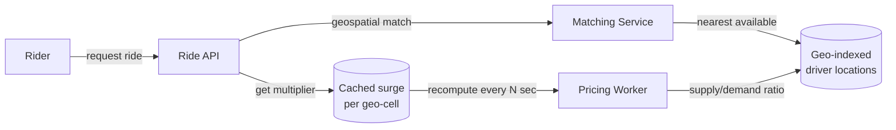

## Overview

- **Real-world analog:** Uber, Lyft, Ola
- **Difficulty:** Medium-Hard

Shares its geospatial-matching bones with food delivery, but adds a genuinely distinct
problem: pricing that moves in near-real-time with local supply and demand, computed
across thousands of overlapping geographic cells simultaneously, without becoming a
write bottleneck itself.

## Clarifying Questions & Requirements

> **Ask these first:** how is a driver matched to a rider — nearest available, or a
> batched/auction-style match? Does pricing (surge) update continuously or on a fixed
> interval? Multi-stop or pooled rides in scope?

| | In scope | Out of scope |
|---|---|---|
| **Functional** | Request a ride, match a driver, track live location, compute dynamic (surge) pricing | Pooled/shared rides, scheduled rides in advance |
| **Non-functional** | Sub-few-second matching latency, pricing that reflects near-real-time supply/demand without recomputing on every single request | Perfectly optimal (as opposed to good-enough) driver assignment |

Assume: dense urban markets where thousands of drivers and riders occupy overlapping
geographic cells, and demand can spike sharply (a stadium event ending, bad weather).

## Back-of-Envelope Estimation

| | Estimate |
|---|---|
| Active drivers in a large city | ~100,000, each pinging location every few seconds |
| Ride requests at peak | Tens of thousands/minute citywide |
| Pricing recalculation granularity | Per geographic cell (a few hundred meters), not per individual request |

The pricing granularity choice matters a lot: computing surge per-request instead of
per-cell would mean redoing the same supply/demand calculation for every rider in the
same area within the same few seconds.

## API Design

```
POST /rides                {pickup, dropoff}            → 201 {rideId, estimatedFare}
GET  /pricing?cell={geoCell}                              → 200 {multiplier}
POST /drivers/{id}/location {lat, lng}                     → 204
POST /rides/{id}/accept      {driverId}                    → 200 | 409 (already matched)
```

## Data Model & Storage

```
rides
  id             uuid PK
  rider_id       uuid
  driver_id      uuid nullable
  state          enum('requested','matched','in_progress','completed','cancelled')
  fare           decimal nullable

driver_locations   -- latest-value, geo-indexed
  driver_id      uuid PK
  lat, lng       float
  status         enum('available','on_trip')

surge_pricing   -- per geographic cell, not per ride
  geo_cell       text PK
  multiplier     float
  computed_at    timestamp
```

| Choice | Why |
|---|---|
| **Surge multiplier computed and cached per geo-cell on a short interval**, not per individual ride request | Riders requesting from the same neighborhood within the same minute should see consistent pricing derived from the same supply/demand snapshot — recomputing per-request means two riders a block apart, seconds apart, could see wildly different multipliers from noise in the calculation, and it's needless repeated work for the same answer |
| **Driver-to-ride matching as an atomic claim** (`POST /rides/{id}/accept` returns `409` if already matched), the same check-and-set pattern used throughout this course | Two drivers accepting the same ride request simultaneously is the same race as two customers checking out the last library book or the last event seat — resolved the same way: an atomic conditional update where exactly one accept succeeds |

## High-Level Architecture



## Deep Dives

**1. Surge pricing as a background computation, not a request-time one.** A dedicated
pricing worker periodically (every 10-30 seconds, say) computes a supply/demand ratio
per geo-cell — active ride requests in that cell divided by available drivers in or near
it — and writes a multiplier to a cache keyed by cell. Every ride request in that window
just reads the cached value. This turns an expensive, noisy per-request calculation into
a cheap read against a stable, periodically-refreshed number.

**2. Matching as nearest-available with an atomic claim, not a global optimization.**
A theoretically optimal citywide driver-rider assignment (minimizing total wait time
across everyone simultaneously) is a much harder problem than most systems actually
solve for in real time. In practice, nearest-available-driver-claims-the-ride, resolved
via the same atomic check-and-set as any other contested-resource assignment in this
course, gets most of the practical benefit at a fraction of the computational cost of a
global matching algorithm.

**3. Geo-cell granularity is a genuine tuning knob.** Too coarse (e.g., whole-city
cells), and surge pricing becomes meaningless — a stadium letting out floods one cell
while the rest of a huge area sits normal. Too fine (single-block cells), and each cell
has too few drivers/requests for the supply/demand ratio to be statistically meaningful,
producing noisy, jumpy pricing. The right granularity is empirical, not derivable from
first principles, and a strong answer says so rather than picking an arbitrary number
with false confidence.

**4. ETA is a periodic recomputation, not a per-request live calculation.** A
traffic-aware ETA (accounting for road conditions, not just straight-line distance) is
expensive to compute — recalculating it on every single location ping from every active
ride would multiply that cost by the ping rate for no real benefit, since a rider's
perceived ETA doesn't need sub-second precision. Recomputing on a fixed short interval
(every 15-30 seconds) per active ride, rather than per ping, keeps the estimate
reasonably fresh without paying for precision nobody notices.

## Bottlenecks & Failure Modes

| Bottleneck | Mitigation | Tradeoff accepted |
|---|---|---|
| Recomputing surge pricing per-request at high request volume | Per-cell caching, refreshed on a fixed interval | Pricing can lag true real-time supply/demand by up to the refresh interval |
| Two drivers accepting the same ride | Atomic conditional accept, same pattern as seat/hotel/library locking | None significant |
| Matching quality vs. matching speed | Nearest-available, not globally optimal | Individual assignments aren't provably optimal, but are fast and good enough in practice |

## Why Not X?

**Why not compute surge pricing per individual ride request for maximum accuracy?**
Produces noisy, inconsistent pricing for nearby riders in the same time window, and
repeats the same expensive supply/demand computation many times over for what's
effectively the same answer — per-cell caching trades a small amount of freshness for
consistency and much lower computational cost.

**Why not run a global optimization algorithm to assign every driver-rider pair
optimally?** Computationally expensive at city scale and adds latency to matching that
riders actually feel while waiting — nearest-available-with-atomic-claim is a
significantly simpler, faster heuristic that captures most of the practical benefit.

**Why not let drivers manually accept or reject each ride request instead of
auto-matching to the nearest one?** Manual accept/reject adds real latency to matching —
every request that isn't immediately accepted has to time out and re-offer to the next
driver — and at high request volume in a dense market, that per-request decision latency
compounds into meaningfully worse wait times platform-wide. Auto-matching with a short
driver opt-out window is the pragmatic middle ground most platforms actually use.

## Interview Signals

| | Strong answer | Weak answer |
|---|---|---|
| Surge pricing | Computes it as a cached, periodic per-cell value, not per-request | Recalculates pricing fresh on every single ride request |
| Matching contention | Names the double-accept race and resolves it atomically | Doesn't consider what happens when two drivers accept simultaneously |
| Matching strategy | Chooses nearest-available deliberately over a global optimum, and explains why | Proposes a complex global optimization without weighing its cost against simpler alternatives |

**Common failure modes:** per-request surge computation instead of cached per-cell
values; no atomicity on driver acceptance; over-engineering a globally optimal matching
algorithm that isn't actually necessary at this scale.

## Glossary Links

This question draws on: Atomic compare-and-set — linked on first mention above.
