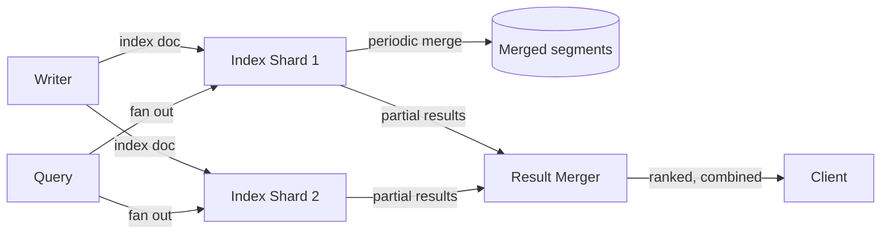

## Overview

- **Real-world analog:** Elasticsearch, Solr, the indexing pipeline behind any full-text
  search product
- **Difficulty:** Hard

A search index is a fundamentally different storage structure than anything else in
this course — an inverted index (term → list of documents containing it) that's
optimized for read-time query speed at the cost of being expensive and awkward to
update in place. The whole design revolves around that one structural fact.

## Clarifying Questions & Requirements

> **Ask these first:** how fresh does search need to be after a document is written —
> instant, or is a short delay acceptable? What's the reindexing strategy when the
> schema or analysis rules change? Read-heavy or write-heavy workload?

| | In scope | Out of scope |
|---|---|---|
| **Functional** | Index documents, support full-text query, near-real-time search freshness, zero-downtime reindexing | Building the ranking/relevance algorithm itself (assume a standard scoring function) |
| **Non-functional** | High query throughput on a large, sharded index; indexing doesn't block or significantly degrade search | Instant (sub-millisecond) visibility of a just-written document — near-real-time (seconds) is the realistic and accepted target |

Assume: billions of documents, an index sharded across many nodes, and a requirement to
reindex the entire dataset periodically without taking search offline.

## Back-of-Envelope Estimation

| | Estimate |
|---|---|
| Documents indexed | Billions, sharded across hundreds of index shards |
| Write rate | Thousands of documents/sec |
| Query rate | Tens of thousands/sec, vastly exceeding write rate |
| Refresh interval (write-to-searchable delay) | Typically 1 second by default, tunable |

The read:write skew, combined with the cost of updating an inverted index, is what
shapes nearly every decision here — the system is built to make reads fast at a real,
accepted cost to write/indexing complexity.

## API Design

```
POST /index/{name}/documents   {id, fields}          → 202 (indexed, visible after refresh)
GET  /index/{name}/search?q=&filters=                  → 200 {hits, scores}
POST /index/{name}/reindex      {newMapping}            → 202 (async, zero-downtime)
```

## Data Model & Storage

An inverted index: `term → [documentId, documentId, ...]`, physically stored as
immutable segment files that are periodically merged.

| Choice | Why |
|---|---|
| **Immutable segments, merged periodically, rather than updating the index structure in place** | Updating an inverted index in place (inserting a new document into every term's posting list it touches) is expensive per-write. Instead, new documents are written to a new small segment, and "updating" an existing document is really "mark old version deleted, write new version to a new segment" — periodic background merges combine small segments into larger ones and physically remove deleted entries, batching the expensive part instead of paying it per-write |
| **A tunable refresh interval, not synchronous per-write visibility** | Making a newly indexed document instantly searchable would mean rebuilding query-time structures on every single write — an expensive operation to do per-document. A short, tunable delay (documents become searchable in batches, roughly every second) amortizes that cost across many writes at once, trading a small, bounded staleness window for much higher indexing throughput |
| **Sharding the index, with each shard independently searchable and merged into a combined result** | A single-node index caps both storage and query parallelism at what one machine can hold and search — sharding spreads both the data and the query workload (each shard searches its own portion in parallel, results are merged) across many nodes |

## High-Level Architecture



## Deep Dives

**1. Why "update" is really delete-and-reindex under the hood.** Because segments are
immutable once written, changing an existing document's content can't be an in-place
edit — the old version is marked deleted (invisible to future queries, but the disk
space isn't reclaimed yet), and the new version is written as a fresh document in a new
segment. This makes writes cheap and append-only at the cost of temporarily holding both
versions on disk until the next merge physically reclaims the space.

**2. Zero-downtime reindexing via a new-index-plus-alias-swap pattern.** When the schema
or analysis rules (tokenization, stemming) need to change, documents have to be
reprocessed and written into an entirely new index built with the new rules — you can't
change the analysis of an existing immutable segment. The standard pattern: build the
new index fully in the background under a new name, then atomically repoint a stable
alias that clients actually query from the old index to the new one — search traffic
sees an instant cutover with no window where the index is unavailable.

**3. Shard count is a real, hard-to-change tuning decision.** Too few shards, and each
one grows too large — merges get expensive, and a single shard becomes a scaling
ceiling. Too many, and per-shard overhead (memory, file handles, and the cost of fanning
a query out to every shard and merging results) dominates. Because resharding an
existing index is expensive (usually requiring a full reindex into a differently-sharded
new index, using the same alias-swap pattern above), shard count is typically chosen
conservatively upfront based on projected data volume, not tuned reactively.

**4. Near-real-time freshness is a deliberate, stated tradeoff, not a limitation to
apologize for.** A refresh interval of one second means a document is genuinely
unsearchable for up to that long after being written — for the overwhelming majority of
search use cases (product search, log search, content search) this is entirely
invisible to users, and forcing tighter freshness system-wide would pay a real
throughput cost for precision almost nobody needs.

## Bottlenecks & Failure Modes

| Bottleneck | Mitigation | Tradeoff accepted |
|---|---|---|
| Per-write index-structure rebuild cost | Batched refresh interval, immutable segments merged periodically | Documents aren't instantly searchable — a bounded, tunable delay |
| A single oversized shard | Conservative upfront shard-count planning based on projected volume | Resharding later requires a full reindex |
| Segment count growing unbounded from frequent small writes | Background merge process combining small segments into larger ones | Merges consume background I/O and CPU, tuned to not compete with query traffic |

## Why Not X?

**Why not index synchronously on every write so search is always instantly fresh?**
Rebuilding query-time index structures per-document is expensive — doing it synchronously
on the write path would make every single write pay the cost of an operation that's far
cheaper when batched, tanking write throughput for a freshness guarantee almost no
real search use case actually requires.

**Why not use one large index instead of sharding?** A single index caps total data
size and query parallelism at one machine's capacity — sharding is what allows the index
to grow past a single node's storage and lets a query be answered by many shards
searching in parallel instead of one node searching everything sequentially.

**Why not update documents in place instead of the delete-and-reindex pattern?**
Inverted index segments are immutable specifically because that's what makes writes fast
(append a new segment) and queries fast (search stable, unchanging structures) — an
in-place update would require rewriting potentially large posting lists on every
document change, reintroducing exactly the per-write cost the immutable-segment design
avoids.

## Interview Signals

| | Strong answer | Weak answer |
|---|---|---|
| Update model | Explains delete-and-reindex via immutable segments, not in-place mutation | Assumes documents can simply be updated in place like a normal database row |
| Freshness | States near-real-time as a deliberate, bounded tradeoff | Assumes or promises instant search visibility |
| Reindexing | Proposes the new-index-plus-alias-swap pattern for zero downtime | Has no plan for changing schema/analysis rules without downtime |

**Common failure modes:** treating the index like a normal mutable database; assuming
synchronous write-to-search visibility; no plan for reindexing without an outage.

## Glossary Links

No shared-glossary terms apply directly to this chapter's core mechanisms.
