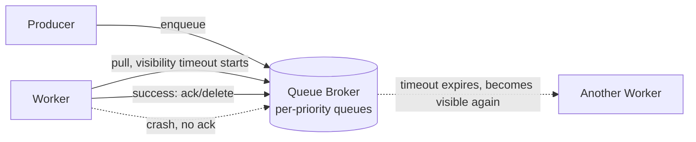

## Overview

- **Real-world analog:** Celery, Sidekiq, AWS SQS-backed workers
- **Difficulty:** Medium

The task queue is the general-purpose infrastructure that the notification system, the
job scheduler, and half the other systems in this course quietly depend on to keep
slow work off the request path. This chapter builds that primitive itself: a broker that
distributes units of work to a pool of workers, safely, even when a worker dies
mid-task.

## Clarifying Questions & Requirements

> **Ask these first:** does the queue need priority levels? Are delayed/scheduled
> tasks in scope? Is at-least-once delivery (with idempotent handlers) acceptable, or
> is exactly-once required?

| | In scope | Out of scope |
|---|---|---|
| **Functional** | Enqueue a task, distribute to workers, retry on failure, support priority and delayed execution | Building the actual task handler logic — assume arbitrary functions |
| **Non-functional** | No task is silently lost if a worker crashes mid-processing | True exactly-once execution (at-least-once with idempotent handlers is the realistic target, same as the job scheduler question) |

Assume: a mixed workload of high-priority (send this now) and low-priority (batch report
generation) tasks, with worker crashes being a routine, expected occurrence at scale.

## Back-of-Envelope Estimation

| | Estimate |
|---|---|
| Tasks enqueued/sec at peak | 10,000+ |
| Worker pool size | Hundreds of worker processes, scaled independently of the enqueueing side |
| Task duration distribution | Wildly variable — milliseconds to minutes depending on task type |

The variable task duration is a real design constraint — a worker pool sized for
millisecond tasks starves under a burst of long-running ones unless queues are
separated by expected duration/priority.

## API Design

```
POST /tasks         {type, payload, priority?, runAt?}   → 202 {taskId}
GET  /tasks/{id}                                           → 200 {status, result}
```

## Data Model & Storage

The broker's core structure is the queue itself, not a relational schema:

```
queue:{priority}    -- a list/stream per priority level
task:{id}            -- payload, status, attempt count, visibility_timeout
```

| Choice | Why |
|---|---|
| **Visibility timeout, not an explicit ack-then-delete as the only completion signal** | When a worker pulls a task, the task becomes invisible to other workers for a bounded window (the visibility timeout) rather than being deleted immediately. If the worker crashes before finishing, the task automatically becomes visible again after the timeout and another worker picks it up — no separate crash-detection process needed. If the worker finishes and acks, the task is deleted before the timeout matters |
| **Separate queues per priority level, not a single queue with a priority field**, drained via weighted round-robin | A single queue with a priority field either processes strictly in priority order (starving low-priority tasks indefinitely if high-priority ones keep arriving) or ignores priority under load. Separate queues, drained at a deliberate ratio (say, 4 high-priority tasks processed for every 1 low-priority), guarantee low-priority tasks still make forward progress without ever fully blocking on high-priority volume |

## High-Level Architecture



## Deep Dives

**1. Visibility timeout is what makes worker crashes a non-event instead of a data-loss
incident.** Without it, a naive design (delete the task the moment a worker pulls it)
loses that task entirely if the worker crashes before completing it — there's no record
left that it was ever claimed. The visibility timeout means "claimed but not yet
confirmed done" is itself a recoverable state: if confirmation (the ack) never comes
within the timeout, the system assumes the worker died and makes the task available
again automatically.

**2. At-least-once delivery is the direct consequence of visibility timeouts, and
handlers must be built for it.** A worker can finish a task's actual side effect and
then crash *before* sending the ack — the task becomes visible again and a second worker
processes it, running the side effect twice. This isn't a bug in the queue; it's the
necessary cost of the crash-recovery mechanism. The queue's contract has to say this
explicitly: task handlers must be idempotent, the same requirement seen in the job
scheduler and notification-system questions, because the underlying reason (at-least-
once delivery under crash recovery) is the same.

**3. Weighted draining across priority queues, not strict priority order.** Strict
priority (always fully drain high before touching low) means a sustained stream of
high-priority tasks can starve low-priority ones indefinitely — technically correct
prioritization, but a real operational problem if "low priority" still needs to complete
eventually. A weighted ratio guarantees a minimum rate of progress on every priority
level regardless of how saturated the higher levels are.

**4. Delayed/scheduled tasks reuse the visibility mechanism rather than needing a
separate system.** A task that shouldn't run until a future time is enqueued with its
visibility timestamp set in the future instead of "now" — workers simply never see it as
available to claim until that timestamp passes. This means delay scheduling and
crash-recovery visibility are the same underlying mechanism, not two separate features
bolted together, which keeps the broker's core model small.

## Bottlenecks & Failure Modes

| Bottleneck | Mitigation | Tradeoff accepted |
|---|---|---|
| Worker crash mid-task | Visibility timeout, automatic re-delivery | Duplicate execution is possible — handlers must be idempotent |
| Long-running tasks starving short ones (or the reverse) | Separate queues by expected duration or priority, weighted draining | More queues to operate and monitor than a single unified one |
| A poison task that always fails and gets endlessly retried | Bounded max-attempt count, then move to a dead-letter queue for manual inspection | Failed tasks need a separate handling path, not automatic infinite retry |

## Why Not X?

**Why not poll a database table for pending tasks instead of a dedicated broker?** A
polling loop against a table adds needless database load and latency (bounded by the
poll interval) compared to a broker built for push-style task distribution — and doing
`SELECT ... FOR UPDATE SKIP LOCKED`-style claiming at high task volume puts real,
avoidable pressure on the primary database that a purpose-built broker doesn't.

**Why not process tasks synchronously in the request path instead of queueing them?**
The same argument made throughout this course for every other queue-based design: it
couples caller latency to task duration, and offers no retry story if the task fails —
a queue exists precisely to decouple "the request that triggered this work" from "the
work actually completing."

**Why not have the producer just delay before enqueueing (e.g., sleep, then enqueue)
instead of building delay into the broker?** Blocks the producer process for the entire
delay duration and loses the scheduled task entirely if the producer restarts or crashes
during that wait — encoding the delay as a future visibility timestamp in the broker
itself means the task survives independently of whatever process originally enqueued it.

## Interview Signals

| | Strong answer | Weak answer |
|---|---|---|
| Crash recovery | Explains visibility timeout as the mechanism that makes crashes recoverable | Has no answer for what happens if a worker dies mid-task |
| Delivery guarantee | States at-least-once explicitly and requires idempotent handlers | Assumes exactly-once without justification |
| Priority handling | Uses weighted draining across separate queues, avoiding starvation | Uses a single queue with a priority field and no starvation protection |

**Common failure modes:** deleting a task the moment it's claimed instead of on
completion; assuming exactly-once delivery; strict priority ordering that can starve
lower-priority work indefinitely.

## Glossary Links

This question draws on: Idempotency — linked on first mention above.
