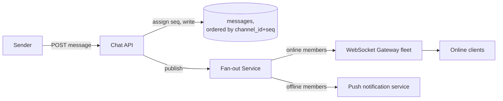

## Overview

- **Real-world analog:** Slack, Microsoft Teams
- **Difficulty:** Hard
- **Frontend counterpart:** [Chat & Messaging](/system-design/c/chat-messaging) covers
  the client-side rendering, optimistic sends, and connection management — this chapter
  is the backend that has to get message ordering and fan-out right for potentially
  thousands of members in one channel.

The frontend question already covers a lot of the delivery mechanics from the client's
side. What it doesn't own is the thing that actually breaks at scale: what "ordering"
even means when messages arrive at a server from many clients through many connections,
and how you fan a single message out to a channel with 10,000 members without that
fan-out becoming the bottleneck.

## Clarifying Questions & Requirements

> **Ask these first:** what's the largest channel size to design for? Do messages need
> strict ordering, or is "close enough" (eventually consistent ordering) acceptable?
> Is search in scope?

| | In scope | Out of scope |
|---|---|---|
| **Functional** | Send a message to a channel, deliver to online members in real time, track per-user read state | Message search/indexing, threads as a distinct data model |
| **Non-functional** | Strict per-channel message ordering, fan-out that doesn't degrade as channel size grows | Guaranteed sub-100ms global delivery latency |

Assume: channels range from 2 to 10,000+ members, and ordering within a single channel
must be strict and consistent for every reader.

## Back-of-Envelope Estimation

| | Estimate |
|---|---|
| Messages/day across a large org | 500M |
| Peak fan-out | A single message to a 10,000-member channel is effectively 10,000 delivery events |
| Read-state writes | Far exceed message writes — every scroll/focus can update a read watermark |

The fan-out multiplier is the number that matters most: one write can imply thousands of
delivery events, and that ratio is what shapes the whole architecture.

## API Design

```
POST /channels/{id}/messages   {body}                    → 201 {messageId, seq}
GET  /channels/{id}/messages?after={seq}                  → 200 [messages]
PUT  /channels/{id}/read-state  {lastReadSeq}              → 204
```

## Data Model & Storage

```
messages
  channel_id     uuid
  seq            bigint       -- monotonic per channel, not a timestamp
  sender_id      uuid
  body           text
  PRIMARY KEY(channel_id, seq)

read_state
  channel_id     uuid
  user_id        uuid
  last_read_seq  bigint
  PRIMARY KEY(channel_id, user_id)
```

| Choice | Why |
|---|---|
| **A per-channel monotonic sequence number (`seq`), not a wall-clock timestamp, as the ordering key** | Server clocks across a distributed fleet drift and skew relative to each other — two messages sent milliseconds apart by different servers can have timestamps in the "wrong" relative order. A single monotonically-increasing counter per channel (assigned by whichever server or partition owns sequencing for that channel) guarantees a total, unambiguous order that a wall clock can't |
| **`read_state` as a single watermark (`last_read_seq`) per user per channel, not a per-message read flag** | The same reasoning as unread-count systems elsewhere in this app's frontend courses: a flag-per-message-per-user is a write multiplied by channel size on every single message, and a table that grows without bound. A watermark is one row, one write, regardless of message volume — "unread" is simply `seq > last_read_seq` |

## High-Level Architecture



## Deep Dives

**1. Assigning a strictly ordered sequence number without a global bottleneck.**
A single global counter for every channel in the system would serialize all writes
through one point. Instead, sequencing is scoped *per channel* — each channel's messages
are ordered relative only to each other, so different channels can be sequenced
completely independently, often by sharding channel ownership across multiple
sequencing nodes (each node owning a subset of channels).

**2. Fan-out on write for online members, fan-out on read for offline ones.** Pushing a
new message immediately to every currently-connected member via their WebSocket
connection (fan-out on write) works well for the online case. For a member who's
offline, there's no connection to push to — their client instead pulls everything after
their last-seen `seq` on reconnect (fan-out on read). Trying to force one strategy for
both cases either wastes effort maintaining phantom connections for offline users, or
adds needless latency for online ones waiting on a pull cycle.

**3. Why a 10,000-member channel doesn't mean 10,000 synchronous pushes.** The fan-out
service publishes once to a message bus; each WebSocket gateway instance holding
connections for a subset of that channel's online members subscribes and delivers to its
own local connections. The "fan-out" work is distributed across however many gateway
instances hold connections for that channel, rather than one process trying to push to
10,000 sockets itself.

**4. Editing and deleting a message can't rewrite history, because ordering guarantees
depend on the log being append-only.** Mutating a stored message row directly breaks any
client that cached the original content or is mid-replay of the ordered log. The safer
model treats an edit or delete the same way as a new message: an `edit` or `delete`
operation is appended with its own new `seq`, referencing the original message's `seq`,
and every client applies it the same way it applies any other ordered event — the
message log itself never has an in-place mutation.

## Bottlenecks & Failure Modes

| Bottleneck | Mitigation | Tradeoff accepted |
|---|---|---|
| Global sequencing bottleneck | Per-channel sequencing, sharded across sequencing nodes | A channel's total message throughput is bounded by its own sequencer, not the whole system's |
| Fan-out to a very large channel | Pub/sub to distributed gateway instances, each handling its own connection subset | More moving infrastructure than a single fan-out process |
| Read-state write volume | Watermark model instead of per-message flags | Can't answer "did user X specifically read message Y" — only "has X read up through Y" |

## Why Not X?

**Why not use each server's wall-clock timestamp for message ordering?** Clock skew
between servers means two near-simultaneous messages from different servers can be
timestamped out of true relative order, and any correction (NTP sync, hybrid logical
clocks) is strictly more complex than just handing out a monotonic counter from whichever
node already owns sequencing for that channel.

**Why not a per-message-per-user read flag for precise read receipts?** At 500M
messages/day multiplied by average channel size, that's an astronomical number of rows
for information a watermark captures in one row per user per channel — precise
per-message read receipts (if genuinely needed) can be layered on top for specific
high-value cases rather than being the default for every message.

**Why not mutate the message row directly when a user edits or deletes it?** Works for a
client that re-fetches the full message list on every view, but breaks any client relying
on the append-only ordering guarantee to replay or cache messages incrementally — an
in-place mutation has no `seq` of its own, so there's no way to tell a client "something
changed" without falling back to re-fetching everything, which defeats the point of
ordered incremental delivery in the first place.

## Interview Signals

| | Strong answer | Weak answer |
|---|---|---|
| Ordering | Uses a per-channel monotonic sequence, explains why timestamps don't work | Orders messages by server timestamp without considering clock skew |
| Fan-out | Distinguishes online (push) vs. offline (pull) delivery paths | One delivery mechanism assumed to work for both cases |
| Read state | Uses a watermark, not a flag per message per user | Designs a read-receipt table that grows with messages × members |

**Common failure modes:** timestamp-based ordering with no clock-skew discussion; a
single fan-out process assumed to scale to any channel size; a read-state model that
doesn't account for its own growth.

## Glossary Links

This question draws on: Message ordering — linked on first mention above.
