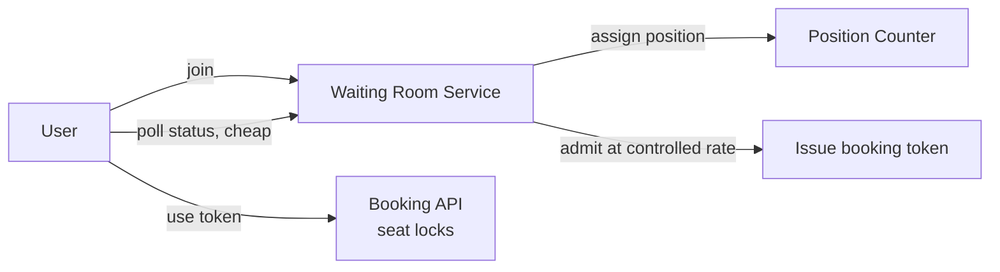

## Overview

- **Real-world analog:** BookMyShow, Ticketmaster
- **Difficulty:** Hard
- **Frontend counterpart:** [Seat Booking](/system-design/c/seat-booking) already covers
  the core atomic seat-lock mechanism (Redis `SET ... NX EX`, multi-seat holds via a Lua
  script) in real depth — this chapter doesn't re-derive that. It picks up where that
  mechanism *stops being enough*: what protects the booking service itself when demand
  for one event is 100x its actual inventory.

The atomic hold mechanism from the seat-booking chapter is necessary but not
sufficient at true on-sale scale. A viral concert on-sale can put a million people in
front of a system with 20,000 seats — even with perfectly correct locking, that many
concurrent requests hammering the same small set of contended rows becomes its own
bottleneck. The new problem here is admission control: deciding who's even allowed to
attempt a booking, and when.

## Clarifying Questions & Requirements

> **Ask these first:** what's the ratio of expected demand to available inventory at
> on-sale moment? Is a virtual waiting room / queue acceptable UX, or must every user be
> able to attempt immediately?

| | In scope | Out of scope |
|---|---|---|
| **Functional** | Admit users into the booking flow in a controlled order, hold seats atomically, confirm on payment | The seat-locking mechanism itself (already covered by the frontend counterpart) |
| **Non-functional** | The booking service stays responsive under load shedding when demand vastly exceeds inventory | Fairness guarantees beyond FIFO-by-arrival (e.g., no attempt at anti-bot/anti-scalper detection) |

Assume: a popular event can see 500,000 concurrent hopefuls against 20,000 seats within
the first minute of sale.

## Back-of-Envelope Estimation

| | Estimate |
|---|---|
| Peak concurrent demand | 500,000 users |
| Available inventory | 20,000 seats |
| Demand:inventory ratio | 25:1 — the overwhelming majority of arrivals cannot succeed no matter how the backend is built |
| Booking-flow capacity the service can actually handle well | A few thousand concurrent active sessions, not 500,000 |

The core insight the estimation forces: no amount of backend optimization changes that
96% of arrivals *will not get a seat* — the design goal is protecting the system's
ability to serve the 4% correctly, not somehow serving all 500,000 well.

## API Design

```
POST /waiting-room/join     {eventId}                → 202 {queueToken, estimatedWait}
GET  /waiting-room/status    {queueToken}              → 200 {position} | 200 {admitted: true, bookingToken}
POST /holds                  {bookingToken, seatIds[]}  → 201 {holdId} | 403 (invalid/expired token)
```

## Data Model & Storage

```
waiting_room
  queue_token     uuid PK
  event_id        uuid
  position         bigint       -- assigned by a monotonic counter, same pattern as the URL shortener's ID generation
  admitted_at      timestamp nullable

seat_locks / holds   -- unchanged from the seat-booking chapter's mechanism
```

| Choice | Why |
|---|---|
| **A separate, lightweight waiting-room service in front of the booking service**, not rate limiting the booking API directly | Rate limiting alone still lets every rejected request retry immediately and repeatedly, which is itself a load source. A waiting room converts "500,000 people hammering an endpoint" into "500,000 people holding a position, checked with cheap, cacheable polling" — fundamentally different load profiles on the same backend |
| **Position assigned via a monotonic counter**, the same pattern as the URL shortener's ID generator | Assigning a strictly increasing position number under massive concurrent join requests is the exact same problem as generating unique, ordered IDs at high write volume — pre-allocated counter ranges per server instance avoid a single shared counter becoming the new bottleneck |

## High-Level Architecture



## Deep Dives

**1. The waiting room's job is converting expensive requests into cheap ones.** Booking
a seat requires a real database transaction against contended rows. Checking a queue
position is a cheap, cacheable read against a monotonically-increasing counter — it can
be served from the edge or a lightweight cache layer without touching the booking
system's actual contended resources at all. The waiting room's entire value is absorbing
500,000 concurrent participants at the *cheap* layer, so only a controlled, sustainable
rate ever reaches the *expensive* layer.

**2. Admission rate is tuned to booking-service capacity, not to demand.** The system
deliberately admits users from the queue at a rate the booking service can actually
handle well (say, a few hundred per second), regardless of how many are waiting — this
is a conscious throttle, not a limitation to apologize for. Admitting faster than the
booking service's real capacity just moves the contention problem from the queue to the
booking transactions themselves, which is worse, not better.

**3. Booking tokens need their own short expiry, layered on top of the seat hold's
expiry.** A user admitted into the booking flow but who doesn't act within a reasonable
window (closes the tab, gets distracted) should have their booking token expire and free
up an admission slot for the next person in line — a separate, shorter-lived concern
from the seat hold's own TTL, which only starts once they've actually selected seats.

**4. The queue token has to prevent a single user from gaming their own position.**
Without binding a `queueToken` to something durable about the requester (an authenticated
session, or at minimum a fingerprinted device/browser), a user could open many tabs and
join the waiting room repeatedly, effectively holding several positions and improving
their odds relative to everyone else. Tying issuance to one token per authenticated user
per event — rejecting a second `join` call for a user who already holds an active token —
keeps the ordering fair to the "one person, one position" fairness this whole mechanism
exists to provide.

## Bottlenecks & Failure Modes

| Bottleneck | Mitigation | Tradeoff accepted |
|---|---|---|
| Booking service overwhelmed by raw demand | Waiting room admission control at a sustainable rate | Most users experience a wait, even though the underlying booking transactions themselves are fast |
| Position-counter contention at extreme join volume | Pre-allocated counter ranges per server, same pattern as the URL shortener | Some position-number gaps if a server restarts mid-range |
| Admitted users who don't complete a booking | Short-lived booking tokens with their own expiry, independent of the seat hold | Slightly more state to track than a single hold TTL |

## Why Not X?

**Why not just rely on the seat-lock mechanism and rate limiting, skipping a separate
waiting room?** Rate limiting rejects excess requests, but a rejected request is still a
request the system had to receive, authenticate, and process enough to reject — at 25:1
demand-to-inventory, that rejection traffic alone can be enough to degrade the system.
A waiting room diverts the vast majority of traffic to a much cheaper layer before it
ever reaches the expensive one.

**Why not admit everyone into the booking flow simultaneously and let the atomic seat
locks sort out the winners?** The locking mechanism is correct under contention, but
"correct" doesn't mean "fast" — extreme concurrent contention on the same small set of
rows degrades throughput even when every individual operation is safe. Admission control
exists specifically to keep contention at a level the locking mechanism handles well.

**Why not use a bare shared counter for queue position instead of individual tokens per
user?** A counter alone can't answer "what's *my* position" without leaking or
correlating other users' positions, and gives no way to prevent one user from
incrementing it multiple times for themselves — an individually issued, authenticated
token is what makes the position both privately queryable and resistant to a single user
claiming more than one slot.

## Interview Signals

| | Strong answer | Weak answer |
|---|---|---|
| System framing | Recognizes this as an admission-control problem layered on top of the (already-solved) locking problem | Re-derives the seat-locking mechanism from scratch without addressing the demand-surge problem |
| Waiting room design | Explains why polling a queue position is cheap relative to a real booking attempt | Treats the waiting room as equivalent load to the booking API itself |
| Admission rate | Ties the admission rate explicitly to booking-service capacity, not to demand | Doesn't explain how the admission rate is chosen |

**Common failure modes:** re-explaining atomic seat locking as if it were the hard part
of this specific question; no admission-control layer at all; an admission rate with no
stated relationship to backend capacity.

## Glossary Links

This question draws on: Load shedding — linked on first mention above (the waiting
room's admission throttle as a deliberate, capacity-aware form of load shedding).
