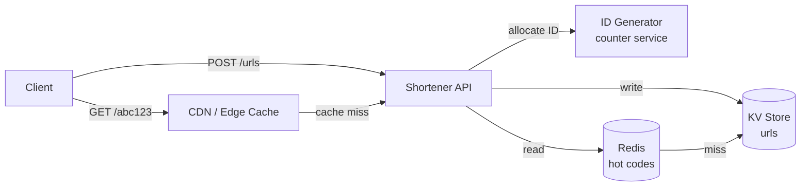

## Overview

- **Real-world analog:** bit.ly, TinyURL, t.co
- **Difficulty:** Easy-Medium

A URL shortener takes a long URL and returns a short one that redirects to it. The
whole problem sounds trivial — it's a hash map — until you have to make that hash map
survive a server restart, handle a hundred million reads a day against a few thousand
writes, and decide what a 301 actually costs you. That gap between "it's a hash map"
and "it's a hash map that has to survive production" is the entire interview.

## Clarifying Questions & Requirements

> **Ask these first:** expected read:write ratio? Do short codes need to be
> unguessable, or just unique? Custom aliases? Do links expire? Do we need click
> analytics?

| | In scope | Out of scope |
|---|---|---|
| **Functional** | Shorten a URL, redirect on visit, optional custom alias, optional expiry | Link preview / OG scraping, spam/malware scanning |
| **Non-functional** | Low-latency redirect (the hot path), high read:write ratio, codes don't collide | Strict global uniqueness across multiple independent shortener deployments |

Assume: 100M new URLs/month, a 100:1 read:write ratio (redirects dominate), and links
live for years by default.

## Back-of-Envelope Estimation

| | Estimate |
|---|---|
| Writes | 100M/month ≈ 40/sec average |
| Reads (100:1) | ≈ 4,000/sec average, bursty well above that at peak |
| Storage per record | ~500 bytes (long URL + short code + metadata) |
| 5-year storage | 100M × 60 months × 500B ≈ 3TB |
| Short code space needed | 6M new codes/day → base62^6 (~56.8 billion) comfortably covers years of growth |

The workload is read-dominated by two orders of magnitude — that single number decides
most of the design: cache aggressively, and don't let the write path get anywhere near
the read path's latency budget.

## API Design

```
POST /urls          {longUrl, customAlias?, expiresAt?}   → 201 {shortCode, shortUrl}
GET  /{shortCode}                                          → 302 → longUrl
GET  /urls/{shortCode}/stats                                → 200 {clicks, createdAt}
DELETE /urls/{shortCode}                                    → 204
```

`POST /urls` is not idempotent — a client retrying after a timeout can end up creating
a second short code for the same long URL. A client-supplied idempotency key, cached
server-side against its response, is the standard fix if duplicate codes for the same
URL are a problem worth solving; for a low-stakes shortener, many teams accept the
occasional duplicate instead.

## Data Model & Storage

```
urls
  short_code    varchar(8)  PK
  long_url      text
  user_id       uuid nullable
  created_at    timestamp
  expires_at    timestamp nullable
  click_count   bigint      -- eventually consistent, see Deep Dives
```

| Choice | Why |
|---|---|
| **Key-value store (DynamoDB/Redis-backed), not a relational table with an auto-increment PK** | The access pattern is a single-key point lookup on `short_code` on the hot path — there's no join, no range query, nothing a relational engine buys you here, and a KV store's single-key latency and horizontal scaling are exactly what a 4,000+ reads/sec redirect path needs |
| **`short_code` as the primary key, not a derived index** | Every read is `GET /{shortCode}` — making it the actual key means the read path is one lookup, not an index traversal |
| **Base62 encoding of a counter, not a random string with collision-retry** | A monotonic counter (from a dedicated ID-generation service, or a range of IDs pre-allocated per app server) run through base62 is collision-free by construction; a random 6-character string needs a collision check on every write, which is extra latency on the one path you can't optimize your way out of |

## High-Level Architecture



The write path and read path barely touch the same infrastructure on purpose — writes
go through the ID generator and land in the durable store; reads hit an edge cache
first, then a Redis layer, and only fall through to the durable store on a genuine
cache miss.

## Deep Dives

**1. 301 vs. 302 — the redirect status code is a real design decision, not a detail.**
A `301 Moved Permanently` gets cached by the browser and even by intermediate proxies,
so a repeat visitor's second click never even reaches your servers — great for load,
terrible for analytics, since you'll never see that second click. A `302 Found` is
never cached, so every click hits your redirect service and gets counted, at the cost
of that server load. Given click analytics is a stated requirement here, `302` is the
right default — but a strong answer states the tradeoff instead of picking one silently.

**2. Counter-based ID generation without a single point of contention.** A single
shared auto-increment counter becomes a bottleneck and a single point of failure at
this write volume. The standard fix is to give each API server a **pre-allocated range**
of IDs (e.g., server A gets IDs 1,000,000–1,999,999, server B gets the next block) it
can hand out locally without a round-trip per request, refilling its range from a
coordination service only when it runs low — trading a small amount of ID-space
fragmentation for removing the counter from the hot path entirely.

**3. Click-count writes shouldn't block the redirect.** Incrementing `click_count`
synchronously on every redirect means every read also does a write — undermining the
whole point of treating this as a read-heavy system. The fix is to fire the redirect
immediately and increment the counter asynchronously (a queue, or a buffered
write-behind), accepting that the count is eventually consistent rather than exact
in real time.

## Bottlenecks & Failure Modes

| Bottleneck | Mitigation | Tradeoff accepted |
|---|---|---|
| Redirect latency at peak read load | Edge/CDN cache in front of the API for hot short codes | Cache invalidation needed if a link is deleted or updated before its TTL expires |
| ID generator as a shared dependency | Pre-allocated ID ranges per server | Some ID space is "wasted" if a server restarts before exhausting its range |
| Hot single-key contention on a viral link | Redis in front of the durable store, not the durable store directly | An extra layer to keep consistent; acceptable since URL mappings are effectively immutable |

## Why Not X?

**Why not just hash the long URL (MD5/SHA) and truncate it for the short code?**
Truncating a cryptographic hash to 6-8 characters reintroduces exactly the collision
problem a counter avoids — two different long URLs can truncate to the same prefix,
and now you need a collision-retry loop on every single write. A monotonic counter is
collision-free by construction, which is strictly better for a system where writes,
however rare, still need to succeed within your latency budget.

**Why not a relational database as the primary store?** Nothing in the access pattern
needs relational features — no joins, no multi-row transactions across URLs, no range
queries. A KV store gives the same durability with better point-lookup latency and
simpler horizontal scaling, which is the only axis this system actually needs to scale
on.

## Interview Signals

| | Strong answer | Weak answer |
|---|---|---|
| Read:write asymmetry | Immediately designs around a 100:1 skew — caching, async click counting | Treats reads and writes as symmetric and designs one path for both |
| Redirect code | States the 301/302 tradeoff explicitly and picks one for a stated reason | Doesn't realize there's a decision to make |
| ID generation | Explains why a shared counter needs pre-allocated ranges under load | Proposes a single global counter with no mention of contention |

**Common failure modes:** proposing a random-string short code with no collision
strategy; putting click-count increments on the synchronous redirect path; not asking
about the read:write ratio before designing the storage layer.

## Glossary Links

This question draws on: Idempotency — linked on first mention above.
