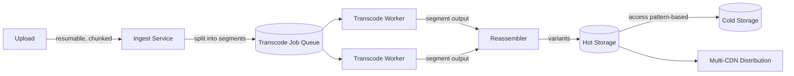

## Overview

- **Real-world analog:** YouTube, Netflix
- **Difficulty:** Hard
- **Frontend counterpart:** [Video Streaming](/system-design/c/video-streaming) covers
  the player, adaptive bitrate switching, and buffering logic client-side — this chapter
  is everything upstream of that: how an uploaded video becomes the set of bitrate
  variants the player actually adapts between, and how it gets stored and distributed
  at global scale.

The player's adaptive bitrate logic only works because a whole pipeline already
transcoded the source video into multiple resolutions and bitrates ahead of time, and
positioned them close to wherever the viewer actually is. This chapter is that pipeline.

## Clarifying Questions & Requirements

> **Ask these first:** what's the acceptable delay between upload and a video being
> watchable (processing latency)? How many bitrate/resolution variants are needed?
> Is live streaming in scope, or only pre-recorded video?

| | In scope | Out of scope |
|---|---|---|
| **Functional** | Ingest an uploaded video, transcode to multiple bitrates/resolutions, store durably, distribute globally via CDN | Live streaming (a related but distinctly different pipeline), recommendation/personalization (its own question) |
| **Non-functional** | Transcoding time doesn't scale linearly with video length, storage cost scales with actual access patterns, not uniformly | Instant (zero-delay) availability after upload — some processing latency is an accepted, explicit cost |

Assume: uploads range from minutes to multiple hours long, need 5-6 bitrate/resolution
variants each, and viewership follows a long-tail distribution (a small fraction of
videos get the vast majority of views).

## Back-of-Envelope Estimation

| | Estimate |
|---|---|
| Uploads/day at scale | Hundreds of thousands of hours of raw video |
| Storage growth (source + all transcoded variants) | Petabytes/month, uncompressed source dominates |
| Transcoding compute | Massively parallelizable — the whole design depends on this |
| Viewership skew | A small percentage of the catalog accounts for the large majority of views (classic long-tail) |

The long-tail viewership number is what justifies storage tiering — most of the catalog,
by volume, is rarely watched after its first weeks.

## API Design

```
POST /uploads              {file}                    → 201 {uploadId}
GET  /videos/{id}/status                                → 200 {status: 'processing'|'ready'}
GET  /videos/{id}/manifest                              → 200 {variants: [{bitrate, url}]}
```

## Data Model & Storage

```
videos
  id             uuid PK
  status          enum('uploading','transcoding','ready','failed')
  storage_tier    enum('hot','cold')
  last_accessed   timestamp

variants
  video_id        uuid FK
  bitrate         int
  resolution      text
  storage_url     text
```

| Choice | Why |
|---|---|
| **Chunked, parallel transcoding — split the source into segments, transcode each independently across a worker fleet, reassemble** | Transcoding a two-hour source video as one sequential job means wall-clock processing time scales with video length regardless of available compute — splitting into independently-transcodable segments lets the job's wall-clock time scale with worker-pool size instead, turning a long serial job into a short parallel one |
| **Storage tiering based on access recency, not a fixed schedule** | Most videos get the bulk of their views shortly after upload and then taper off sharply — keeping everything on the fastest (and most expensive) storage indefinitely pays for speed that's mostly wasted on content nobody's actively watching. Moving cold content to cheaper storage tiers, triggered by actual access patterns rather than a blanket age cutoff, matches cost to real usage |

## High-Level Architecture



## Deep Dives

**1. Parallel chunked transcoding is what makes processing time roughly constant
relative to available compute, not video length.** The source is split into short
segments (a few seconds to a minute each) at keyframe boundaries so each segment can be
transcoded independently without needing context from adjacent segments. A worker fleet
processes many segments simultaneously; a reassembly step stitches the transcoded
segments back into complete variant files. A ten-times-longer video costs roughly the
same wall-clock time to process, given proportionally more workers, rather than ten
times longer.

**2. Storage tiering triggered by actual access, not a fixed age threshold.** A video
that goes viral six months after upload shouldn't stay stuck on cold storage just
because of its age — tiering decisions driven by recent access frequency (moved to hot
storage on a resurgence in views, moved to cold after a sustained quiet period) match
cost to real demand far better than a simple "move everything older than 30 days"
policy, at the cost of needing to actively monitor access patterns per video rather than
applying a static rule.

**3. Multi-CDN distribution, routed by real-time performance, not a single provider.**
No single CDN provider has uniformly excellent performance in every region and with
every ISP — routing traffic across multiple CDN providers based on real-time
measurements of which one is performing best for a given viewer's network gives
meaningfully better playback reliability than committing to one provider everywhere,
at the cost of operating and monitoring multiple provider relationships simultaneously.

**4. A resumable upload protects large source files from network instability.**
A multi-gigabyte upload over a real-world (possibly mobile, possibly unreliable)
connection has a meaningful chance of being interrupted partway through — uploading in
checksummed chunks, with the ability to resume from the last successfully received
chunk rather than restarting from zero, is the difference between a large upload being
mildly annoying on a bad connection versus effectively impossible.

## Bottlenecks & Failure Modes

| Bottleneck | Mitigation | Tradeoff accepted |
|---|---|---|
| Long videos taking excessive wall-clock time to transcode | Chunked, parallel transcoding across a worker fleet | Reassembly and segment-boundary handling adds pipeline complexity |
| Storage cost growing with the full catalog regardless of demand | Access-pattern-driven tiering between hot and cold storage | Occasional latency spike when a cold, resurgent video needs to be promoted back to hot storage |
| Single-CDN regional/ISP performance gaps | Multi-CDN routing based on real-time performance | Operational complexity of managing multiple provider integrations |

## Why Not X?

**Why not transcode the entire video as one sequential job?** Wall-clock processing
time scales directly with video length with no parallelism benefit — for very long
content (hours), this becomes an unacceptable delay between upload and availability
that chunked parallel processing avoids by construction.

**Why not keep every video on the fastest storage tier permanently, given storage is
relatively cheap?** Storage cost still scales with total catalog size regardless of
whether content is being watched — for a platform where most content sees a sharp
falloff in views after its first weeks, paying premium-tier cost for the entire
long-tail catalog indefinitely is a real, avoidable expense at this scale.

**Why not rely on a single CDN provider for simplicity?** A single provider's
regional peering quality or an outage in one region degrades playback for whatever
subset of viewers depend on that provider's performance there, with no fallback — multi-
CDN routing trades operational complexity for meaningfully better worst-case playback
reliability.

## Interview Signals

| | Strong answer | Weak answer |
|---|---|---|
| Transcoding | Proposes chunked, parallel transcoding and explains the wall-clock benefit | Assumes a single sequential transcode job, ignoring processing time for long videos |
| Storage economics | Ties storage tier to actual access patterns, not just age | Treats all content as needing the same storage tier indefinitely |
| CDN strategy | Considers multi-CDN routing for global reliability | Assumes a single CDN provider is sufficient everywhere |

**Common failure modes:** sequential transcoding with no parallelism plan; storage
tiering based purely on age rather than access patterns; no resumable-upload strategy
for large source files.

## Glossary Links

This question draws on: Resumable upload — linked on first mention above.
