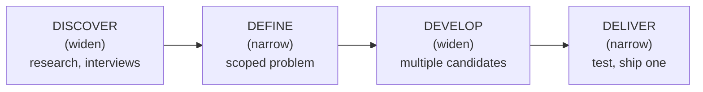

> **TL;DR:** There is no best design, only a design that's best for a specific set of users, goals, and constraints. Every chapter in this course is a different lens on that one idea.

## Four things people mean when they say "design"

Collapsing these into one word is the biggest source of designer/engineer miscommunication. "The design feels off" is nearly useless until you know which layer it's about.

| Layer | Decides | Artifact | Owner |
|---|---|---|---|
| **Visual design** | Color, type, spacing — how it looks | Mockups, style guides | Visual/UI designer |
| **UX design** | Flow, interaction, structure — how it works | Wireframes, prototypes | UX/product designer |
| **Product design** | What gets built at all, for whom | Specs, research | Product designer, PM |
| **Design systems** | The reusable vocabulary everything's built from | Component libraries, tokens | Design systems team |

This course focuses on the first two plus design systems — what a frontend engineer touches daily.

## The double diamond: how design decisions get made

- **Define** is the step most commonly skipped under deadline pressure — and skipping it is the #1 predictor of a design that technically works and nobody wants.
- Structurally identical to a PM's discovery-and-shaping process, or the "understand before you build" discipline for an ambiguous ticket.
- ⚠️ A design that jumps straight from "users are confused" to one delivered mockup, with no visible Define step, is as risky as a code fix with no root-cause analysis.

## Form follows function

> **The real meaning:** the *order* of decisions matters — figure out what the thing needs to do, then let that determine the shape. Not "decoration is bad."

- **Structure and content before visual treatment.** A component whose visual design locked before anyone agreed on its content will fight you forever.
- **Semantics before pixels.** Mark a heading as a heading before deciding its size. Semantically correct content survives redesigns and works with screen readers; a div styled to *look* like a heading breaks the moment anything needs the real meaning.

## Constraints are the actual design material

A design review arguing about color/spacing without naming the real constraint in tension is arguing about symptoms.

| Constraint type | Examples |
|---|---|
| **User** | Who, what they already know, device/context (one-handed on a train is real) |
| **Business** | Budget, timeline, brand, legal, what sales already promised |
| **Technical** | What the architecture can render, at what cost, with what to reuse |
| **Content** | How much real content exists — a beautiful layout designed for one short label breaks on real 40-character titles |
| **Accessibility** | Not phase two — a first-class constraint from day one |

## Translating vague feedback

| They say | It usually means | The actual lever |
|---|---|---|
| "Make it pop" | Contrast & hierarchy unclear | Is the important thing visually distinguishable? |
| "Make it feel premium" | Inconsistency | Premium is what a well-executed system feels like — not more decoration |
| "It needs more energy" | Flat pacing | Motion, contrast, rhythm |

> **Ask this:** "When you say it needs more energy, do you mean the hierarchy isn't clear, or is it about motion?" You don't need to be the designer to ask the translating question.

## How to read the rest of this course

Every chapter treats a technique as a decision with a tradeoff, not a rule. The end goal isn't reciting definitions — it's asking, on sight: *what was this designed for, and does the decision in front of me actually serve that?*
