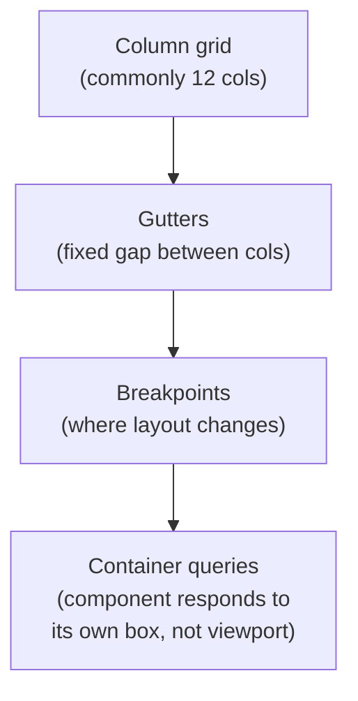

> **TL;DR:** A grid and a spacing scale trade a small amount of creative freedom for a large amount of consistency and speed — the same trade as a linter or a type system.

## The tell that a layout has no real grid

Measure the gaps on a real production screen — dozens of near-but-not-quite values (14px, 17px, 22px), each reasonable alone, collectively chaotic. Nobody planned it; it accumulated one "close enough" at a time, like undocumented magic numbers.

## The spacing scale (typical 8-point)

| Token | Value | Typical use |
|---|---|---|
| `space-1` | 4px | Icon-to-label gap |
| `space-2` | 8px | Default internal padding |
| `space-4` | 16px | Default stack spacing, card padding |
| `space-6` | 24px | Section-internal spacing |
| `space-8` | 32px | Between distinct groups |
| `space-12` | 48px | Between major sections |
| `space-16` | 64px | Page-level rhythm |

**Why base 8, not 10:** 8 scales predictably across 1×/2×/3× device pixel densities — a technical reason, not a style preference. This is chapter 6's design token, before the name: `padding: var(--space-4)` instead of `padding: 17px`, so the number lives in exactly one place.

## Grid systems

- **12 columns** wins because 12 divides evenly into halves, thirds, quarters — covers most layouts with no fractional column.
- **Breakpoints** should come from where *your content* actually breaks — not copy-pasted framework defaults.
- **Container queries** let a card in a 3-column grid lay out differently than the same card full-width, at the identical viewport size.

## Alignment: cheapest, highest-leverage fix in visual design

- **Edge alignment** — the eye is brutal about near-misses. 2px off reads as a mistake; 20px off reads as intentional grouping. There's no comfortable middle.
- **Optical alignment** — sometimes mathematically perfect alignment doesn't *look* aligned (a triangle boxed identically to a square looks offset). Eyes win over pixels here.

## Visual hierarchy: five levers

| Lever | Effect |
|---|---|
| **Size** | Bigger draws attention first — most overused lever |
| **Weight/contrast** | Bold beats size regardless |
| **Color** | One saturated element among muted ones — overuse flattens hierarchy back out |
| **Position** | Top-left (LTR) and pattern-breaking positions draw disproportionate attention |
| **Whitespace** | Isolating an element makes it read as important, with zero change to the element itself |

**F-pattern** (text-heavy pages: full read of line 1-2, then scanning down the left edge) and **Z-pattern** (sparser layouts: top-left → top-right → bottom-left → bottom-right) explain a lot of real scan behavior — not laws, but real tendencies worth designing toward.

## Whitespace is designed, not leftover

- **Macro** — between sections, page margins. Sets pacing.
- **Micro** — within a component (label-to-input gap). Makes it feel considered, not cramped.
- Density is a legitimate choice (a trading terminal ≠ a landing page) — but it should be *deliberate*, not an accident of cramming in one more feature.

## CRAP — run this in under a minute

- **C**ontrast — does the most important thing actually look most important?
- **R**epetition — do recurring elements look consistently like themselves?
- **A**lignment — does everything share an intentional edge, no accidental near-misses?
- **P**roximity — are related things grouped, unrelated things separated?

## Bringing it to the browser

Spacing scale → CSS custom properties / Tailwind theme. Column grid → CSS Grid `grid-template-columns` + shared `gap`. Breakpoints → media queries from real content breaks. Container queries → a card that adapts to its slot, not just the viewport.
